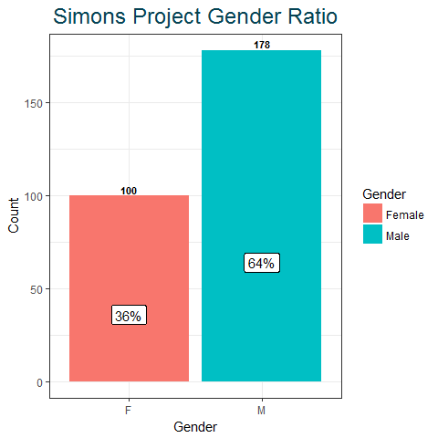
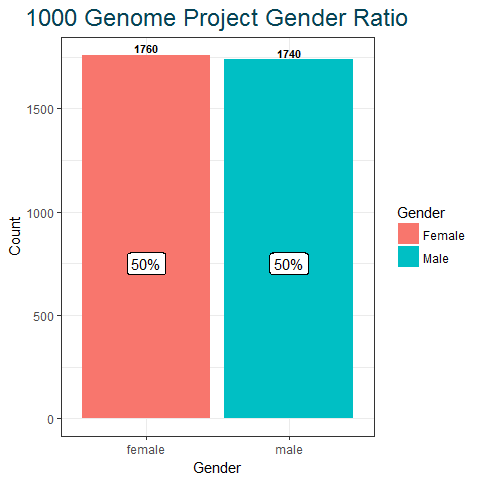
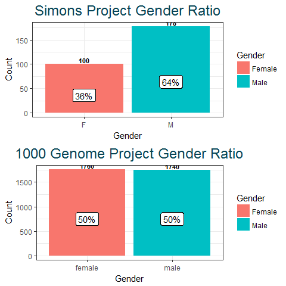
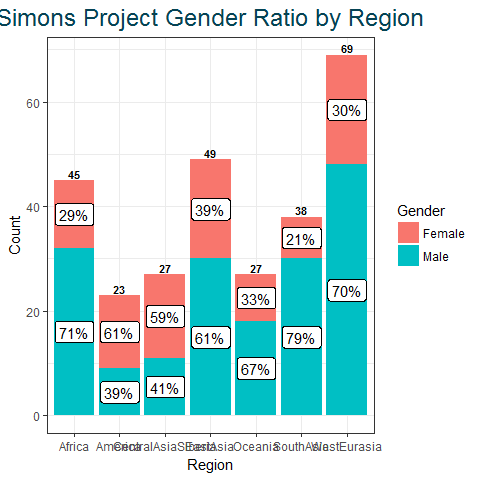
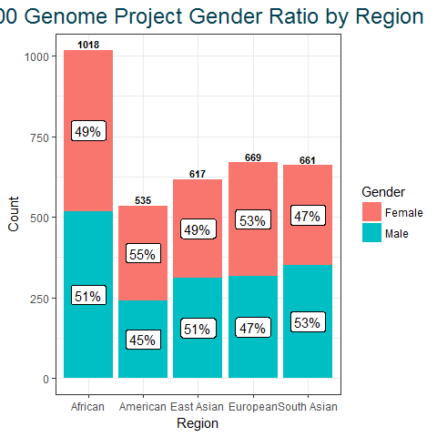
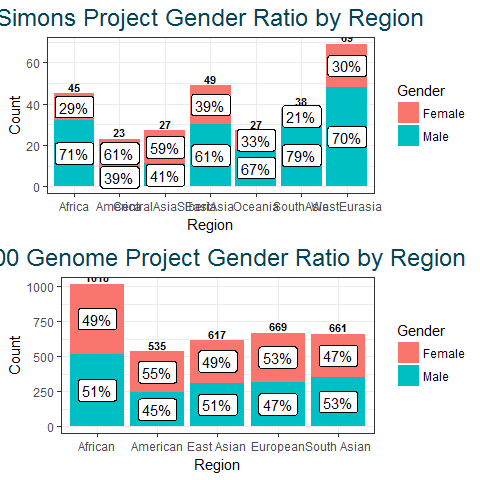
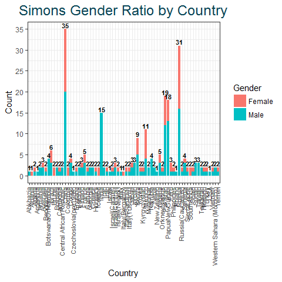
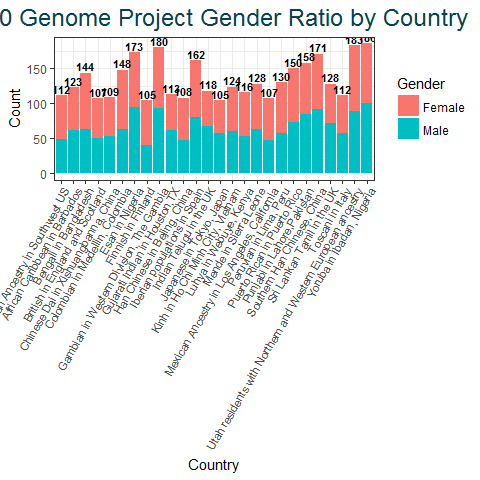

Gender analysis and comparison between Simons Genome Diversity Project and 1000 Genomes Project
================
November, 24, 2018

-   [Part 1: Connect to Google BigQuery](#part-1-connect-to-google-bigquery)
    -   [Load Packages](#load-packages)
    -   [Set up BigQuery connection with DBI](#set-up-bigquery-connection-with-dbi)
    -   [Connect to *simons\_genome\_diversity\_project\_sample\_metadata*](#connect-to-simons_genome_diversity_project_sample_metadata)
    -   [Connect to *1000\_genomes\_sample\_info*](#connect-to-1000_genomes_sample_info)
-   [Part 2: Total Gender Ratio](#part-2-total-gender-ratio)
    -   [Simons Project Gender Ratio](#simons-project-gender-ratio)
    -   [1000 Genome Project Gender Ratio](#genome-project-gender-ratio)
    -   [Compare Total Gender Ratio:](#compare-total-gender-ratio)
-   [Part 3: Gender Ratio by Region](#part-3-gender-ratio-by-region)
    -   [Simons Project Region Gender Ratio](#simons-project-region-gender-ratio)
    -   [1000 Genome Project Region Gender Ratio](#genome-project-region-gender-ratio)
    -   [Compare Region Gender Ratio:](#compare-region-gender-ratio)
-   [Part 4: Gender Ratio by Country](#part-4-gender-ratio-by-country)
    -   [Simons Project Country Gender Ratio](#simons-project-country-gender-ratio)
    -   [1000 Genome Project Country Gender Ratio](#genome-project-country-gender-ratio)
-   [Part 5: Simons Project Countries with Only One Represented Gender](#part-5-simons-project-countries-with-only-one-represented-gender)
-   [Part 6: Conclusion](#part-6-conclusion)

<hr />
Part 1: Connect to Google BigQuery
----------------------------------

-   Connect to Google BigQuery using R package *bigrquery*
-   After authenticating, connect to *bigquery-public-data* to get *human\_genome\_variants* datasets
-   Datasets that will be used are: *simons\_genome\_diversity\_project\_sample\_metadata* and *1000\_genomes\_sample\_info*

#### Load Packages

``` r
# Load packages
library(bigrquery) 
library(DBI)
library(dplyr)
library(readr)
library(ggplot2)
library(gridExtra)
```

### Set up BigQuery connection with DBI

-   Use Project ID as the billing project when working with free sample data
-   Load Google Cloud Platform Project ID from a separate file for protection

``` r
# Get project ID from a file or assign directly to billing 
project_id <- read_file(file="project_ID.txt")
billing <- project_id

# Set up BigQuery connection with DBI
con <- DBI::dbConnect(
  bigrquery::bigquery(),
  project = "bigquery-public-data",
  dataset = "human_genome_variants",
  billing = billing
)
```

#### List available datasets

``` r
dbListTables(con)
```

    ## [1] "1000_genomes_pedigree"                                  
    ## [2] "1000_genomes_phase_3_optimized_schema_variants_20150220"
    ## [3] "1000_genomes_phase_3_variants_20150220"                 
    ## [4] "1000_genomes_sample_info"                               
    ## [5] "platinum_genomes_deepvariant_variants_20180823"         
    ## [6] "simons_genome_diversity_project_sample_attributes"      
    ## [7] "simons_genome_diversity_project_sample_metadata"        
    ## [8] "simons_genome_diversity_project_sample_variants"

### Connect to *simons\_genome\_diversity\_project\_sample\_metadata*

-   Convert to a local tibble
-   Select columns for use

``` r
simmons_metadata <- tbl(con, "simons_genome_diversity_project_sample_metadata")

# Convert to a local tibble
simons_data <- simmons_metadata %>%
  as_tibble() %>%
  select(Region, Country, Gender) 

simons_data
```

<script data-pagedtable-source type="application/json">
{"columns":[{"label":["Region"],"name":[1],"type":["chr"],"align":["left"]},{"label":["Country"],"name":[2],"type":["chr"],"align":["left"]},{"label":["Gender"],"name":[3],"type":["chr"],"align":["left"]}],"data":[{"1":"Africa","2":"Nigeria","3":"M"},{"1":"Africa","2":"Nigeria","3":"F"},{"1":"Africa","2":"Gambia","3":"M"},{"1":"Africa","2":"Gambia","3":"F"},{"1":"Africa","2":"SierraLeone","3":"M"},{"1":"Africa","2":"SierraLeone","3":"F"},{"1":"Africa","2":"Kenya","3":"F"},{"1":"Africa","2":"Kenya","3":"M"},{"1":"Africa","2":"Kenya","3":"M"},{"1":"Africa","2":"Kenya","3":"M"},{"1":"Africa","2":"SouthAfrica","3":"F"},{"1":"Africa","2":"SouthAfrica","3":"F"},{"1":"Africa","2":"Western Sahara (Morocco)","3":"M"},{"1":"Africa","2":"Western Sahara (Morocco)","3":"M"},{"1":"Africa","2":"Kenya","3":"M"},{"1":"Africa","2":"Kenya","3":"F"},{"1":"Africa","2":"Kenya","3":"F"},{"1":"Africa","2":"BotswanaOrNamibia","3":"M"},{"1":"Africa","2":"BotswanaOrNamibia","3":"M"},{"1":"Africa","2":"Kenya","3":"M"},{"1":"Africa","2":"Kenya","3":"F"},{"1":"Africa","2":"BotswanaOrNamibia","3":"M"},{"1":"Africa","2":"BotswanaOrNamibia","3":"M"},{"1":"Africa","2":"Central African Republic","3":"M"},{"1":"Africa","2":"Central African Republic","3":"M"},{"1":"Africa","2":"Namibia","3":"M"},{"1":"Africa","2":"Namibia","3":"M"},{"1":"Africa","2":"Namibia","3":"M"},{"1":"Africa","2":"Namibia","3":"M"},{"1":"Africa","2":"Senegal","3":"M"},{"1":"Africa","2":"Senegal","3":"M"},{"1":"Africa","2":"Senegal","3":"M"},{"1":"Africa","2":"Senegal","3":"F"},{"1":"Africa","2":"Congo","3":"M"},{"1":"Africa","2":"Congo","3":"M"},{"1":"Africa","2":"Congo","3":"F"},{"1":"Africa","2":"Congo","3":"M"},{"1":"Africa","2":"Algeria","3":"M"},{"1":"Africa","2":"Algeria","3":"F"},{"1":"Africa","2":"Nigeria","3":"M"},{"1":"Africa","2":"Nigeria","3":"F"},{"1":"Africa","2":"Nigeria","3":"M"},{"1":"Africa","2":"Sudan","3":"M"},{"1":"Africa","2":"Sudan","3":"M"},{"1":"Africa","2":"Sudan","3":"M"},{"1":"America","2":"Peru","3":"F"},{"1":"America","2":"Peru","3":"M"},{"1":"America","2":"Brazil","3":"M"},{"1":"America","2":"Brazil","3":"M"},{"1":"America","2":"Brazil","3":"M"},{"1":"America","2":"Brazil","3":"F"},{"1":"America","2":"Mexico","3":"F"},{"1":"America","2":"Mexico","3":"F"},{"1":"America","2":"Colombia","3":"F"},{"1":"America","2":"Colombia","3":"F"},{"1":"America","2":"Mexico","3":"M"},{"1":"America","2":"Mexico","3":"F"},{"1":"America","2":"Brazil","3":"F"},{"1":"America","2":"Brazil","3":"F"},{"1":"America","2":"Mexico","3":"F"},{"1":"America","2":"Mexico","3":"F"},{"1":"America","2":"Mexico","3":"F"},{"1":"America","2":"Mexico","3":"M"},{"1":"America","2":"Mexico","3":"F"},{"1":"America","2":"Mexico","3":"M"},{"1":"America","2":"Mexico","3":"M"},{"1":"America","2":"Argentina","3":"M"},{"1":"America","2":"Peru","3":"F"},{"1":"Oceania","2":"Australia","3":"M"},{"1":"Oceania","2":"Australia","3":"F"},{"1":"Oceania","2":"Australia","3":"M"},{"1":"Oceania","2":"USA","3":"M"},{"1":"Oceania","2":"New Zealand","3":"M"},{"1":"Oceania","2":"PapuaNewGuinea","3":"F"},{"1":"Oceania","2":"PapuaNewGuinea","3":"F"},{"1":"Oceania","2":"PapuaNewGuinea","3":"M"},{"1":"Oceania","2":"PapuaNewGuinea","3":"M"},{"1":"Oceania","2":"PapuaNewGuinea","3":"F"},{"1":"Oceania","2":"PapuaNewGuinea","3":"M"},{"1":"Oceania","2":"PapuaNewGuinea","3":"M"},{"1":"Oceania","2":"PapuaNewGuinea","3":"M"},{"1":"Oceania","2":"PapuaNewGuinea","3":"F"},{"1":"Oceania","2":"PapuaNewGuinea","3":"F"},{"1":"Oceania","2":"PapuaNewGuinea","3":"M"},{"1":"Oceania","2":"PapuaNewGuinea","3":"M"},{"1":"Oceania","2":"PapuaNewGuinea","3":"M"},{"1":"Oceania","2":"PapuaNewGuinea","3":"M"},{"1":"Oceania","2":"PapuaNewGuinea","3":"M"},{"1":"Oceania","2":"PapuaNewGuinea","3":"M"},{"1":"Oceania","2":"PapuaNewGuinea","3":"M"},{"1":"Oceania","2":"PapuaNewGuinea","3":"M"},{"1":"Oceania","2":"Brunei","3":"F"},{"1":"Oceania","2":"Brunei","3":"F"},{"1":"Oceania","2":"Philippines","3":"F"},{"1":"Oceania","2":"Philippines","3":"M"},{"1":"EastAsia","2":"Vietnam","3":"F"},{"1":"EastAsia","2":"Vietnam","3":"M"},{"1":"EastAsia","2":"Thailand","3":"M"},{"1":"EastAsia","2":"Thailand","3":"F"},{"1":"EastAsia","2":"Taiwan","3":"M"},{"1":"EastAsia","2":"Taiwan","3":"M"},{"1":"EastAsia","2":"Taiwan","3":"M"},{"1":"EastAsia","2":"Japan","3":"M"},{"1":"EastAsia","2":"Korea","3":"M"},{"1":"EastAsia","2":"Korea","3":"F"},{"1":"EastAsia","2":"Cambodia","3":"M"},{"1":"EastAsia","2":"Cambodia","3":"F"},{"1":"EastAsia","2":"China","3":"M"},{"1":"EastAsia","2":"China","3":"M"},{"1":"EastAsia","2":"China","3":"F"},{"1":"EastAsia","2":"China","3":"M"},{"1":"EastAsia","2":"China","3":"F"},{"1":"EastAsia","2":"China","3":"F"},{"1":"EastAsia","2":"China","3":"M"},{"1":"EastAsia","2":"China","3":"M"},{"1":"EastAsia","2":"China","3":"F"},{"1":"EastAsia","2":"China","3":"M"},{"1":"EastAsia","2":"China","3":"M"},{"1":"EastAsia","2":"China","3":"F"},{"1":"EastAsia","2":"Japan","3":"M"},{"1":"EastAsia","2":"Japan","3":"F"},{"1":"EastAsia","2":"China","3":"F"},{"1":"EastAsia","2":"China","3":"M"},{"1":"EastAsia","2":"China","3":"M"},{"1":"EastAsia","2":"China","3":"F"},{"1":"EastAsia","2":"China","3":"M"},{"1":"EastAsia","2":"China","3":"M"},{"1":"EastAsia","2":"China","3":"F"},{"1":"EastAsia","2":"China","3":"M"},{"1":"EastAsia","2":"China","3":"F"},{"1":"EastAsia","2":"China","3":"F"},{"1":"EastAsia","2":"China","3":"M"},{"1":"EastAsia","2":"China","3":"M"},{"1":"EastAsia","2":"China","3":"F"},{"1":"EastAsia","2":"China","3":"M"},{"1":"EastAsia","2":"China","3":"F"},{"1":"EastAsia","2":"China","3":"F"},{"1":"EastAsia","2":"China","3":"M"},{"1":"EastAsia","2":"China","3":"M"},{"1":"EastAsia","2":"China","3":"M"},{"1":"EastAsia","2":"China","3":"M"},{"1":"EastAsia","2":"China","3":"F"},{"1":"EastAsia","2":"Myanmar","3":"M"},{"1":"EastAsia","2":"Myanmar","3":"M"},{"1":"SouthAsia","2":"Bangladesh","3":"M"},{"1":"SouthAsia","2":"Bangladesh","3":"F"},{"1":"SouthAsia","2":"Pakistan","3":"M"},{"1":"SouthAsia","2":"Pakistan","3":"M"},{"1":"SouthAsia","2":"Pakistan","3":"F"},{"1":"SouthAsia","2":"Pakistan","3":"F"},{"1":"SouthAsia","2":"Pakistan","3":"M"},{"1":"SouthAsia","2":"Pakistan","3":"M"},{"1":"SouthAsia","2":"Pakistan","3":"M"},{"1":"SouthAsia","2":"Pakistan","3":"M"},{"1":"SouthAsia","2":"Pakistan","3":"F"},{"1":"SouthAsia","2":"Pakistan","3":"M"},{"1":"SouthAsia","2":"Pakistan","3":"M"},{"1":"SouthAsia","2":"Pakistan","3":"M"},{"1":"SouthAsia","2":"Pakistan","3":"F"},{"1":"SouthAsia","2":"Pakistan","3":"M"},{"1":"SouthAsia","2":"Pakistan","3":"F"},{"1":"SouthAsia","2":"Pakistan","3":"M"},{"1":"SouthAsia","2":"Pakistan","3":"F"},{"1":"SouthAsia","2":"Pakistan","3":"M"},{"1":"SouthAsia","2":"Pakistan","3":"F"},{"1":"SouthAsia","2":"India","3":"M"},{"1":"SouthAsia","2":"India","3":"M"},{"1":"SouthAsia","2":"India","3":"M"},{"1":"SouthAsia","2":"India","3":"M"},{"1":"SouthAsia","2":"India","3":"M"},{"1":"SouthAsia","2":"India","3":"M"},{"1":"SouthAsia","2":"India","3":"M"},{"1":"SouthAsia","2":"India","3":"M"},{"1":"SouthAsia","2":"India","3":"M"},{"1":"SouthAsia","2":"India","3":"M"},{"1":"SouthAsia","2":"India","3":"M"},{"1":"SouthAsia","2":"India","3":"M"},{"1":"SouthAsia","2":"India","3":"M"},{"1":"SouthAsia","2":"India","3":"M"},{"1":"SouthAsia","2":"India","3":"M"},{"1":"SouthAsia","2":"Nepal","3":"M"},{"1":"SouthAsia","2":"Nepal","3":"M"},{"1":"WestEurasia","2":"England","3":"M"},{"1":"WestEurasia","2":"England","3":"F"},{"1":"WestEurasia","2":"Finland","3":"F"},{"1":"WestEurasia","2":"Finland","3":"M"},{"1":"WestEurasia","2":"Finland","3":"M"},{"1":"WestEurasia","2":"Spain","3":"M"},{"1":"WestEurasia","2":"Spain","3":"F"},{"1":"WestEurasia","2":"Czechoslovia(pre1989)","3":"M"},{"1":"WestEurasia","2":"Greece","3":"M"},{"1":"WestEurasia","2":"Greece","3":"M"},{"1":"WestEurasia","2":"Hungary","3":"F"},{"1":"WestEurasia","2":"Hungary","3":"M"},{"1":"WestEurasia","2":"Iceland","3":"F"},{"1":"WestEurasia","2":"Iceland","3":"F"},{"1":"WestEurasia","2":"Poland","3":"M"},{"1":"WestEurasia","2":"Albania","3":"F"},{"1":"WestEurasia","2":"Russia(Caucasus)","3":"M"},{"1":"WestEurasia","2":"Russia(Caucasus)","3":"F"},{"1":"WestEurasia","2":"France","3":"M"},{"1":"WestEurasia","2":"France","3":"F"},{"1":"WestEurasia","2":"Israel(Negev)","3":"M"},{"1":"WestEurasia","2":"Israel(Negev)","3":"F"},{"1":"WestEurasia","2":"Italy(Bergamo)","3":"F"},{"1":"WestEurasia","2":"Israel(Carmel)","3":"F"},{"1":"WestEurasia","2":"Israel(Carmel)","3":"M"},{"1":"WestEurasia","2":"France","3":"M"},{"1":"WestEurasia","2":"France","3":"M"},{"1":"WestEurasia","2":"France","3":"F"},{"1":"WestEurasia","2":"OrkneyIslands","3":"M"},{"1":"WestEurasia","2":"OrkneyIslands","3":"F"},{"1":"WestEurasia","2":"Israel(Central)","3":"M"},{"1":"WestEurasia","2":"Israel(Central)","3":"M"},{"1":"WestEurasia","2":"Israel(Central)","3":"F"},{"1":"WestEurasia","2":"Russia","3":"M"},{"1":"WestEurasia","2":"Russia","3":"F"},{"1":"WestEurasia","2":"Italy","3":"M"},{"1":"WestEurasia","2":"Italy(Sardinia)","3":"M"},{"1":"WestEurasia","2":"Italy(Sardinia)","3":"F"},{"1":"WestEurasia","2":"Italy(Tuscany)","3":"F"},{"1":"WestEurasia","2":"Italy(Tuscany)","3":"M"},{"1":"WestEurasia","2":"Iraq","3":"F"},{"1":"WestEurasia","2":"Iraq","3":"M"},{"1":"WestEurasia","2":"Yemen","3":"F"},{"1":"WestEurasia","2":"Yemen","3":"M"},{"1":"WestEurasia","2":"Israel","3":"M"},{"1":"WestEurasia","2":"Turkey","3":"M"},{"1":"WestEurasia","2":"Turkey","3":"F"},{"1":"WestEurasia","2":"Tajikistan","3":"M"},{"1":"WestEurasia","2":"Tajikistan","3":"M"},{"1":"WestEurasia","2":"Abkhazia","3":"M"},{"1":"WestEurasia","2":"Russia","3":"M"},{"1":"WestEurasia","2":"Russia","3":"M"},{"1":"WestEurasia","2":"Georgia","3":"M"},{"1":"WestEurasia","2":"Georgia","3":"M"},{"1":"WestEurasia","2":"Russia","3":"M"},{"1":"WestEurasia","2":"Russia","3":"M"},{"1":"WestEurasia","2":"Russia","3":"M"},{"1":"WestEurasia","2":"Russia","3":"M"},{"1":"WestEurasia","2":"Armenia","3":"M"},{"1":"WestEurasia","2":"Armenia","3":"M"},{"1":"WestEurasia","2":"Bulgaria","3":"M"},{"1":"WestEurasia","2":"Bulgaria","3":"M"},{"1":"WestEurasia","2":"Estonia","3":"M"},{"1":"WestEurasia","2":"Estonia","3":"M"},{"1":"WestEurasia","2":"Iran","3":"M"},{"1":"WestEurasia","2":"Iran","3":"M"},{"1":"WestEurasia","2":"Jordan","3":"M"},{"1":"WestEurasia","2":"Jordan","3":"M"},{"1":"WestEurasia","2":"Jordan","3":"M"},{"1":"CentralAsiaSiberia","2":"China","3":"M"},{"1":"CentralAsiaSiberia","2":"China","3":"F"},{"1":"CentralAsiaSiberia","2":"Russia","3":"F"},{"1":"CentralAsiaSiberia","2":"Russia","3":"M"},{"1":"CentralAsiaSiberia","2":"Russia","3":"M"},{"1":"CentralAsiaSiberia","2":"Kyrgyzystan","3":"M"},{"1":"CentralAsiaSiberia","2":"Kyrgyzystan","3":"F"},{"1":"CentralAsiaSiberia","2":"Russia","3":"M"},{"1":"CentralAsiaSiberia","2":"Russia","3":"F"},{"1":"CentralAsiaSiberia","2":"Russia","3":"M"},{"1":"CentralAsiaSiberia","2":"Russia","3":"M"},{"1":"CentralAsiaSiberia","2":"Russia","3":"F"},{"1":"CentralAsiaSiberia","2":"Russia","3":"F"},{"1":"CentralAsiaSiberia","2":"Russia","3":"M"},{"1":"CentralAsiaSiberia","2":"Russia","3":"F"},{"1":"CentralAsiaSiberia","2":"Russia","3":"F"},{"1":"CentralAsiaSiberia","2":"Russia","3":"M"},{"1":"CentralAsiaSiberia","2":"Russia","3":"F"},{"1":"CentralAsiaSiberia","2":"Russia","3":"F"},{"1":"CentralAsiaSiberia","2":"Russia","3":"F"},{"1":"CentralAsiaSiberia","2":"Russia","3":"F"},{"1":"CentralAsiaSiberia","2":"Russia","3":"F"},{"1":"CentralAsiaSiberia","2":"Russia","3":"F"},{"1":"CentralAsiaSiberia","2":"Russia","3":"M"},{"1":"CentralAsiaSiberia","2":"Russia","3":"F"},{"1":"CentralAsiaSiberia","2":"Russia","3":"M"},{"1":"CentralAsiaSiberia","2":"Russia","3":"F"}],"options":{"columns":{"min":{},"max":[10]},"rows":{"min":[10],"max":[10]},"pages":{}}}
  </script>

### Connect to *1000\_genomes\_sample\_info*

-   Convert to a local tibble
-   Select columns for use and rename

``` r
k_metadata <- tbl(con, "1000_genomes_sample_info")

# Convert to a local tibble
k_data <- k_metadata %>%
  as_tibble() %>%
  select(Super_Population_Description, Population_Description, Gender) %>% 
  rename(Region = Super_Population_Description,
         Country = Population_Description)

k_data
```

<script data-pagedtable-source type="application/json">
{"columns":[{"label":["Region"],"name":[1],"type":["chr"],"align":["left"]},{"label":["Country"],"name":[2],"type":["chr"],"align":["left"]},{"label":["Gender"],"name":[3],"type":["chr"],"align":["left"]}],"data":[{"1":"European","2":"British in England and Scotland","3":"female"},{"1":"European","2":"British in England and Scotland","3":"female"},{"1":"European","2":"British in England and Scotland","3":"female"},{"1":"European","2":"British in England and Scotland","3":"female"},{"1":"European","2":"Finnish in Finland","3":"female"},{"1":"East Asian","2":"Southern Han Chinese, China","3":"female"},{"1":"East Asian","2":"Southern Han Chinese, China","3":"female"},{"1":"East Asian","2":"Southern Han Chinese, China","3":"male"},{"1":"East Asian","2":"Southern Han Chinese, China","3":"male"},{"1":"East Asian","2":"Southern Han Chinese, China","3":"female"},{"1":"East Asian","2":"Southern Han Chinese, China","3":"male"},{"1":"East Asian","2":"Southern Han Chinese, China","3":"female"},{"1":"East Asian","2":"Southern Han Chinese, China","3":"male"},{"1":"East Asian","2":"Southern Han Chinese, China","3":"female"},{"1":"East Asian","2":"Southern Han Chinese, China","3":"female"},{"1":"East Asian","2":"Southern Han Chinese, China","3":"female"},{"1":"East Asian","2":"Southern Han Chinese, China","3":"male"},{"1":"East Asian","2":"Southern Han Chinese, China","3":"male"},{"1":"East Asian","2":"Southern Han Chinese, China","3":"male"},{"1":"East Asian","2":"Southern Han Chinese, China","3":"male"},{"1":"East Asian","2":"Southern Han Chinese, China","3":"male"},{"1":"East Asian","2":"Southern Han Chinese, China","3":"male"},{"1":"East Asian","2":"Southern Han Chinese, China","3":"female"},{"1":"East Asian","2":"Southern Han Chinese, China","3":"male"},{"1":"East Asian","2":"Southern Han Chinese, China","3":"male"},{"1":"East Asian","2":"Southern Han Chinese, China","3":"male"},{"1":"East Asian","2":"Southern Han Chinese, China","3":"male"},{"1":"East Asian","2":"Southern Han Chinese, China","3":"female"},{"1":"American","2":"Puerto Rican in Puerto Rico","3":"male"},{"1":"American","2":"Puerto Rican in Puerto Rico","3":"female"},{"1":"East Asian","2":"Southern Han Chinese, China","3":"female"},{"1":"East Asian","2":"Southern Han Chinese, China","3":"female"},{"1":"East Asian","2":"Southern Han Chinese, China","3":"male"},{"1":"East Asian","2":"Southern Han Chinese, China","3":"female"},{"1":"East Asian","2":"Southern Han Chinese, China","3":"female"},{"1":"East Asian","2":"Southern Han Chinese, China","3":"female"},{"1":"East Asian","2":"Southern Han Chinese, China","3":"male"},{"1":"East Asian","2":"Southern Han Chinese, China","3":"male"},{"1":"East Asian","2":"Southern Han Chinese, China","3":"female"},{"1":"East Asian","2":"Southern Han Chinese, China","3":"female"},{"1":"East Asian","2":"Southern Han Chinese, China","3":"male"},{"1":"East Asian","2":"Southern Han Chinese, China","3":"female"},{"1":"East Asian","2":"Southern Han Chinese, China","3":"female"},{"1":"East Asian","2":"Southern Han Chinese, China","3":"male"},{"1":"East Asian","2":"Southern Han Chinese, China","3":"male"},{"1":"East Asian","2":"Southern Han Chinese, China","3":"male"},{"1":"East Asian","2":"Southern Han Chinese, China","3":"male"},{"1":"East Asian","2":"Southern Han Chinese, China","3":"male"},{"1":"East Asian","2":"Southern Han Chinese, China","3":"male"},{"1":"American","2":"Puerto Rican in Puerto Rico","3":"female"},{"1":"American","2":"Puerto Rican in Puerto Rico","3":"male"},{"1":"East Asian","2":"Southern Han Chinese, China","3":"female"},{"1":"East Asian","2":"Southern Han Chinese, China","3":"female"},{"1":"East Asian","2":"Southern Han Chinese, China","3":"male"},{"1":"East Asian","2":"Southern Han Chinese, China","3":"male"},{"1":"East Asian","2":"Southern Han Chinese, China","3":"male"},{"1":"East Asian","2":"Southern Han Chinese, China","3":"male"},{"1":"East Asian","2":"Southern Han Chinese, China","3":"male"},{"1":"East Asian","2":"Southern Han Chinese, China","3":"male"},{"1":"East Asian","2":"Southern Han Chinese, China","3":"male"},{"1":"East Asian","2":"Southern Han Chinese, China","3":"female"},{"1":"East Asian","2":"Southern Han Chinese, China","3":"male"},{"1":"East Asian","2":"Southern Han Chinese, China","3":"male"},{"1":"East Asian","2":"Southern Han Chinese, China","3":"male"},{"1":"East Asian","2":"Southern Han Chinese, China","3":"male"},{"1":"East Asian","2":"Southern Han Chinese, China","3":"female"},{"1":"American","2":"Puerto Rican in Puerto Rico","3":"female"},{"1":"American","2":"Puerto Rican in Puerto Rico","3":"male"},{"1":"American","2":"Puerto Rican in Puerto Rico","3":"female"},{"1":"East Asian","2":"Chinese Dai in Xishuangbanna, China","3":"male"},{"1":"East Asian","2":"Chinese Dai in Xishuangbanna, China","3":"male"},{"1":"American","2":"Puerto Rican in Puerto Rico","3":"female"},{"1":"American","2":"Puerto Rican in Puerto Rico","3":"female"},{"1":"American","2":"Puerto Rican in Puerto Rico","3":"male"},{"1":"American","2":"Puerto Rican in Puerto Rico","3":"female"},{"1":"American","2":"Puerto Rican in Puerto Rico","3":"female"},{"1":"American","2":"Puerto Rican in Puerto Rico","3":"female"},{"1":"American","2":"Puerto Rican in Puerto Rico","3":"male"},{"1":"American","2":"Puerto Rican in Puerto Rico","3":"female"},{"1":"American","2":"Puerto Rican in Puerto Rico","3":"female"},{"1":"American","2":"Puerto Rican in Puerto Rico","3":"female"},{"1":"American","2":"Puerto Rican in Puerto Rico","3":"male"},{"1":"American","2":"Puerto Rican in Puerto Rico","3":"male"},{"1":"American","2":"Puerto Rican in Puerto Rico","3":"male"},{"1":"American","2":"Puerto Rican in Puerto Rico","3":"female"},{"1":"American","2":"Puerto Rican in Puerto Rico","3":"female"},{"1":"American","2":"Puerto Rican in Puerto Rico","3":"male"},{"1":"American","2":"Puerto Rican in Puerto Rico","3":"male"},{"1":"American","2":"Colombian in Medellin, Colombia","3":"female"},{"1":"American","2":"Colombian in Medellin, Colombia","3":"female"},{"1":"American","2":"Colombian in Medellin, Colombia","3":"male"},{"1":"American","2":"Colombian in Medellin, Colombia","3":"male"},{"1":"American","2":"Colombian in Medellin, Colombia","3":"male"},{"1":"American","2":"Colombian in Medellin, Colombia","3":"female"},{"1":"American","2":"Colombian in Medellin, Colombia","3":"female"},{"1":"American","2":"Puerto Rican in Puerto Rico","3":"female"},{"1":"American","2":"Puerto Rican in Puerto Rico","3":"male"},{"1":"American","2":"Puerto Rican in Puerto Rico","3":"female"},{"1":"American","2":"Puerto Rican in Puerto Rico","3":"male"},{"1":"American","2":"Puerto Rican in Puerto Rico","3":"female"},{"1":"American","2":"Puerto Rican in Puerto Rico","3":"male"},{"1":"American","2":"Puerto Rican in Puerto Rico","3":"male"},{"1":"American","2":"Puerto Rican in Puerto Rico","3":"male"},{"1":"American","2":"Puerto Rican in Puerto Rico","3":"male"},{"1":"American","2":"Puerto Rican in Puerto Rico","3":"male"},{"1":"American","2":"Puerto Rican in Puerto Rico","3":"female"},{"1":"American","2":"Colombian in Medellin, Colombia","3":"male"},{"1":"American","2":"Colombian in Medellin, Colombia","3":"male"},{"1":"American","2":"Colombian in Medellin, Colombia","3":"male"},{"1":"American","2":"Colombian in Medellin, Colombia","3":"male"},{"1":"American","2":"Colombian in Medellin, Colombia","3":"male"},{"1":"American","2":"Colombian in Medellin, Colombia","3":"female"},{"1":"American","2":"Colombian in Medellin, Colombia","3":"female"},{"1":"American","2":"Colombian in Medellin, Colombia","3":"female"},{"1":"American","2":"Puerto Rican in Puerto Rico","3":"female"},{"1":"American","2":"Puerto Rican in Puerto Rico","3":"female"},{"1":"American","2":"Puerto Rican in Puerto Rico","3":"male"},{"1":"American","2":"Colombian in Medellin, Colombia","3":"female"},{"1":"American","2":"Colombian in Medellin, Colombia","3":"female"},{"1":"American","2":"Colombian in Medellin, Colombia","3":"female"},{"1":"American","2":"Colombian in Medellin, Colombia","3":"female"},{"1":"American","2":"Colombian in Medellin, Colombia","3":"female"},{"1":"American","2":"Colombian in Medellin, Colombia","3":"male"},{"1":"American","2":"Colombian in Medellin, Colombia","3":"female"},{"1":"American","2":"Colombian in Medellin, Colombia","3":"female"},{"1":"American","2":"Colombian in Medellin, Colombia","3":"female"},{"1":"American","2":"Colombian in Medellin, Colombia","3":"female"},{"1":"American","2":"Colombian in Medellin, Colombia","3":"female"},{"1":"American","2":"Colombian in Medellin, Colombia","3":"female"},{"1":"American","2":"Colombian in Medellin, Colombia","3":"female"},{"1":"American","2":"Puerto Rican in Puerto Rico","3":"female"},{"1":"American","2":"Puerto Rican in Puerto Rico","3":"female"},{"1":"American","2":"Puerto Rican in Puerto Rico","3":"female"},{"1":"American","2":"Puerto Rican in Puerto Rico","3":"male"},{"1":"American","2":"Puerto Rican in Puerto Rico","3":"female"},{"1":"American","2":"Colombian in Medellin, Colombia","3":"male"},{"1":"American","2":"Colombian in Medellin, Colombia","3":"female"},{"1":"American","2":"Colombian in Medellin, Colombia","3":"male"},{"1":"American","2":"Colombian in Medellin, Colombia","3":"male"},{"1":"American","2":"Colombian in Medellin, Colombia","3":"female"},{"1":"American","2":"Colombian in Medellin, Colombia","3":"male"},{"1":"American","2":"Colombian in Medellin, Colombia","3":"female"},{"1":"American","2":"Colombian in Medellin, Colombia","3":"female"},{"1":"American","2":"Colombian in Medellin, Colombia","3":"female"},{"1":"American","2":"Colombian in Medellin, Colombia","3":"female"},{"1":"American","2":"Colombian in Medellin, Colombia","3":"female"},{"1":"American","2":"Colombian in Medellin, Colombia","3":"female"},{"1":"American","2":"Colombian in Medellin, Colombia","3":"female"},{"1":"American","2":"Colombian in Medellin, Colombia","3":"female"},{"1":"American","2":"Colombian in Medellin, Colombia","3":"male"},{"1":"European","2":"Iberian populations in Spain","3":"male"},{"1":"European","2":"Iberian populations in Spain","3":"male"},{"1":"European","2":"Iberian populations in Spain","3":"male"},{"1":"European","2":"Iberian populations in Spain","3":"female"},{"1":"European","2":"Iberian populations in Spain","3":"female"},{"1":"European","2":"Iberian populations in Spain","3":"female"},{"1":"European","2":"Iberian populations in Spain","3":"female"},{"1":"European","2":"Iberian populations in Spain","3":"male"},{"1":"European","2":"Iberian populations in Spain","3":"male"},{"1":"European","2":"Iberian populations in Spain","3":"male"},{"1":"European","2":"Iberian populations in Spain","3":"male"},{"1":"European","2":"Iberian populations in Spain","3":"female"},{"1":"American","2":"Colombian in Medellin, Colombia","3":"male"},{"1":"American","2":"Peruvian in Lima, Peru","3":"female"},{"1":"American","2":"Peruvian in Lima, Peru","3":"female"},{"1":"American","2":"Peruvian in Lima, Peru","3":"male"},{"1":"South Asian","2":"Punjabi in Lahore,Pakistan","3":"male"},{"1":"European","2":"Iberian populations in Spain","3":"male"},{"1":"European","2":"Iberian populations in Spain","3":"female"},{"1":"European","2":"Iberian populations in Spain","3":"male"},{"1":"European","2":"Iberian populations in Spain","3":"male"},{"1":"European","2":"Iberian populations in Spain","3":"female"},{"1":"European","2":"Iberian populations in Spain","3":"female"},{"1":"European","2":"Iberian populations in Spain","3":"male"},{"1":"European","2":"Iberian populations in Spain","3":"female"},{"1":"European","2":"Iberian populations in Spain","3":"male"},{"1":"European","2":"Iberian populations in Spain","3":"male"},{"1":"European","2":"Iberian populations in Spain","3":"male"},{"1":"European","2":"Iberian populations in Spain","3":"male"},{"1":"European","2":"Iberian populations in Spain","3":"male"},{"1":"European","2":"Iberian populations in Spain","3":"male"},{"1":"European","2":"Iberian populations in Spain","3":"female"},{"1":"European","2":"Iberian populations in Spain","3":"female"},{"1":"European","2":"Iberian populations in Spain","3":"male"},{"1":"European","2":"Iberian populations in Spain","3":"female"},{"1":"European","2":"Iberian populations in Spain","3":"male"},{"1":"European","2":"Iberian populations in Spain","3":"male"},{"1":"European","2":"Iberian populations in Spain","3":"male"},{"1":"European","2":"Iberian populations in Spain","3":"male"},{"1":"European","2":"Iberian populations in Spain","3":"female"},{"1":"European","2":"Iberian populations in Spain","3":"female"},{"1":"European","2":"Iberian populations in Spain","3":"male"},{"1":"European","2":"Iberian populations in Spain","3":"female"},{"1":"European","2":"Iberian populations in Spain","3":"female"},{"1":"European","2":"Iberian populations in Spain","3":"female"},{"1":"European","2":"Iberian populations in Spain","3":"female"},{"1":"European","2":"Iberian populations in Spain","3":"female"},{"1":"European","2":"Iberian populations in Spain","3":"male"},{"1":"European","2":"Iberian populations in Spain","3":"male"},{"1":"European","2":"Iberian populations in Spain","3":"male"},{"1":"European","2":"Iberian populations in Spain","3":"female"},{"1":"European","2":"Iberian populations in Spain","3":"female"},{"1":"African","2":"African Caribbean in Barbados","3":"female"},{"1":"African","2":"African Caribbean in Barbados","3":"female"},{"1":"African","2":"African Caribbean in Barbados","3":"male"},{"1":"African","2":"African Caribbean in Barbados","3":"male"},{"1":"African","2":"African Caribbean in Barbados","3":"female"},{"1":"African","2":"African Caribbean in Barbados","3":"male"},{"1":"African","2":"African Caribbean in Barbados","3":"male"},{"1":"American","2":"Peruvian in Lima, Peru","3":"female"},{"1":"African","2":"African Caribbean in Barbados","3":"female"},{"1":"American","2":"Peruvian in Lima, Peru","3":"female"},{"1":"American","2":"Peruvian in Lima, Peru","3":"female"},{"1":"American","2":"Peruvian in Lima, Peru","3":"female"},{"1":"American","2":"Peruvian in Lima, Peru","3":"male"},{"1":"American","2":"Peruvian in Lima, Peru","3":"male"},{"1":"American","2":"Peruvian in Lima, Peru","3":"male"},{"1":"American","2":"Peruvian in Lima, Peru","3":"female"},{"1":"American","2":"Peruvian in Lima, Peru","3":"male"},{"1":"American","2":"Peruvian in Lima, Peru","3":"male"},{"1":"American","2":"Peruvian in Lima, Peru","3":"female"},{"1":"American","2":"Peruvian in Lima, Peru","3":"male"},{"1":"American","2":"Peruvian in Lima, Peru","3":"female"},{"1":"African","2":"African Caribbean in Barbados","3":"female"},{"1":"African","2":"African Caribbean in Barbados","3":"female"},{"1":"American","2":"Peruvian in Lima, Peru","3":"female"},{"1":"American","2":"Peruvian in Lima, Peru","3":"female"},{"1":"American","2":"Peruvian in Lima, Peru","3":"female"},{"1":"American","2":"Peruvian in Lima, Peru","3":"female"},{"1":"American","2":"Peruvian in Lima, Peru","3":"female"},{"1":"American","2":"Peruvian in Lima, Peru","3":"male"},{"1":"African","2":"African Caribbean in Barbados","3":"male"},{"1":"American","2":"Peruvian in Lima, Peru","3":"female"},{"1":"American","2":"Peruvian in Lima, Peru","3":"male"},{"1":"American","2":"Peruvian in Lima, Peru","3":"female"},{"1":"African","2":"African Caribbean in Barbados","3":"male"},{"1":"East Asian","2":"Kinh in Ho Chi Minh City, Vietnam","3":"male"},{"1":"East Asian","2":"Kinh in Ho Chi Minh City, Vietnam","3":"female"},{"1":"East Asian","2":"Kinh in Ho Chi Minh City, Vietnam","3":"male"},{"1":"East Asian","2":"Kinh in Ho Chi Minh City, Vietnam","3":"male"},{"1":"East Asian","2":"Kinh in Ho Chi Minh City, Vietnam","3":"male"},{"1":"African","2":"African Caribbean in Barbados","3":"male"},{"1":"East Asian","2":"Kinh in Ho Chi Minh City, Vietnam","3":"male"},{"1":"East Asian","2":"Kinh in Ho Chi Minh City, Vietnam","3":"female"},{"1":"East Asian","2":"Kinh in Ho Chi Minh City, Vietnam","3":"female"},{"1":"East Asian","2":"Kinh in Ho Chi Minh City, Vietnam","3":"male"},{"1":"East Asian","2":"Kinh in Ho Chi Minh City, Vietnam","3":"male"},{"1":"East Asian","2":"Kinh in Ho Chi Minh City, Vietnam","3":"male"},{"1":"East Asian","2":"Kinh in Ho Chi Minh City, Vietnam","3":"female"},{"1":"East Asian","2":"Kinh in Ho Chi Minh City, Vietnam","3":"male"},{"1":"American","2":"Peruvian in Lima, Peru","3":"female"},{"1":"American","2":"Peruvian in Lima, Peru","3":"female"},{"1":"East Asian","2":"Kinh in Ho Chi Minh City, Vietnam","3":"male"},{"1":"East Asian","2":"Kinh in Ho Chi Minh City, Vietnam","3":"female"},{"1":"East Asian","2":"Kinh in Ho Chi Minh City, Vietnam","3":"male"},{"1":"East Asian","2":"Kinh in Ho Chi Minh City, Vietnam","3":"male"},{"1":"East Asian","2":"Kinh in Ho Chi Minh City, Vietnam","3":"male"},{"1":"African","2":"African Caribbean in Barbados","3":"male"},{"1":"American","2":"Peruvian in Lima, Peru","3":"female"},{"1":"East Asian","2":"Chinese Dai in Xishuangbanna, China","3":"female"},{"1":"European","2":"Iberian populations in Spain","3":"female"},{"1":"European","2":"Iberian populations in Spain","3":"female"},{"1":"European","2":"Iberian populations in Spain","3":"female"},{"1":"European","2":"Iberian populations in Spain","3":"female"},{"1":"European","2":"Iberian populations in Spain","3":"male"},{"1":"European","2":"Iberian populations in Spain","3":"female"},{"1":"European","2":"Iberian populations in Spain","3":"female"},{"1":"American","2":"Peruvian in Lima, Peru","3":"female"},{"1":"African","2":"African Caribbean in Barbados","3":"female"},{"1":"African","2":"African Caribbean in Barbados","3":"male"},{"1":"American","2":"Peruvian in Lima, Peru","3":"male"},{"1":"American","2":"Peruvian in Lima, Peru","3":"female"},{"1":"American","2":"Peruvian in Lima, Peru","3":"female"},{"1":"American","2":"Peruvian in Lima, Peru","3":"female"},{"1":"American","2":"Peruvian in Lima, Peru","3":"male"},{"1":"African","2":"African Caribbean in Barbados","3":"female"},{"1":"American","2":"Peruvian in Lima, Peru","3":"female"},{"1":"American","2":"Peruvian in Lima, Peru","3":"female"},{"1":"American","2":"Peruvian in Lima, Peru","3":"male"},{"1":"American","2":"Peruvian in Lima, Peru","3":"male"},{"1":"American","2":"Peruvian in Lima, Peru","3":"female"},{"1":"African","2":"African Caribbean in Barbados","3":"male"},{"1":"African","2":"African Caribbean in Barbados","3":"female"},{"1":"American","2":"Peruvian in Lima, Peru","3":"female"},{"1":"African","2":"African Caribbean in Barbados","3":"male"},{"1":"African","2":"African Caribbean in Barbados","3":"female"},{"1":"African","2":"Gambian in Western Division, The Gambia","3":"male"},{"1":"African","2":"Gambian in Western Division, The Gambia","3":"male"},{"1":"African","2":"African Caribbean in Barbados","3":"female"},{"1":"African","2":"African Caribbean in Barbados","3":"male"},{"1":"South Asian","2":"Punjabi in Lahore,Pakistan","3":"male"},{"1":"South Asian","2":"Punjabi in Lahore,Pakistan","3":"female"},{"1":"East Asian","2":"Kinh in Ho Chi Minh City, Vietnam","3":"male"},{"1":"East Asian","2":"Kinh in Ho Chi Minh City, Vietnam","3":"female"},{"1":"East Asian","2":"Kinh in Ho Chi Minh City, Vietnam","3":"female"},{"1":"African","2":"African Caribbean in Barbados","3":"male"},{"1":"African","2":"African Caribbean in Barbados","3":"female"},{"1":"African","2":"Gambian in Western Division, The Gambia","3":"male"},{"1":"African","2":"Gambian in Western Division, The Gambia","3":"male"},{"1":"African","2":"Gambian in Western Division, The Gambia","3":"male"},{"1":"African","2":"Gambian in Western Division, The Gambia","3":"male"},{"1":"African","2":"Gambian in Western Division, The Gambia","3":"male"},{"1":"African","2":"Gambian in Western Division, The Gambia","3":"female"},{"1":"African","2":"Gambian in Western Division, The Gambia","3":"male"},{"1":"African","2":"Gambian in Western Division, The Gambia","3":"male"},{"1":"South Asian","2":"Punjabi in Lahore,Pakistan","3":"male"},{"1":"South Asian","2":"Punjabi in Lahore,Pakistan","3":"male"},{"1":"South Asian","2":"Punjabi in Lahore,Pakistan","3":"female"},{"1":"African","2":"Gambian in Western Division, The Gambia","3":"male"},{"1":"African","2":"Gambian in Western Division, The Gambia","3":"female"},{"1":"African","2":"Gambian in Western Division, The Gambia","3":"female"},{"1":"African","2":"Gambian in Western Division, The Gambia","3":"male"},{"1":"African","2":"Gambian in Western Division, The Gambia","3":"female"},{"1":"African","2":"Gambian in Western Division, The Gambia","3":"male"},{"1":"African","2":"Gambian in Western Division, The Gambia","3":"male"},{"1":"African","2":"Gambian in Western Division, The Gambia","3":"male"},{"1":"South Asian","2":"Punjabi in Lahore,Pakistan","3":"male"},{"1":"South Asian","2":"Punjabi in Lahore,Pakistan","3":"female"},{"1":"South Asian","2":"Punjabi in Lahore,Pakistan","3":"male"},{"1":"South Asian","2":"Punjabi in Lahore,Pakistan","3":"female"},{"1":"South Asian","2":"Punjabi in Lahore,Pakistan","3":"female"},{"1":"African","2":"Gambian in Western Division, The Gambia","3":"male"},{"1":"African","2":"Gambian in Western Division, The Gambia","3":"female"},{"1":"African","2":"Gambian in Western Division, The Gambia","3":"female"},{"1":"South Asian","2":"Punjabi in Lahore,Pakistan","3":"female"},{"1":"South Asian","2":"Punjabi in Lahore,Pakistan","3":"male"},{"1":"South Asian","2":"Punjabi in Lahore,Pakistan","3":"male"},{"1":"South Asian","2":"Punjabi in Lahore,Pakistan","3":"female"},{"1":"South Asian","2":"Punjabi in Lahore,Pakistan","3":"male"},{"1":"South Asian","2":"Punjabi in Lahore,Pakistan","3":"male"},{"1":"African","2":"Gambian in Western Division, The Gambia","3":"female"},{"1":"African","2":"Gambian in Western Division, The Gambia","3":"male"},{"1":"African","2":"Gambian in Western Division, The Gambia","3":"female"},{"1":"South Asian","2":"Punjabi in Lahore,Pakistan","3":"female"},{"1":"South Asian","2":"Punjabi in Lahore,Pakistan","3":"male"},{"1":"South Asian","2":"Punjabi in Lahore,Pakistan","3":"male"},{"1":"South Asian","2":"Punjabi in Lahore,Pakistan","3":"male"},{"1":"African","2":"Gambian in Western Division, The Gambia","3":"female"},{"1":"African","2":"Gambian in Western Division, The Gambia","3":"female"},{"1":"African","2":"Gambian in Western Division, The Gambia","3":"male"},{"1":"African","2":"Gambian in Western Division, The Gambia","3":"female"},{"1":"African","2":"Gambian in Western Division, The Gambia","3":"male"},{"1":"South Asian","2":"Punjabi in Lahore,Pakistan","3":"female"},{"1":"South Asian","2":"Punjabi in Lahore,Pakistan","3":"male"},{"1":"South Asian","2":"Punjabi in Lahore,Pakistan","3":"female"},{"1":"South Asian","2":"Punjabi in Lahore,Pakistan","3":"female"},{"1":"South Asian","2":"Punjabi in Lahore,Pakistan","3":"male"},{"1":"South Asian","2":"Punjabi in Lahore,Pakistan","3":"male"},{"1":"African","2":"Gambian in Western Division, The Gambia","3":"male"},{"1":"African","2":"Gambian in Western Division, The Gambia","3":"female"},{"1":"African","2":"Gambian in Western Division, The Gambia","3":"female"},{"1":"African","2":"Gambian in Western Division, The Gambia","3":"male"},{"1":"African","2":"Gambian in Western Division, The Gambia","3":"male"},{"1":"African","2":"Gambian in Western Division, The Gambia","3":"female"},{"1":"African","2":"Gambian in Western Division, The Gambia","3":"male"},{"1":"African","2":"Gambian in Western Division, The Gambia","3":"male"},{"1":"African","2":"Gambian in Western Division, The Gambia","3":"female"},{"1":"African","2":"Gambian in Western Division, The Gambia","3":"male"},{"1":"African","2":"Gambian in Western Division, The Gambia","3":"male"},{"1":"African","2":"Gambian in Western Division, The Gambia","3":"female"},{"1":"African","2":"Gambian in Western Division, The Gambia","3":"female"},{"1":"African","2":"Gambian in Western Division, The Gambia","3":"female"},{"1":"African","2":"Gambian in Western Division, The Gambia","3":"male"},{"1":"African","2":"Gambian in Western Division, The Gambia","3":"female"},{"1":"African","2":"Gambian in Western Division, The Gambia","3":"female"},{"1":"African","2":"Gambian in Western Division, The Gambia","3":"male"},{"1":"African","2":"Gambian in Western Division, The Gambia","3":"female"},{"1":"African","2":"Esan in Nigeria","3":"male"},{"1":"African","2":"Esan in Nigeria","3":"male"},{"1":"African","2":"Esan in Nigeria","3":"male"},{"1":"African","2":"Esan in Nigeria","3":"female"},{"1":"African","2":"Esan in Nigeria","3":"male"},{"1":"African","2":"Esan in Nigeria","3":"male"},{"1":"African","2":"Esan in Nigeria","3":"male"},{"1":"African","2":"Esan in Nigeria","3":"female"},{"1":"African","2":"Esan in Nigeria","3":"male"},{"1":"African","2":"Esan in Nigeria","3":"male"},{"1":"African","2":"Esan in Nigeria","3":"female"},{"1":"African","2":"Esan in Nigeria","3":"male"},{"1":"African","2":"Gambian in Western Division, The Gambia","3":"male"},{"1":"South Asian","2":"Bengali in Bangladesh","3":"male"},{"1":"South Asian","2":"Punjabi in Lahore,Pakistan","3":"male"},{"1":"South Asian","2":"Punjabi in Lahore,Pakistan","3":"male"},{"1":"African","2":"Gambian in Western Division, The Gambia","3":"female"},{"1":"African","2":"Gambian in Western Division, The Gambia","3":"male"},{"1":"African","2":"Gambian in Western Division, The Gambia","3":"male"},{"1":"African","2":"Gambian in Western Division, The Gambia","3":"female"},{"1":"African","2":"Gambian in Western Division, The Gambia","3":"female"},{"1":"African","2":"Gambian in Western Division, The Gambia","3":"male"},{"1":"African","2":"Mende in Sierra Leone","3":"female"},{"1":"African","2":"Mende in Sierra Leone","3":"male"},{"1":"African","2":"Mende in Sierra Leone","3":"male"},{"1":"African","2":"Mende in Sierra Leone","3":"male"},{"1":"African","2":"Mende in Sierra Leone","3":"male"},{"1":"African","2":"Mende in Sierra Leone","3":"female"},{"1":"African","2":"Mende in Sierra Leone","3":"male"},{"1":"African","2":"Esan in Nigeria","3":"male"},{"1":"African","2":"Esan in Nigeria","3":"female"},{"1":"African","2":"Esan in Nigeria","3":"female"},{"1":"African","2":"Esan in Nigeria","3":"female"},{"1":"African","2":"Esan in Nigeria","3":"female"},{"1":"African","2":"Esan in Nigeria","3":"female"},{"1":"African","2":"Esan in Nigeria","3":"female"},{"1":"African","2":"Esan in Nigeria","3":"male"},{"1":"African","2":"Esan in Nigeria","3":"female"},{"1":"African","2":"Esan in Nigeria","3":"male"},{"1":"African","2":"Esan in Nigeria","3":"male"},{"1":"African","2":"Esan in Nigeria","3":"male"},{"1":"African","2":"Esan in Nigeria","3":"male"},{"1":"African","2":"Esan in Nigeria","3":"female"},{"1":"African","2":"Esan in Nigeria","3":"female"},{"1":"African","2":"Esan in Nigeria","3":"male"},{"1":"African","2":"Esan in Nigeria","3":"female"},{"1":"African","2":"Esan in Nigeria","3":"male"},{"1":"African","2":"Esan in Nigeria","3":"male"},{"1":"African","2":"Esan in Nigeria","3":"male"},{"1":"African","2":"Esan in Nigeria","3":"male"},{"1":"African","2":"Esan in Nigeria","3":"male"},{"1":"African","2":"Esan in Nigeria","3":"male"},{"1":"African","2":"Esan in Nigeria","3":"male"},{"1":"African","2":"Esan in Nigeria","3":"female"},{"1":"African","2":"Esan in Nigeria","3":"female"},{"1":"South Asian","2":"Punjabi in Lahore,Pakistan","3":"female"},{"1":"South Asian","2":"Punjabi in Lahore,Pakistan","3":"female"},{"1":"South Asian","2":"Punjabi in Lahore,Pakistan","3":"female"},{"1":"African","2":"Gambian in Western Division, The Gambia","3":"male"},{"1":"African","2":"Gambian in Western Division, The Gambia","3":"male"},{"1":"African","2":"Gambian in Western Division, The Gambia","3":"female"},{"1":"African","2":"Gambian in Western Division, The Gambia","3":"male"},{"1":"African","2":"Esan in Nigeria","3":"female"},{"1":"African","2":"Esan in Nigeria","3":"male"},{"1":"African","2":"Esan in Nigeria","3":"female"},{"1":"African","2":"Esan in Nigeria","3":"male"},{"1":"African","2":"Esan in Nigeria","3":"male"},{"1":"African","2":"Esan in Nigeria","3":"male"},{"1":"African","2":"Esan in Nigeria","3":"male"},{"1":"African","2":"Esan in Nigeria","3":"female"},{"1":"African","2":"Esan in Nigeria","3":"male"},{"1":"African","2":"Esan in Nigeria","3":"female"},{"1":"African","2":"Esan in Nigeria","3":"male"},{"1":"African","2":"Esan in Nigeria","3":"female"},{"1":"African","2":"Esan in Nigeria","3":"male"},{"1":"African","2":"Esan in Nigeria","3":"male"},{"1":"African","2":"Esan in Nigeria","3":"male"},{"1":"African","2":"Esan in Nigeria","3":"male"},{"1":"African","2":"Esan in Nigeria","3":"male"},{"1":"African","2":"Esan in Nigeria","3":"male"},{"1":"African","2":"Esan in Nigeria","3":"female"},{"1":"African","2":"Mende in Sierra Leone","3":"female"},{"1":"African","2":"Mende in Sierra Leone","3":"female"},{"1":"African","2":"Mende in Sierra Leone","3":"male"},{"1":"African","2":"Mende in Sierra Leone","3":"male"},{"1":"African","2":"Mende in Sierra Leone","3":"female"},{"1":"African","2":"Mende in Sierra Leone","3":"female"},{"1":"African","2":"Mende in Sierra Leone","3":"female"},{"1":"African","2":"Mende in Sierra Leone","3":"female"},{"1":"African","2":"Mende in Sierra Leone","3":"female"},{"1":"African","2":"Mende in Sierra Leone","3":"male"},{"1":"African","2":"Mende in Sierra Leone","3":"male"},{"1":"African","2":"Mende in Sierra Leone","3":"male"},{"1":"African","2":"Mende in Sierra Leone","3":"male"},{"1":"African","2":"Mende in Sierra Leone","3":"male"},{"1":"African","2":"Mende in Sierra Leone","3":"male"},{"1":"African","2":"Mende in Sierra Leone","3":"male"},{"1":"African","2":"Mende in Sierra Leone","3":"male"},{"1":"African","2":"Mende in Sierra Leone","3":"female"},{"1":"African","2":"Mende in Sierra Leone","3":"female"},{"1":"South Asian","2":"Punjabi in Lahore,Pakistan","3":"male"},{"1":"South Asian","2":"Punjabi in Lahore,Pakistan","3":"male"},{"1":"African","2":"Esan in Nigeria","3":"female"},{"1":"African","2":"Esan in Nigeria","3":"male"},{"1":"African","2":"Esan in Nigeria","3":"female"},{"1":"African","2":"Esan in Nigeria","3":"male"},{"1":"African","2":"Esan in Nigeria","3":"female"},{"1":"African","2":"Gambian in Western Division, The Gambia","3":"female"},{"1":"African","2":"Mende in Sierra Leone","3":"female"},{"1":"African","2":"Mende in Sierra Leone","3":"female"},{"1":"African","2":"Mende in Sierra Leone","3":"male"},{"1":"African","2":"Mende in Sierra Leone","3":"female"},{"1":"South Asian","2":"Bengali in Bangladesh","3":"female"},{"1":"South Asian","2":"Bengali in Bangladesh","3":"male"},{"1":"South Asian","2":"Bengali in Bangladesh","3":"male"},{"1":"South Asian","2":"Bengali in Bangladesh","3":"female"},{"1":"South Asian","2":"Bengali in Bangladesh","3":"male"},{"1":"South Asian","2":"Bengali in Bangladesh","3":"female"},{"1":"South Asian","2":"Bengali in Bangladesh","3":"female"},{"1":"South Asian","2":"Punjabi in Lahore,Pakistan","3":"female"},{"1":"South Asian","2":"Punjabi in Lahore,Pakistan","3":"female"},{"1":"South Asian","2":"Punjabi in Lahore,Pakistan","3":"female"},{"1":"South Asian","2":"Punjabi in Lahore,Pakistan","3":"female"},{"1":"South Asian","2":"Punjabi in Lahore,Pakistan","3":"male"},{"1":"South Asian","2":"Punjabi in Lahore,Pakistan","3":"male"},{"1":"South Asian","2":"Punjabi in Lahore,Pakistan","3":"male"},{"1":"South Asian","2":"Punjabi in Lahore,Pakistan","3":"male"},{"1":"South Asian","2":"Punjabi in Lahore,Pakistan","3":"female"},{"1":"South Asian","2":"Sri Lankan Tamil in the UK","3":"male"},{"1":"South Asian","2":"Sri Lankan Tamil in the UK","3":"female"},{"1":"South Asian","2":"Sri Lankan Tamil in the UK","3":"male"},{"1":"South Asian","2":"Punjabi in Lahore,Pakistan","3":"male"},{"1":"South Asian","2":"Punjabi in Lahore,Pakistan","3":"female"},{"1":"South Asian","2":"Punjabi in Lahore,Pakistan","3":"male"},{"1":"South Asian","2":"Punjabi in Lahore,Pakistan","3":"male"},{"1":"South Asian","2":"Indian Telugu in the UK","3":"female"},{"1":"South Asian","2":"Indian Telugu in the UK","3":"male"},{"1":"South Asian","2":"Punjabi in Lahore,Pakistan","3":"male"},{"1":"South Asian","2":"Punjabi in Lahore,Pakistan","3":"male"},{"1":"South Asian","2":"Punjabi in Lahore,Pakistan","3":"male"},{"1":"South Asian","2":"Indian Telugu in the UK","3":"male"},{"1":"South Asian","2":"Bengali in Bangladesh","3":"male"},{"1":"South Asian","2":"Bengali in Bangladesh","3":"male"},{"1":"South Asian","2":"Bengali in Bangladesh","3":"female"},{"1":"South Asian","2":"Bengali in Bangladesh","3":"female"},{"1":"South Asian","2":"Bengali in Bangladesh","3":"female"},{"1":"South Asian","2":"Bengali in Bangladesh","3":"female"},{"1":"South Asian","2":"Bengali in Bangladesh","3":"female"},{"1":"South Asian","2":"Bengali in Bangladesh","3":"male"},{"1":"South Asian","2":"Bengali in Bangladesh","3":"female"},{"1":"South Asian","2":"Bengali in Bangladesh","3":"female"},{"1":"South Asian","2":"Bengali in Bangladesh","3":"female"},{"1":"South Asian","2":"Sri Lankan Tamil in the UK","3":"female"},{"1":"South Asian","2":"Sri Lankan Tamil in the UK","3":"male"},{"1":"South Asian","2":"Indian Telugu in the UK","3":"male"},{"1":"South Asian","2":"Indian Telugu in the UK","3":"male"},{"1":"South Asian","2":"Bengali in Bangladesh","3":"female"},{"1":"South Asian","2":"Bengali in Bangladesh","3":"male"},{"1":"South Asian","2":"Bengali in Bangladesh","3":"male"},{"1":"South Asian","2":"Bengali in Bangladesh","3":"female"},{"1":"South Asian","2":"Bengali in Bangladesh","3":"female"},{"1":"South Asian","2":"Bengali in Bangladesh","3":"female"},{"1":"South Asian","2":"Bengali in Bangladesh","3":"female"},{"1":"South Asian","2":"Bengali in Bangladesh","3":"female"},{"1":"South Asian","2":"Bengali in Bangladesh","3":"male"},{"1":"South Asian","2":"Sri Lankan Tamil in the UK","3":"male"},{"1":"South Asian","2":"Sri Lankan Tamil in the UK","3":"female"},{"1":"South Asian","2":"Sri Lankan Tamil in the UK","3":"male"},{"1":"South Asian","2":"Sri Lankan Tamil in the UK","3":"female"},{"1":"South Asian","2":"Sri Lankan Tamil in the UK","3":"male"},{"1":"South Asian","2":"Sri Lankan Tamil in the UK","3":"male"},{"1":"South Asian","2":"Bengali in Bangladesh","3":"female"},{"1":"South Asian","2":"Bengali in Bangladesh","3":"female"},{"1":"South Asian","2":"Bengali in Bangladesh","3":"female"},{"1":"South Asian","2":"Bengali in Bangladesh","3":"female"},{"1":"South Asian","2":"Bengali in Bangladesh","3":"female"},{"1":"South Asian","2":"Bengali in Bangladesh","3":"male"},{"1":"South Asian","2":"Bengali in Bangladesh","3":"male"},{"1":"South Asian","2":"Bengali in Bangladesh","3":"female"},{"1":"South Asian","2":"Bengali in Bangladesh","3":"female"},{"1":"South Asian","2":"Bengali in Bangladesh","3":"female"},{"1":"South Asian","2":"Bengali in Bangladesh","3":"male"},{"1":"South Asian","2":"Bengali in Bangladesh","3":"male"},{"1":"South Asian","2":"Sri Lankan Tamil in the UK","3":"female"},{"1":"South Asian","2":"Sri Lankan Tamil in the UK","3":"male"},{"1":"South Asian","2":"Sri Lankan Tamil in the UK","3":"male"},{"1":"South Asian","2":"Sri Lankan Tamil in the UK","3":"female"},{"1":"South Asian","2":"Sri Lankan Tamil in the UK","3":"male"},{"1":"South Asian","2":"Indian Telugu in the UK","3":"female"},{"1":"South Asian","2":"Sri Lankan Tamil in the UK","3":"male"},{"1":"European","2":"Utah residents with Northern and Western European ancestry","3":"female"},{"1":"European","2":"Utah residents with Northern and Western European ancestry","3":"male"},{"1":"European","2":"Utah residents with Northern and Western European ancestry","3":"male"},{"1":"European","2":"Utah residents with Northern and Western European ancestry","3":"female"},{"1":"European","2":"Utah residents with Northern and Western European ancestry","3":"female"},{"1":"European","2":"Utah residents with Northern and Western European ancestry","3":"female"},{"1":"European","2":"Utah residents with Northern and Western European ancestry","3":"male"},{"1":"European","2":"Utah residents with Northern and Western European ancestry","3":"male"},{"1":"European","2":"Utah residents with Northern and Western European ancestry","3":"female"},{"1":"European","2":"Utah residents with Northern and Western European ancestry","3":"male"},{"1":"European","2":"Utah residents with Northern and Western European ancestry","3":"female"},{"1":"European","2":"Utah residents with Northern and Western European ancestry","3":"female"},{"1":"European","2":"Utah residents with Northern and Western European ancestry","3":"female"},{"1":"European","2":"Utah residents with Northern and Western European ancestry","3":"female"},{"1":"European","2":"Utah residents with Northern and Western European ancestry","3":"female"},{"1":"European","2":"Utah residents with Northern and Western European ancestry","3":"male"},{"1":"European","2":"Utah residents with Northern and Western European ancestry","3":"male"},{"1":"European","2":"Utah residents with Northern and Western European ancestry","3":"male"},{"1":"European","2":"Utah residents with Northern and Western European ancestry","3":"female"},{"1":"European","2":"Utah residents with Northern and Western European ancestry","3":"male"},{"1":"European","2":"Utah residents with Northern and Western European ancestry","3":"female"},{"1":"European","2":"Utah residents with Northern and Western European ancestry","3":"male"},{"1":"European","2":"Utah residents with Northern and Western European ancestry","3":"male"},{"1":"European","2":"Utah residents with Northern and Western European ancestry","3":"female"},{"1":"European","2":"Utah residents with Northern and Western European ancestry","3":"female"},{"1":"European","2":"Utah residents with Northern and Western European ancestry","3":"male"},{"1":"European","2":"Utah residents with Northern and Western European ancestry","3":"female"},{"1":"European","2":"Utah residents with Northern and Western European ancestry","3":"male"},{"1":"European","2":"Utah residents with Northern and Western European ancestry","3":"male"},{"1":"European","2":"Utah residents with Northern and Western European ancestry","3":"female"},{"1":"European","2":"Utah residents with Northern and Western European ancestry","3":"female"},{"1":"European","2":"Utah residents with Northern and Western European ancestry","3":"male"},{"1":"European","2":"Utah residents with Northern and Western European ancestry","3":"female"},{"1":"European","2":"Utah residents with Northern and Western European ancestry","3":"female"},{"1":"European","2":"Utah residents with Northern and Western European ancestry","3":"male"},{"1":"European","2":"Utah residents with Northern and Western European ancestry","3":"male"},{"1":"European","2":"Utah residents with Northern and Western European ancestry","3":"female"},{"1":"European","2":"Utah residents with Northern and Western European ancestry","3":"male"},{"1":"European","2":"Utah residents with Northern and Western European ancestry","3":"female"},{"1":"European","2":"Utah residents with Northern and Western European ancestry","3":"female"},{"1":"European","2":"Utah residents with Northern and Western European ancestry","3":"female"},{"1":"European","2":"Utah residents with Northern and Western European ancestry","3":"male"},{"1":"European","2":"Utah residents with Northern and Western European ancestry","3":"male"},{"1":"European","2":"Utah residents with Northern and Western European ancestry","3":"female"},{"1":"European","2":"Utah residents with Northern and Western European ancestry","3":"male"},{"1":"European","2":"Utah residents with Northern and Western European ancestry","3":"male"},{"1":"European","2":"Utah residents with Northern and Western European ancestry","3":"male"},{"1":"European","2":"Utah residents with Northern and Western European ancestry","3":"female"},{"1":"European","2":"Utah residents with Northern and Western European ancestry","3":"female"},{"1":"European","2":"Utah residents with Northern and Western European ancestry","3":"male"},{"1":"European","2":"Utah residents with Northern and Western European ancestry","3":"female"},{"1":"European","2":"Utah residents with Northern and Western European ancestry","3":"male"},{"1":"European","2":"Utah residents with Northern and Western European ancestry","3":"male"},{"1":"European","2":"Utah residents with Northern and Western European ancestry","3":"male"},{"1":"European","2":"Utah residents with Northern and Western European ancestry","3":"female"},{"1":"European","2":"Utah residents with Northern and Western European ancestry","3":"male"},{"1":"European","2":"Utah residents with Northern and Western European ancestry","3":"female"},{"1":"European","2":"Utah residents with Northern and Western European ancestry","3":"female"},{"1":"European","2":"Utah residents with Northern and Western European ancestry","3":"male"},{"1":"European","2":"Utah residents with Northern and Western European ancestry","3":"male"},{"1":"European","2":"Utah residents with Northern and Western European ancestry","3":"female"},{"1":"European","2":"Utah residents with Northern and Western European ancestry","3":"female"},{"1":"European","2":"Utah residents with Northern and Western European ancestry","3":"male"},{"1":"European","2":"Utah residents with Northern and Western European ancestry","3":"male"},{"1":"European","2":"Utah residents with Northern and Western European ancestry","3":"female"},{"1":"European","2":"Utah residents with Northern and Western European ancestry","3":"male"},{"1":"European","2":"Utah residents with Northern and Western European ancestry","3":"female"},{"1":"European","2":"Utah residents with Northern and Western European ancestry","3":"male"},{"1":"European","2":"Utah residents with Northern and Western European ancestry","3":"female"},{"1":"European","2":"Utah residents with Northern and Western European ancestry","3":"male"},{"1":"European","2":"Utah residents with Northern and Western European ancestry","3":"female"},{"1":"European","2":"Utah residents with Northern and Western European ancestry","3":"male"},{"1":"European","2":"Utah residents with Northern and Western European ancestry","3":"female"},{"1":"European","2":"Utah residents with Northern and Western European ancestry","3":"male"},{"1":"European","2":"Utah residents with Northern and Western European ancestry","3":"female"},{"1":"European","2":"Utah residents with Northern and Western European ancestry","3":"female"},{"1":"European","2":"Utah residents with Northern and Western European ancestry","3":"male"},{"1":"European","2":"Utah residents with Northern and Western European ancestry","3":"female"},{"1":"European","2":"Utah residents with Northern and Western European ancestry","3":"female"},{"1":"European","2":"Utah residents with Northern and Western European ancestry","3":"male"},{"1":"European","2":"Utah residents with Northern and Western European ancestry","3":"male"},{"1":"European","2":"Utah residents with Northern and Western European ancestry","3":"female"},{"1":"African","2":"Yoruba in Ibadan, Nigeria","3":"female"},{"1":"African","2":"Yoruba in Ibadan, Nigeria","3":"male"},{"1":"African","2":"Yoruba in Ibadan, Nigeria","3":"male"},{"1":"African","2":"Yoruba in Ibadan, Nigeria","3":"male"},{"1":"African","2":"Yoruba in Ibadan, Nigeria","3":"male"},{"1":"African","2":"Yoruba in Ibadan, Nigeria","3":"male"},{"1":"African","2":"Yoruba in Ibadan, Nigeria","3":"male"},{"1":"African","2":"Yoruba in Ibadan, Nigeria","3":"male"},{"1":"African","2":"Yoruba in Ibadan, Nigeria","3":"female"},{"1":"African","2":"Yoruba in Ibadan, Nigeria","3":"male"},{"1":"East Asian","2":"Han Chinese in Bejing, China","3":"female"},{"1":"East Asian","2":"Han Chinese in Bejing, China","3":"male"},{"1":"East Asian","2":"Han Chinese in Bejing, China","3":"female"},{"1":"African","2":"Yoruba in Ibadan, Nigeria","3":"female"},{"1":"African","2":"Yoruba in Ibadan, Nigeria","3":"male"},{"1":"African","2":"Yoruba in Ibadan, Nigeria","3":"female"},{"1":"African","2":"Yoruba in Ibadan, Nigeria","3":"male"},{"1":"African","2":"Yoruba in Ibadan, Nigeria","3":"male"},{"1":"African","2":"Yoruba in Ibadan, Nigeria","3":"male"},{"1":"African","2":"Yoruba in Ibadan, Nigeria","3":"male"},{"1":"African","2":"Yoruba in Ibadan, Nigeria","3":"male"},{"1":"African","2":"Yoruba in Ibadan, Nigeria","3":"male"},{"1":"African","2":"Yoruba in Ibadan, Nigeria","3":"male"},{"1":"African","2":"Yoruba in Ibadan, Nigeria","3":"female"},{"1":"African","2":"Yoruba in Ibadan, Nigeria","3":"female"},{"1":"African","2":"Yoruba in Ibadan, Nigeria","3":"male"},{"1":"African","2":"Yoruba in Ibadan, Nigeria","3":"male"},{"1":"African","2":"Yoruba in Ibadan, Nigeria","3":"male"},{"1":"African","2":"Yoruba in Ibadan, Nigeria","3":"male"},{"1":"African","2":"Yoruba in Ibadan, Nigeria","3":"female"},{"1":"African","2":"Yoruba in Ibadan, Nigeria","3":"male"},{"1":"African","2":"Yoruba in Ibadan, Nigeria","3":"female"},{"1":"African","2":"Yoruba in Ibadan, Nigeria","3":"female"},{"1":"African","2":"Yoruba in Ibadan, Nigeria","3":"female"},{"1":"African","2":"Yoruba in Ibadan, Nigeria","3":"male"},{"1":"African","2":"Yoruba in Ibadan, Nigeria","3":"male"},{"1":"African","2":"Yoruba in Ibadan, Nigeria","3":"male"},{"1":"African","2":"Yoruba in Ibadan, Nigeria","3":"female"},{"1":"African","2":"Yoruba in Ibadan, Nigeria","3":"female"},{"1":"African","2":"Yoruba in Ibadan, Nigeria","3":"female"},{"1":"African","2":"Yoruba in Ibadan, Nigeria","3":"male"},{"1":"African","2":"Yoruba in Ibadan, Nigeria","3":"female"},{"1":"African","2":"Yoruba in Ibadan, Nigeria","3":"male"},{"1":"African","2":"Yoruba in Ibadan, Nigeria","3":"female"},{"1":"African","2":"Yoruba in Ibadan, Nigeria","3":"male"},{"1":"African","2":"Yoruba in Ibadan, Nigeria","3":"female"},{"1":"African","2":"Yoruba in Ibadan, Nigeria","3":"male"},{"1":"African","2":"Yoruba in Ibadan, Nigeria","3":"female"},{"1":"African","2":"Yoruba in Ibadan, Nigeria","3":"male"},{"1":"African","2":"Yoruba in Ibadan, Nigeria","3":"male"},{"1":"African","2":"Yoruba in Ibadan, Nigeria","3":"female"},{"1":"African","2":"Yoruba in Ibadan, Nigeria","3":"female"},{"1":"African","2":"Yoruba in Ibadan, Nigeria","3":"male"},{"1":"African","2":"Yoruba in Ibadan, Nigeria","3":"male"},{"1":"African","2":"Yoruba in Ibadan, Nigeria","3":"female"},{"1":"African","2":"Yoruba in Ibadan, Nigeria","3":"male"},{"1":"African","2":"Yoruba in Ibadan, Nigeria","3":"male"},{"1":"African","2":"Yoruba in Ibadan, Nigeria","3":"female"},{"1":"African","2":"Yoruba in Ibadan, Nigeria","3":"male"},{"1":"African","2":"Yoruba in Ibadan, Nigeria","3":"male"},{"1":"African","2":"Yoruba in Ibadan, Nigeria","3":"male"},{"1":"African","2":"Yoruba in Ibadan, Nigeria","3":"male"},{"1":"African","2":"Yoruba in Ibadan, Nigeria","3":"female"},{"1":"African","2":"Yoruba in Ibadan, Nigeria","3":"female"},{"1":"African","2":"Yoruba in Ibadan, Nigeria","3":"female"},{"1":"African","2":"Yoruba in Ibadan, Nigeria","3":"male"},{"1":"African","2":"Yoruba in Ibadan, Nigeria","3":"male"},{"1":"African","2":"Yoruba in Ibadan, Nigeria","3":"male"},{"1":"African","2":"Yoruba in Ibadan, Nigeria","3":"male"},{"1":"African","2":"Yoruba in Ibadan, Nigeria","3":"female"},{"1":"African","2":"Yoruba in Ibadan, Nigeria","3":"female"},{"1":"African","2":"Yoruba in Ibadan, Nigeria","3":"male"},{"1":"African","2":"Yoruba in Ibadan, Nigeria","3":"male"},{"1":"African","2":"Yoruba in Ibadan, Nigeria","3":"female"},{"1":"African","2":"Yoruba in Ibadan, Nigeria","3":"male"},{"1":"African","2":"Yoruba in Ibadan, Nigeria","3":"male"},{"1":"African","2":"Yoruba in Ibadan, Nigeria","3":"female"},{"1":"African","2":"Yoruba in Ibadan, Nigeria","3":"male"},{"1":"African","2":"Luhya in Webuye, Kenya","3":"female"},{"1":"American","2":"Mexican Ancestry in Los Angeles, California","3":"male"},{"1":"American","2":"Mexican Ancestry in Los Angeles, California","3":"female"},{"1":"American","2":"Mexican Ancestry in Los Angeles, California","3":"female"},{"1":"American","2":"Mexican Ancestry in Los Angeles, California","3":"female"},{"1":"American","2":"Mexican Ancestry in Los Angeles, California","3":"female"},{"1":"American","2":"Mexican Ancestry in Los Angeles, California","3":"female"},{"1":"American","2":"Mexican Ancestry in Los Angeles, California","3":"female"},{"1":"American","2":"Mexican Ancestry in Los Angeles, California","3":"female"},{"1":"American","2":"Mexican Ancestry in Los Angeles, California","3":"male"},{"1":"American","2":"Mexican Ancestry in Los Angeles, California","3":"female"},{"1":"American","2":"Mexican Ancestry in Los Angeles, California","3":"female"},{"1":"American","2":"Mexican Ancestry in Los Angeles, California","3":"female"},{"1":"American","2":"Mexican Ancestry in Los Angeles, California","3":"female"},{"1":"African","2":"African Ancestry in Southwest US","3":"male"},{"1":"African","2":"African Ancestry in Southwest US","3":"male"},{"1":"African","2":"African Ancestry in Southwest US","3":"female"},{"1":"African","2":"African Ancestry in Southwest US","3":"female"},{"1":"American","2":"Mexican Ancestry in Los Angeles, California","3":"female"},{"1":"American","2":"Mexican Ancestry in Los Angeles, California","3":"female"},{"1":"American","2":"Mexican Ancestry in Los Angeles, California","3":"male"},{"1":"American","2":"Mexican Ancestry in Los Angeles, California","3":"male"},{"1":"American","2":"Mexican Ancestry in Los Angeles, California","3":"female"},{"1":"American","2":"Mexican Ancestry in Los Angeles, California","3":"female"},{"1":"American","2":"Mexican Ancestry in Los Angeles, California","3":"male"},{"1":"American","2":"Mexican Ancestry in Los Angeles, California","3":"female"},{"1":"American","2":"Mexican Ancestry in Los Angeles, California","3":"male"},{"1":"American","2":"Mexican Ancestry in Los Angeles, California","3":"female"},{"1":"American","2":"Mexican Ancestry in Los Angeles, California","3":"male"},{"1":"American","2":"Mexican Ancestry in Los Angeles, California","3":"female"},{"1":"American","2":"Mexican Ancestry in Los Angeles, California","3":"female"},{"1":"American","2":"Mexican Ancestry in Los Angeles, California","3":"female"},{"1":"American","2":"Mexican Ancestry in Los Angeles, California","3":"male"},{"1":"American","2":"Mexican Ancestry in Los Angeles, California","3":"female"},{"1":"American","2":"Mexican Ancestry in Los Angeles, California","3":"male"},{"1":"American","2":"Mexican Ancestry in Los Angeles, California","3":"female"},{"1":"American","2":"Mexican Ancestry in Los Angeles, California","3":"male"},{"1":"American","2":"Mexican Ancestry in Los Angeles, California","3":"male"},{"1":"American","2":"Mexican Ancestry in Los Angeles, California","3":"female"},{"1":"American","2":"Mexican Ancestry in Los Angeles, California","3":"male"},{"1":"African","2":"African Ancestry in Southwest US","3":"male"},{"1":"African","2":"African Ancestry in Southwest US","3":"female"},{"1":"African","2":"African Ancestry in Southwest US","3":"female"},{"1":"African","2":"African Ancestry in Southwest US","3":"female"},{"1":"African","2":"African Ancestry in Southwest US","3":"male"},{"1":"African","2":"African Ancestry in Southwest US","3":"male"},{"1":"African","2":"African Ancestry in Southwest US","3":"male"},{"1":"African","2":"African Ancestry in Southwest US","3":"female"},{"1":"African","2":"African Ancestry in Southwest US","3":"female"},{"1":"African","2":"African Ancestry in Southwest US","3":"female"},{"1":"African","2":"African Ancestry in Southwest US","3":"female"},{"1":"African","2":"African Ancestry in Southwest US","3":"female"},{"1":"African","2":"African Ancestry in Southwest US","3":"male"},{"1":"African","2":"African Ancestry in Southwest US","3":"male"},{"1":"African","2":"African Ancestry in Southwest US","3":"male"},{"1":"African","2":"African Ancestry in Southwest US","3":"male"},{"1":"African","2":"African Ancestry in Southwest US","3":"female"},{"1":"African","2":"African Ancestry in Southwest US","3":"female"},{"1":"African","2":"African Ancestry in Southwest US","3":"male"},{"1":"African","2":"African Ancestry in Southwest US","3":"male"},{"1":"African","2":"African Ancestry in Southwest US","3":"female"},{"1":"African","2":"African Ancestry in Southwest US","3":"female"},{"1":"African","2":"African Ancestry in Southwest US","3":"male"},{"1":"African","2":"African Ancestry in Southwest US","3":"female"},{"1":"African","2":"African Ancestry in Southwest US","3":"female"},{"1":"African","2":"African Ancestry in Southwest US","3":"male"},{"1":"African","2":"African Ancestry in Southwest US","3":"female"},{"1":"African","2":"African Ancestry in Southwest US","3":"female"},{"1":"African","2":"African Ancestry in Southwest US","3":"male"},{"1":"African","2":"African Ancestry in Southwest US","3":"female"},{"1":"African","2":"African Ancestry in Southwest US","3":"male"},{"1":"African","2":"African Ancestry in Southwest US","3":"male"},{"1":"African","2":"African Ancestry in Southwest US","3":"male"},{"1":"African","2":"African Ancestry in Southwest US","3":"male"},{"1":"African","2":"African Ancestry in Southwest US","3":"male"},{"1":"African","2":"African Ancestry in Southwest US","3":"male"},{"1":"African","2":"African Ancestry in Southwest US","3":"male"},{"1":"African","2":"African Ancestry in Southwest US","3":"female"},{"1":"African","2":"African Ancestry in Southwest US","3":"female"},{"1":"African","2":"African Ancestry in Southwest US","3":"female"},{"1":"African","2":"African Ancestry in Southwest US","3":"male"},{"1":"African","2":"African Ancestry in Southwest US","3":"female"},{"1":"South Asian","2":"Gujarati Indian in Houston,TX","3":"female"},{"1":"South Asian","2":"Gujarati Indian in Houston,TX","3":"female"},{"1":"South Asian","2":"Gujarati Indian in Houston,TX","3":"male"},{"1":"South Asian","2":"Gujarati Indian in Houston,TX","3":"male"},{"1":"European","2":"British in England and Scotland","3":"female"},{"1":"European","2":"British in England and Scotland","3":"female"},{"1":"European","2":"British in England and Scotland","3":"female"},{"1":"European","2":"British in England and Scotland","3":"female"},{"1":"European","2":"British in England and Scotland","3":"male"},{"1":"European","2":"British in England and Scotland","3":"female"},{"1":"European","2":"British in England and Scotland","3":"male"},{"1":"European","2":"British in England and Scotland","3":"female"},{"1":"European","2":"British in England and Scotland","3":"female"},{"1":"European","2":"British in England and Scotland","3":"female"},{"1":"European","2":"British in England and Scotland","3":"female"},{"1":"East Asian","2":"Southern Han Chinese, China","3":"male"},{"1":"East Asian","2":"Southern Han Chinese, China","3":"female"},{"1":"American","2":"Puerto Rican in Puerto Rico","3":"female"},{"1":"East Asian","2":"Southern Han Chinese, China","3":"male"},{"1":"East Asian","2":"Southern Han Chinese, China","3":"female"},{"1":"East Asian","2":"Southern Han Chinese, China","3":"male"},{"1":"East Asian","2":"Southern Han Chinese, China","3":"female"},{"1":"East Asian","2":"Southern Han Chinese, China","3":"male"},{"1":"East Asian","2":"Southern Han Chinese, China","3":"female"},{"1":"American","2":"Puerto Rican in Puerto Rico","3":"female"},{"1":"East Asian","2":"Southern Han Chinese, China","3":"male"},{"1":"East Asian","2":"Southern Han Chinese, China","3":"female"},{"1":"East Asian","2":"Southern Han Chinese, China","3":"male"},{"1":"East Asian","2":"Southern Han Chinese, China","3":"female"},{"1":"American","2":"Puerto Rican in Puerto Rico","3":"female"},{"1":"American","2":"Puerto Rican in Puerto Rico","3":"female"},{"1":"American","2":"Puerto Rican in Puerto Rico","3":"female"},{"1":"American","2":"Puerto Rican in Puerto Rico","3":"female"},{"1":"American","2":"Puerto Rican in Puerto Rico","3":"male"},{"1":"American","2":"Puerto Rican in Puerto Rico","3":"female"},{"1":"American","2":"Puerto Rican in Puerto Rico","3":"female"},{"1":"American","2":"Puerto Rican in Puerto Rico","3":"male"},{"1":"American","2":"Puerto Rican in Puerto Rico","3":"female"},{"1":"American","2":"Puerto Rican in Puerto Rico","3":"female"},{"1":"American","2":"Puerto Rican in Puerto Rico","3":"female"},{"1":"American","2":"Puerto Rican in Puerto Rico","3":"male"},{"1":"American","2":"Puerto Rican in Puerto Rico","3":"female"},{"1":"American","2":"Puerto Rican in Puerto Rico","3":"female"},{"1":"American","2":"Puerto Rican in Puerto Rico","3":"male"},{"1":"American","2":"Puerto Rican in Puerto Rico","3":"female"},{"1":"American","2":"Puerto Rican in Puerto Rico","3":"female"},{"1":"American","2":"Puerto Rican in Puerto Rico","3":"female"},{"1":"American","2":"Puerto Rican in Puerto Rico","3":"male"},{"1":"American","2":"Puerto Rican in Puerto Rico","3":"female"},{"1":"American","2":"Puerto Rican in Puerto Rico","3":"female"},{"1":"American","2":"Puerto Rican in Puerto Rico","3":"female"},{"1":"American","2":"Puerto Rican in Puerto Rico","3":"female"},{"1":"American","2":"Puerto Rican in Puerto Rico","3":"female"},{"1":"American","2":"Puerto Rican in Puerto Rico","3":"male"},{"1":"American","2":"Puerto Rican in Puerto Rico","3":"female"},{"1":"American","2":"Puerto Rican in Puerto Rico","3":"male"},{"1":"American","2":"Puerto Rican in Puerto Rico","3":"female"},{"1":"American","2":"Colombian in Medellin, Colombia","3":"male"},{"1":"American","2":"Colombian in Medellin, Colombia","3":"female"},{"1":"American","2":"Colombian in Medellin, Colombia","3":"female"},{"1":"American","2":"Colombian in Medellin, Colombia","3":"female"},{"1":"American","2":"Colombian in Medellin, Colombia","3":"female"},{"1":"American","2":"Colombian in Medellin, Colombia","3":"male"},{"1":"American","2":"Colombian in Medellin, Colombia","3":"female"},{"1":"American","2":"Colombian in Medellin, Colombia","3":"female"},{"1":"American","2":"Colombian in Medellin, Colombia","3":"female"},{"1":"European","2":"Iberian populations in Spain","3":"female"},{"1":"European","2":"Iberian populations in Spain","3":"male"},{"1":"European","2":"Iberian populations in Spain","3":"female"},{"1":"European","2":"Iberian populations in Spain","3":"male"},{"1":"European","2":"Iberian populations in Spain","3":"male"},{"1":"European","2":"Iberian populations in Spain","3":"female"},{"1":"European","2":"Iberian populations in Spain","3":"female"},{"1":"European","2":"Iberian populations in Spain","3":"male"},{"1":"East Asian","2":"Kinh in Ho Chi Minh City, Vietnam","3":"female"},{"1":"East Asian","2":"Kinh in Ho Chi Minh City, Vietnam","3":"female"},{"1":"East Asian","2":"Kinh in Ho Chi Minh City, Vietnam","3":"male"},{"1":"East Asian","2":"Kinh in Ho Chi Minh City, Vietnam","3":"male"},{"1":"East Asian","2":"Kinh in Ho Chi Minh City, Vietnam","3":"male"},{"1":"East Asian","2":"Kinh in Ho Chi Minh City, Vietnam","3":"male"},{"1":"East Asian","2":"Kinh in Ho Chi Minh City, Vietnam","3":"female"},{"1":"East Asian","2":"Kinh in Ho Chi Minh City, Vietnam","3":"female"},{"1":"African","2":"African Caribbean in Barbados","3":"male"},{"1":"American","2":"Peruvian in Lima, Peru","3":"male"},{"1":"American","2":"Peruvian in Lima, Peru","3":"female"},{"1":"American","2":"Peruvian in Lima, Peru","3":"male"},{"1":"American","2":"Peruvian in Lima, Peru","3":"female"},{"1":"American","2":"Peruvian in Lima, Peru","3":"male"},{"1":"American","2":"Peruvian in Lima, Peru","3":"female"},{"1":"American","2":"Peruvian in Lima, Peru","3":"male"},{"1":"American","2":"Peruvian in Lima, Peru","3":"female"},{"1":"American","2":"Peruvian in Lima, Peru","3":"male"},{"1":"American","2":"Peruvian in Lima, Peru","3":"female"},{"1":"American","2":"Peruvian in Lima, Peru","3":"male"},{"1":"American","2":"Peruvian in Lima, Peru","3":"female"},{"1":"American","2":"Peruvian in Lima, Peru","3":"male"},{"1":"American","2":"Peruvian in Lima, Peru","3":"female"},{"1":"American","2":"Peruvian in Lima, Peru","3":"male"},{"1":"American","2":"Peruvian in Lima, Peru","3":"female"},{"1":"African","2":"African Caribbean in Barbados","3":"female"},{"1":"East Asian","2":"Kinh in Ho Chi Minh City, Vietnam","3":"male"},{"1":"East Asian","2":"Kinh in Ho Chi Minh City, Vietnam","3":"female"},{"1":"East Asian","2":"Kinh in Ho Chi Minh City, Vietnam","3":"female"},{"1":"East Asian","2":"Kinh in Ho Chi Minh City, Vietnam","3":"male"},{"1":"East Asian","2":"Kinh in Ho Chi Minh City, Vietnam","3":"female"},{"1":"East Asian","2":"Kinh in Ho Chi Minh City, Vietnam","3":"male"},{"1":"African","2":"African Caribbean in Barbados","3":"female"},{"1":"African","2":"African Caribbean in Barbados","3":"female"},{"1":"African","2":"African Caribbean in Barbados","3":"male"},{"1":"African","2":"African Caribbean in Barbados","3":"female"},{"1":"African","2":"African Caribbean in Barbados","3":"female"},{"1":"East Asian","2":"Kinh in Ho Chi Minh City, Vietnam","3":"male"},{"1":"African","2":"African Caribbean in Barbados","3":"male"},{"1":"African","2":"African Caribbean in Barbados","3":"female"},{"1":"African","2":"African Caribbean in Barbados","3":"male"},{"1":"African","2":"African Caribbean in Barbados","3":"male"},{"1":"African","2":"African Caribbean in Barbados","3":"male"},{"1":"African","2":"African Caribbean in Barbados","3":"female"},{"1":"African","2":"African Caribbean in Barbados","3":"female"},{"1":"African","2":"African Caribbean in Barbados","3":"male"},{"1":"African","2":"African Caribbean in Barbados","3":"female"},{"1":"African","2":"African Caribbean in Barbados","3":"female"},{"1":"African","2":"African Caribbean in Barbados","3":"male"},{"1":"African","2":"African Caribbean in Barbados","3":"female"},{"1":"African","2":"African Caribbean in Barbados","3":"male"},{"1":"African","2":"African Caribbean in Barbados","3":"male"},{"1":"African","2":"African Caribbean in Barbados","3":"male"},{"1":"African","2":"African Caribbean in Barbados","3":"female"},{"1":"African","2":"African Caribbean in Barbados","3":"female"},{"1":"African","2":"African Caribbean in Barbados","3":"male"},{"1":"African","2":"African Caribbean in Barbados","3":"female"},{"1":"African","2":"African Caribbean in Barbados","3":"male"},{"1":"African","2":"African Caribbean in Barbados","3":"female"},{"1":"African","2":"African Caribbean in Barbados","3":"male"},{"1":"African","2":"Gambian in Western Division, The Gambia","3":"male"},{"1":"African","2":"Gambian in Western Division, The Gambia","3":"female"},{"1":"African","2":"Gambian in Western Division, The Gambia","3":"male"},{"1":"African","2":"Gambian in Western Division, The Gambia","3":"female"},{"1":"South Asian","2":"Punjabi in Lahore,Pakistan","3":"male"},{"1":"South Asian","2":"Punjabi in Lahore,Pakistan","3":"female"},{"1":"East Asian","2":"Kinh in Ho Chi Minh City, Vietnam","3":"male"},{"1":"East Asian","2":"Kinh in Ho Chi Minh City, Vietnam","3":"female"},{"1":"East Asian","2":"Kinh in Ho Chi Minh City, Vietnam","3":"male"},{"1":"East Asian","2":"Kinh in Ho Chi Minh City, Vietnam","3":"female"},{"1":"African","2":"Gambian in Western Division, The Gambia","3":"male"},{"1":"African","2":"Gambian in Western Division, The Gambia","3":"female"},{"1":"African","2":"Gambian in Western Division, The Gambia","3":"male"},{"1":"African","2":"Gambian in Western Division, The Gambia","3":"female"},{"1":"African","2":"Gambian in Western Division, The Gambia","3":"male"},{"1":"African","2":"Gambian in Western Division, The Gambia","3":"female"},{"1":"African","2":"Gambian in Western Division, The Gambia","3":"male"},{"1":"African","2":"Gambian in Western Division, The Gambia","3":"female"},{"1":"African","2":"Gambian in Western Division, The Gambia","3":"male"},{"1":"African","2":"Gambian in Western Division, The Gambia","3":"female"},{"1":"African","2":"Gambian in Western Division, The Gambia","3":"male"},{"1":"African","2":"Gambian in Western Division, The Gambia","3":"female"},{"1":"African","2":"Gambian in Western Division, The Gambia","3":"male"},{"1":"African","2":"Gambian in Western Division, The Gambia","3":"female"},{"1":"South Asian","2":"Punjabi in Lahore,Pakistan","3":"male"},{"1":"South Asian","2":"Punjabi in Lahore,Pakistan","3":"female"},{"1":"South Asian","2":"Punjabi in Lahore,Pakistan","3":"male"},{"1":"South Asian","2":"Punjabi in Lahore,Pakistan","3":"female"},{"1":"African","2":"Gambian in Western Division, The Gambia","3":"male"},{"1":"African","2":"Gambian in Western Division, The Gambia","3":"female"},{"1":"African","2":"Gambian in Western Division, The Gambia","3":"male"},{"1":"African","2":"Gambian in Western Division, The Gambia","3":"female"},{"1":"African","2":"Gambian in Western Division, The Gambia","3":"male"},{"1":"African","2":"Gambian in Western Division, The Gambia","3":"female"},{"1":"African","2":"Gambian in Western Division, The Gambia","3":"male"},{"1":"African","2":"Gambian in Western Division, The Gambia","3":"female"},{"1":"African","2":"Gambian in Western Division, The Gambia","3":"male"},{"1":"African","2":"Gambian in Western Division, The Gambia","3":"female"},{"1":"African","2":"Gambian in Western Division, The Gambia","3":"male"},{"1":"African","2":"Gambian in Western Division, The Gambia","3":"female"},{"1":"African","2":"Gambian in Western Division, The Gambia","3":"male"},{"1":"African","2":"Gambian in Western Division, The Gambia","3":"female"},{"1":"African","2":"Gambian in Western Division, The Gambia","3":"male"},{"1":"African","2":"Gambian in Western Division, The Gambia","3":"female"},{"1":"South Asian","2":"Punjabi in Lahore,Pakistan","3":"male"},{"1":"South Asian","2":"Punjabi in Lahore,Pakistan","3":"female"},{"1":"South Asian","2":"Punjabi in Lahore,Pakistan","3":"male"},{"1":"South Asian","2":"Punjabi in Lahore,Pakistan","3":"female"},{"1":"South Asian","2":"Punjabi in Lahore,Pakistan","3":"male"},{"1":"South Asian","2":"Punjabi in Lahore,Pakistan","3":"female"},{"1":"African","2":"Gambian in Western Division, The Gambia","3":"male"},{"1":"African","2":"Gambian in Western Division, The Gambia","3":"female"},{"1":"African","2":"Gambian in Western Division, The Gambia","3":"male"},{"1":"African","2":"Gambian in Western Division, The Gambia","3":"female"},{"1":"African","2":"Gambian in Western Division, The Gambia","3":"male"},{"1":"African","2":"Gambian in Western Division, The Gambia","3":"female"},{"1":"South Asian","2":"Punjabi in Lahore,Pakistan","3":"male"},{"1":"South Asian","2":"Punjabi in Lahore,Pakistan","3":"female"},{"1":"South Asian","2":"Punjabi in Lahore,Pakistan","3":"male"},{"1":"South Asian","2":"Punjabi in Lahore,Pakistan","3":"female"},{"1":"South Asian","2":"Punjabi in Lahore,Pakistan","3":"male"},{"1":"South Asian","2":"Punjabi in Lahore,Pakistan","3":"female"},{"1":"African","2":"Gambian in Western Division, The Gambia","3":"male"},{"1":"African","2":"Gambian in Western Division, The Gambia","3":"female"},{"1":"African","2":"Gambian in Western Division, The Gambia","3":"male"},{"1":"African","2":"Gambian in Western Division, The Gambia","3":"female"},{"1":"African","2":"Gambian in Western Division, The Gambia","3":"male"},{"1":"African","2":"Gambian in Western Division, The Gambia","3":"female"},{"1":"South Asian","2":"Punjabi in Lahore,Pakistan","3":"male"},{"1":"South Asian","2":"Punjabi in Lahore,Pakistan","3":"female"},{"1":"South Asian","2":"Punjabi in Lahore,Pakistan","3":"male"},{"1":"South Asian","2":"Punjabi in Lahore,Pakistan","3":"female"},{"1":"South Asian","2":"Punjabi in Lahore,Pakistan","3":"male"},{"1":"South Asian","2":"Punjabi in Lahore,Pakistan","3":"female"},{"1":"African","2":"Gambian in Western Division, The Gambia","3":"male"},{"1":"African","2":"Gambian in Western Division, The Gambia","3":"female"},{"1":"African","2":"Gambian in Western Division, The Gambia","3":"male"},{"1":"African","2":"Gambian in Western Division, The Gambia","3":"female"},{"1":"African","2":"Gambian in Western Division, The Gambia","3":"male"},{"1":"African","2":"Gambian in Western Division, The Gambia","3":"female"},{"1":"South Asian","2":"Punjabi in Lahore,Pakistan","3":"male"},{"1":"South Asian","2":"Punjabi in Lahore,Pakistan","3":"female"},{"1":"South Asian","2":"Punjabi in Lahore,Pakistan","3":"male"},{"1":"South Asian","2":"Punjabi in Lahore,Pakistan","3":"female"},{"1":"South Asian","2":"Punjabi in Lahore,Pakistan","3":"male"},{"1":"South Asian","2":"Punjabi in Lahore,Pakistan","3":"female"},{"1":"African","2":"Gambian in Western Division, The Gambia","3":"male"},{"1":"African","2":"Gambian in Western Division, The Gambia","3":"female"},{"1":"African","2":"Gambian in Western Division, The Gambia","3":"male"},{"1":"African","2":"Gambian in Western Division, The Gambia","3":"female"},{"1":"African","2":"Gambian in Western Division, The Gambia","3":"male"},{"1":"African","2":"Gambian in Western Division, The Gambia","3":"female"},{"1":"African","2":"Gambian in Western Division, The Gambia","3":"male"},{"1":"African","2":"Gambian in Western Division, The Gambia","3":"female"},{"1":"African","2":"Esan in Nigeria","3":"female"},{"1":"African","2":"Esan in Nigeria","3":"male"},{"1":"African","2":"Esan in Nigeria","3":"female"},{"1":"African","2":"Esan in Nigeria","3":"male"},{"1":"African","2":"Esan in Nigeria","3":"male"},{"1":"African","2":"Esan in Nigeria","3":"female"},{"1":"South Asian","2":"Bengali in Bangladesh","3":"male"},{"1":"South Asian","2":"Bengali in Bangladesh","3":"female"},{"1":"African","2":"Gambian in Western Division, The Gambia","3":"male"},{"1":"African","2":"Gambian in Western Division, The Gambia","3":"female"},{"1":"African","2":"Gambian in Western Division, The Gambia","3":"male"},{"1":"African","2":"Gambian in Western Division, The Gambia","3":"female"},{"1":"African","2":"Gambian in Western Division, The Gambia","3":"male"},{"1":"African","2":"Gambian in Western Division, The Gambia","3":"female"},{"1":"African","2":"Gambian in Western Division, The Gambia","3":"male"},{"1":"African","2":"Gambian in Western Division, The Gambia","3":"female"},{"1":"African","2":"Mende in Sierra Leone","3":"female"},{"1":"African","2":"Mende in Sierra Leone","3":"male"},{"1":"African","2":"Mende in Sierra Leone","3":"female"},{"1":"African","2":"Mende in Sierra Leone","3":"male"},{"1":"African","2":"Mende in Sierra Leone","3":"male"},{"1":"African","2":"Mende in Sierra Leone","3":"female"},{"1":"African","2":"Mende in Sierra Leone","3":"male"},{"1":"African","2":"Mende in Sierra Leone","3":"female"},{"1":"African","2":"Esan in Nigeria","3":"female"},{"1":"African","2":"Esan in Nigeria","3":"male"},{"1":"African","2":"Esan in Nigeria","3":"female"},{"1":"African","2":"Esan in Nigeria","3":"male"},{"1":"African","2":"Esan in Nigeria","3":"female"},{"1":"African","2":"Esan in Nigeria","3":"male"},{"1":"African","2":"Esan in Nigeria","3":"male"},{"1":"African","2":"Esan in Nigeria","3":"female"},{"1":"African","2":"Esan in Nigeria","3":"female"},{"1":"African","2":"Esan in Nigeria","3":"male"},{"1":"African","2":"Esan in Nigeria","3":"female"},{"1":"African","2":"Esan in Nigeria","3":"male"},{"1":"African","2":"Esan in Nigeria","3":"female"},{"1":"African","2":"Esan in Nigeria","3":"male"},{"1":"African","2":"Gambian in Western Division, The Gambia","3":"male"},{"1":"African","2":"Gambian in Western Division, The Gambia","3":"female"},{"1":"African","2":"Mende in Sierra Leone","3":"male"},{"1":"African","2":"Mende in Sierra Leone","3":"male"},{"1":"African","2":"Mende in Sierra Leone","3":"female"},{"1":"African","2":"Mende in Sierra Leone","3":"female"},{"1":"African","2":"Mende in Sierra Leone","3":"male"},{"1":"African","2":"Mende in Sierra Leone","3":"male"},{"1":"South Asian","2":"Bengali in Bangladesh","3":"male"},{"1":"South Asian","2":"Bengali in Bangladesh","3":"female"},{"1":"South Asian","2":"Sri Lankan Tamil in the UK","3":"female"},{"1":"South Asian","2":"Sri Lankan Tamil in the UK","3":"female"},{"1":"South Asian","2":"Sri Lankan Tamil in the UK","3":"male"},{"1":"South Asian","2":"Sri Lankan Tamil in the UK","3":"female"},{"1":"South Asian","2":"Sri Lankan Tamil in the UK","3":"male"},{"1":"South Asian","2":"Sri Lankan Tamil in the UK","3":"male"},{"1":"South Asian","2":"Sri Lankan Tamil in the UK","3":"male"},{"1":"South Asian","2":"Sri Lankan Tamil in the UK","3":"female"},{"1":"South Asian","2":"Sri Lankan Tamil in the UK","3":"male"},{"1":"South Asian","2":"Sri Lankan Tamil in the UK","3":"female"},{"1":"South Asian","2":"Sri Lankan Tamil in the UK","3":"male"},{"1":"South Asian","2":"Indian Telugu in the UK","3":"male"},{"1":"South Asian","2":"Indian Telugu in the UK","3":"female"},{"1":"South Asian","2":"Indian Telugu in the UK","3":"male"},{"1":"South Asian","2":"Indian Telugu in the UK","3":"male"},{"1":"South Asian","2":"Indian Telugu in the UK","3":"female"},{"1":"South Asian","2":"Indian Telugu in the UK","3":"female"},{"1":"South Asian","2":"Indian Telugu in the UK","3":"female"},{"1":"South Asian","2":"Indian Telugu in the UK","3":"male"},{"1":"South Asian","2":"Indian Telugu in the UK","3":"male"},{"1":"South Asian","2":"Indian Telugu in the UK","3":"male"},{"1":"South Asian","2":"Indian Telugu in the UK","3":"female"},{"1":"South Asian","2":"Indian Telugu in the UK","3":"female"},{"1":"South Asian","2":"Sri Lankan Tamil in the UK","3":"male"},{"1":"South Asian","2":"Sri Lankan Tamil in the UK","3":"female"},{"1":"South Asian","2":"Sri Lankan Tamil in the UK","3":"male"},{"1":"South Asian","2":"Sri Lankan Tamil in the UK","3":"male"},{"1":"South Asian","2":"Sri Lankan Tamil in the UK","3":"male"},{"1":"South Asian","2":"Sri Lankan Tamil in the UK","3":"female"},{"1":"South Asian","2":"Sri Lankan Tamil in the UK","3":"female"},{"1":"South Asian","2":"Sri Lankan Tamil in the UK","3":"female"},{"1":"South Asian","2":"Indian Telugu in the UK","3":"female"},{"1":"South Asian","2":"Indian Telugu in the UK","3":"male"},{"1":"South Asian","2":"Indian Telugu in the UK","3":"female"},{"1":"South Asian","2":"Indian Telugu in the UK","3":"male"},{"1":"South Asian","2":"Indian Telugu in the UK","3":"male"},{"1":"South Asian","2":"Indian Telugu in the UK","3":"female"},{"1":"South Asian","2":"Indian Telugu in the UK","3":"female"},{"1":"South Asian","2":"Indian Telugu in the UK","3":"male"},{"1":"South Asian","2":"Indian Telugu in the UK","3":"female"},{"1":"South Asian","2":"Indian Telugu in the UK","3":"male"},{"1":"South Asian","2":"Indian Telugu in the UK","3":"female"},{"1":"South Asian","2":"Bengali in Bangladesh","3":"female"},{"1":"South Asian","2":"Bengali in Bangladesh","3":"female"},{"1":"South Asian","2":"Bengali in Bangladesh","3":"male"},{"1":"South Asian","2":"Bengali in Bangladesh","3":"female"},{"1":"South Asian","2":"Bengali in Bangladesh","3":"male"},{"1":"South Asian","2":"Bengali in Bangladesh","3":"female"},{"1":"South Asian","2":"Bengali in Bangladesh","3":"male"},{"1":"South Asian","2":"Bengali in Bangladesh","3":"male"},{"1":"South Asian","2":"Sri Lankan Tamil in the UK","3":"female"},{"1":"South Asian","2":"Sri Lankan Tamil in the UK","3":"male"},{"1":"South Asian","2":"Sri Lankan Tamil in the UK","3":"female"},{"1":"South Asian","2":"Sri Lankan Tamil in the UK","3":"female"},{"1":"South Asian","2":"Indian Telugu in the UK","3":"female"},{"1":"South Asian","2":"Indian Telugu in the UK","3":"male"},{"1":"South Asian","2":"Indian Telugu in the UK","3":"male"},{"1":"South Asian","2":"Indian Telugu in the UK","3":"female"},{"1":"South Asian","2":"Indian Telugu in the UK","3":"female"},{"1":"South Asian","2":"Sri Lankan Tamil in the UK","3":"female"},{"1":"South Asian","2":"Sri Lankan Tamil in the UK","3":"male"},{"1":"South Asian","2":"Sri Lankan Tamil in the UK","3":"female"},{"1":"South Asian","2":"Sri Lankan Tamil in the UK","3":"male"},{"1":"South Asian","2":"Sri Lankan Tamil in the UK","3":"female"},{"1":"South Asian","2":"Sri Lankan Tamil in the UK","3":"male"},{"1":"South Asian","2":"Sri Lankan Tamil in the UK","3":"female"},{"1":"South Asian","2":"Sri Lankan Tamil in the UK","3":"male"},{"1":"South Asian","2":"Sri Lankan Tamil in the UK","3":"male"},{"1":"South Asian","2":"Sri Lankan Tamil in the UK","3":"female"},{"1":"South Asian","2":"Sri Lankan Tamil in the UK","3":"male"},{"1":"South Asian","2":"Indian Telugu in the UK","3":"male"},{"1":"South Asian","2":"Sri Lankan Tamil in the UK","3":"female"},{"1":"South Asian","2":"Sri Lankan Tamil in the UK","3":"male"},{"1":"European","2":"Utah residents with Northern and Western European ancestry","3":"female"},{"1":"European","2":"Utah residents with Northern and Western European ancestry","3":"female"},{"1":"European","2":"Utah residents with Northern and Western European ancestry","3":"female"},{"1":"European","2":"Utah residents with Northern and Western European ancestry","3":"female"},{"1":"European","2":"Utah residents with Northern and Western European ancestry","3":"female"},{"1":"European","2":"Utah residents with Northern and Western European ancestry","3":"female"},{"1":"European","2":"Utah residents with Northern and Western European ancestry","3":"female"},{"1":"European","2":"Utah residents with Northern and Western European ancestry","3":"female"},{"1":"African","2":"Yoruba in Ibadan, Nigeria","3":"female"},{"1":"African","2":"Yoruba in Ibadan, Nigeria","3":"female"},{"1":"African","2":"Yoruba in Ibadan, Nigeria","3":"female"},{"1":"African","2":"Yoruba in Ibadan, Nigeria","3":"female"},{"1":"East Asian","2":"Han Chinese in Bejing, China","3":"female"},{"1":"East Asian","2":"Han Chinese in Bejing, China","3":"female"},{"1":"East Asian","2":"Han Chinese in Bejing, China","3":"female"},{"1":"East Asian","2":"Han Chinese in Bejing, China","3":"female"},{"1":"East Asian","2":"Han Chinese in Bejing, China","3":"female"},{"1":"East Asian","2":"Han Chinese in Bejing, China","3":"female"},{"1":"East Asian","2":"Han Chinese in Bejing, China","3":"female"},{"1":"East Asian","2":"Han Chinese in Bejing, China","3":"female"},{"1":"East Asian","2":"Han Chinese in Bejing, China","3":"female"},{"1":"East Asian","2":"Han Chinese in Bejing, China","3":"female"},{"1":"African","2":"Yoruba in Ibadan, Nigeria","3":"female"},{"1":"African","2":"Yoruba in Ibadan, Nigeria","3":"female"},{"1":"African","2":"Yoruba in Ibadan, Nigeria","3":"female"},{"1":"East Asian","2":"Japanese in Tokyo, Japan","3":"female"},{"1":"East Asian","2":"Japanese in Tokyo, Japan","3":"female"},{"1":"East Asian","2":"Japanese in Tokyo, Japan","3":"female"},{"1":"East Asian","2":"Japanese in Tokyo, Japan","3":"female"},{"1":"African","2":"Luhya in Webuye, Kenya","3":"female"},{"1":"African","2":"Luhya in Webuye, Kenya","3":"female"},{"1":"African","2":"Luhya in Webuye, Kenya","3":"female"},{"1":"African","2":"Luhya in Webuye, Kenya","3":"female"},{"1":"African","2":"Luhya in Webuye, Kenya","3":"male"},{"1":"African","2":"Luhya in Webuye, Kenya","3":"female"},{"1":"African","2":"Luhya in Webuye, Kenya","3":"male"},{"1":"East Asian","2":"Japanese in Tokyo, Japan","3":"female"},{"1":"East Asian","2":"Japanese in Tokyo, Japan","3":"female"},{"1":"East Asian","2":"Japanese in Tokyo, Japan","3":"female"},{"1":"East Asian","2":"Japanese in Tokyo, Japan","3":"female"},{"1":"East Asian","2":"Japanese in Tokyo, Japan","3":"female"},{"1":"African","2":"Yoruba in Ibadan, Nigeria","3":"male"},{"1":"African","2":"Yoruba in Ibadan, Nigeria","3":"female"},{"1":"African","2":"Yoruba in Ibadan, Nigeria","3":"female"},{"1":"African","2":"Yoruba in Ibadan, Nigeria","3":"female"},{"1":"African","2":"Yoruba in Ibadan, Nigeria","3":"female"},{"1":"African","2":"Yoruba in Ibadan, Nigeria","3":"female"},{"1":"African","2":"Luhya in Webuye, Kenya","3":"female"},{"1":"African","2":"Luhya in Webuye, Kenya","3":"female"},{"1":"African","2":"Luhya in Webuye, Kenya","3":"female"},{"1":"African","2":"Luhya in Webuye, Kenya","3":"female"},{"1":"African","2":"Luhya in Webuye, Kenya","3":"male"},{"1":"African","2":"Luhya in Webuye, Kenya","3":"female"},{"1":"African","2":"Luhya in Webuye, Kenya","3":"female"},{"1":"African","2":"Luhya in Webuye, Kenya","3":"female"},{"1":"African","2":"Luhya in Webuye, Kenya","3":"female"},{"1":"African","2":"African Ancestry in Southwest US","3":"female"},{"1":"American","2":"Mexican Ancestry in Los Angeles, California","3":"female"},{"1":"American","2":"Mexican Ancestry in Los Angeles, California","3":"male"},{"1":"American","2":"Mexican Ancestry in Los Angeles, California","3":"female"},{"1":"American","2":"Mexican Ancestry in Los Angeles, California","3":"female"},{"1":"American","2":"Mexican Ancestry in Los Angeles, California","3":"female"},{"1":"American","2":"Mexican Ancestry in Los Angeles, California","3":"male"},{"1":"American","2":"Mexican Ancestry in Los Angeles, California","3":"female"},{"1":"American","2":"Mexican Ancestry in Los Angeles, California","3":"female"},{"1":"American","2":"Mexican Ancestry in Los Angeles, California","3":"female"},{"1":"American","2":"Mexican Ancestry in Los Angeles, California","3":"male"},{"1":"American","2":"Mexican Ancestry in Los Angeles, California","3":"female"},{"1":"American","2":"Mexican Ancestry in Los Angeles, California","3":"female"},{"1":"American","2":"Mexican Ancestry in Los Angeles, California","3":"female"},{"1":"American","2":"Mexican Ancestry in Los Angeles, California","3":"female"},{"1":"African","2":"African Ancestry in Southwest US","3":"female"},{"1":"African","2":"African Ancestry in Southwest US","3":"female"},{"1":"African","2":"African Ancestry in Southwest US","3":"female"},{"1":"African","2":"African Ancestry in Southwest US","3":"female"},{"1":"African","2":"African Ancestry in Southwest US","3":"female"},{"1":"American","2":"Mexican Ancestry in Los Angeles, California","3":"female"},{"1":"American","2":"Mexican Ancestry in Los Angeles, California","3":"female"},{"1":"American","2":"Mexican Ancestry in Los Angeles, California","3":"female"},{"1":"American","2":"Mexican Ancestry in Los Angeles, California","3":"female"},{"1":"American","2":"Mexican Ancestry in Los Angeles, California","3":"male"},{"1":"African","2":"African Ancestry in Southwest US","3":"female"},{"1":"African","2":"African Ancestry in Southwest US","3":"female"},{"1":"African","2":"African Ancestry in Southwest US","3":"female"},{"1":"African","2":"African Ancestry in Southwest US","3":"female"},{"1":"African","2":"African Ancestry in Southwest US","3":"female"},{"1":"African","2":"African Ancestry in Southwest US","3":"female"},{"1":"African","2":"African Ancestry in Southwest US","3":"female"},{"1":"European","2":"Toscani in Italy","3":"female"},{"1":"South Asian","2":"Gujarati Indian in Houston,TX","3":"male"},{"1":"South Asian","2":"Gujarati Indian in Houston,TX","3":"female"},{"1":"South Asian","2":"Gujarati Indian in Houston,TX","3":"male"},{"1":"South Asian","2":"Gujarati Indian in Houston,TX","3":"female"},{"1":"South Asian","2":"Gujarati Indian in Houston,TX","3":"male"},{"1":"South Asian","2":"Gujarati Indian in Houston,TX","3":"male"},{"1":"South Asian","2":"Gujarati Indian in Houston,TX","3":"male"},{"1":"South Asian","2":"Gujarati Indian in Houston,TX","3":"female"},{"1":"South Asian","2":"Gujarati Indian in Houston,TX","3":"female"},{"1":"South Asian","2":"Gujarati Indian in Houston,TX","3":"female"},{"1":"South Asian","2":"Gujarati Indian in Houston,TX","3":"male"},{"1":"South Asian","2":"Gujarati Indian in Houston,TX","3":"female"},{"1":"South Asian","2":"Gujarati Indian in Houston,TX","3":"male"},{"1":"South Asian","2":"Gujarati Indian in Houston,TX","3":"male"},{"1":"South Asian","2":"Gujarati Indian in Houston,TX","3":"female"},{"1":"South Asian","2":"Gujarati Indian in Houston,TX","3":"male"},{"1":"South Asian","2":"Gujarati Indian in Houston,TX","3":"female"},{"1":"South Asian","2":"Gujarati Indian in Houston,TX","3":"male"},{"1":"South Asian","2":"Gujarati Indian in Houston,TX","3":"male"},{"1":"South Asian","2":"Gujarati Indian in Houston,TX","3":"male"},{"1":"South Asian","2":"Gujarati Indian in Houston,TX","3":"female"},{"1":"South Asian","2":"Gujarati Indian in Houston,TX","3":"female"},{"1":"South Asian","2":"Gujarati Indian in Houston,TX","3":"female"},{"1":"South Asian","2":"Gujarati Indian in Houston,TX","3":"male"},{"1":"South Asian","2":"Gujarati Indian in Houston,TX","3":"female"},{"1":"South Asian","2":"Gujarati Indian in Houston,TX","3":"male"},{"1":"South Asian","2":"Gujarati Indian in Houston,TX","3":"female"},{"1":"South Asian","2":"Gujarati Indian in Houston,TX","3":"male"},{"1":"South Asian","2":"Gujarati Indian in Houston,TX","3":"male"},{"1":"South Asian","2":"Gujarati Indian in Houston,TX","3":"male"},{"1":"South Asian","2":"Gujarati Indian in Houston,TX","3":"male"},{"1":"South Asian","2":"Gujarati Indian in Houston,TX","3":"male"},{"1":"South Asian","2":"Gujarati Indian in Houston,TX","3":"male"},{"1":"European","2":"British in England and Scotland","3":"male"},{"1":"European","2":"British in England and Scotland","3":"female"},{"1":"European","2":"British in England and Scotland","3":"female"},{"1":"European","2":"British in England and Scotland","3":"male"},{"1":"European","2":"British in England and Scotland","3":"female"},{"1":"European","2":"British in England and Scotland","3":"female"},{"1":"European","2":"British in England and Scotland","3":"female"},{"1":"European","2":"Finnish in Finland","3":"female"},{"1":"European","2":"Finnish in Finland","3":"female"},{"1":"European","2":"Finnish in Finland","3":"female"},{"1":"European","2":"Finnish in Finland","3":"female"},{"1":"European","2":"Finnish in Finland","3":"female"},{"1":"European","2":"Finnish in Finland","3":"female"},{"1":"European","2":"Finnish in Finland","3":"female"},{"1":"European","2":"Finnish in Finland","3":"female"},{"1":"European","2":"Finnish in Finland","3":"male"},{"1":"European","2":"British in England and Scotland","3":"female"},{"1":"European","2":"British in England and Scotland","3":"female"},{"1":"European","2":"British in England and Scotland","3":"female"},{"1":"European","2":"Finnish in Finland","3":"female"},{"1":"European","2":"Finnish in Finland","3":"female"},{"1":"European","2":"Finnish in Finland","3":"female"},{"1":"European","2":"Finnish in Finland","3":"female"},{"1":"European","2":"Finnish in Finland","3":"female"},{"1":"European","2":"Finnish in Finland","3":"male"},{"1":"European","2":"Finnish in Finland","3":"female"},{"1":"European","2":"Finnish in Finland","3":"female"},{"1":"European","2":"Finnish in Finland","3":"female"},{"1":"European","2":"Finnish in Finland","3":"female"},{"1":"European","2":"Finnish in Finland","3":"female"},{"1":"European","2":"Finnish in Finland","3":"female"},{"1":"East Asian","2":"Southern Han Chinese, China","3":"female"},{"1":"American","2":"Puerto Rican in Puerto Rico","3":"female"},{"1":"East Asian","2":"Southern Han Chinese, China","3":"female"},{"1":"East Asian","2":"Southern Han Chinese, China","3":"female"},{"1":"East Asian","2":"Southern Han Chinese, China","3":"female"},{"1":"East Asian","2":"Southern Han Chinese, China","3":"female"},{"1":"East Asian","2":"Southern Han Chinese, China","3":"female"},{"1":"East Asian","2":"Southern Han Chinese, China","3":"female"},{"1":"East Asian","2":"Southern Han Chinese, China","3":"female"},{"1":"East Asian","2":"Southern Han Chinese, China","3":"female"},{"1":"East Asian","2":"Southern Han Chinese, China","3":"female"},{"1":"American","2":"Puerto Rican in Puerto Rico","3":"female"},{"1":"American","2":"Puerto Rican in Puerto Rico","3":"male"},{"1":"American","2":"Puerto Rican in Puerto Rico","3":"female"},{"1":"American","2":"Colombian in Medellin, Colombia","3":"male"},{"1":"American","2":"Colombian in Medellin, Colombia","3":"female"},{"1":"American","2":"Colombian in Medellin, Colombia","3":"female"},{"1":"American","2":"Colombian in Medellin, Colombia","3":"female"},{"1":"American","2":"Colombian in Medellin, Colombia","3":"female"},{"1":"American","2":"Colombian in Medellin, Colombia","3":"male"},{"1":"American","2":"Colombian in Medellin, Colombia","3":"female"},{"1":"American","2":"Colombian in Medellin, Colombia","3":"female"},{"1":"American","2":"Puerto Rican in Puerto Rico","3":"male"},{"1":"American","2":"Puerto Rican in Puerto Rico","3":"female"},{"1":"American","2":"Puerto Rican in Puerto Rico","3":"male"},{"1":"American","2":"Puerto Rican in Puerto Rico","3":"female"},{"1":"American","2":"Puerto Rican in Puerto Rico","3":"male"},{"1":"American","2":"Puerto Rican in Puerto Rico","3":"female"},{"1":"American","2":"Puerto Rican in Puerto Rico","3":"male"},{"1":"American","2":"Puerto Rican in Puerto Rico","3":"female"},{"1":"American","2":"Colombian in Medellin, Colombia","3":"male"},{"1":"American","2":"Colombian in Medellin, Colombia","3":"female"},{"1":"American","2":"Colombian in Medellin, Colombia","3":"male"},{"1":"American","2":"Colombian in Medellin, Colombia","3":"female"},{"1":"American","2":"Colombian in Medellin, Colombia","3":"male"},{"1":"American","2":"Colombian in Medellin, Colombia","3":"female"},{"1":"American","2":"Colombian in Medellin, Colombia","3":"male"},{"1":"American","2":"Colombian in Medellin, Colombia","3":"female"},{"1":"European","2":"Iberian populations in Spain","3":"male"},{"1":"European","2":"Iberian populations in Spain","3":"female"},{"1":"European","2":"Iberian populations in Spain","3":"male"},{"1":"European","2":"Iberian populations in Spain","3":"female"},{"1":"European","2":"Iberian populations in Spain","3":"male"},{"1":"European","2":"Iberian populations in Spain","3":"female"},{"1":"European","2":"Iberian populations in Spain","3":"male"},{"1":"European","2":"Iberian populations in Spain","3":"female"},{"1":"European","2":"Iberian populations in Spain","3":"male"},{"1":"European","2":"Iberian populations in Spain","3":"female"},{"1":"American","2":"Peruvian in Lima, Peru","3":"male"},{"1":"American","2":"Peruvian in Lima, Peru","3":"female"},{"1":"American","2":"Peruvian in Lima, Peru","3":"male"},{"1":"American","2":"Peruvian in Lima, Peru","3":"female"},{"1":"American","2":"Peruvian in Lima, Peru","3":"male"},{"1":"American","2":"Peruvian in Lima, Peru","3":"female"},{"1":"East Asian","2":"Kinh in Ho Chi Minh City, Vietnam","3":"female"},{"1":"East Asian","2":"Kinh in Ho Chi Minh City, Vietnam","3":"male"},{"1":"East Asian","2":"Kinh in Ho Chi Minh City, Vietnam","3":"female"},{"1":"East Asian","2":"Kinh in Ho Chi Minh City, Vietnam","3":"female"},{"1":"European","2":"Iberian populations in Spain","3":"female"},{"1":"European","2":"Iberian populations in Spain","3":"male"},{"1":"European","2":"Iberian populations in Spain","3":"female"},{"1":"European","2":"Iberian populations in Spain","3":"male"},{"1":"European","2":"British in England and Scotland","3":"male"},{"1":"European","2":"British in England and Scotland","3":"female"},{"1":"European","2":"British in England and Scotland","3":"male"},{"1":"African","2":"African Caribbean in Barbados","3":"female"},{"1":"African","2":"African Caribbean in Barbados","3":"male"},{"1":"American","2":"Peruvian in Lima, Peru","3":"male"},{"1":"American","2":"Peruvian in Lima, Peru","3":"female"},{"1":"African","2":"African Caribbean in Barbados","3":"male"},{"1":"African","2":"African Caribbean in Barbados","3":"female"},{"1":"American","2":"Peruvian in Lima, Peru","3":"female"},{"1":"East Asian","2":"Kinh in Ho Chi Minh City, Vietnam","3":"female"},{"1":"East Asian","2":"Kinh in Ho Chi Minh City, Vietnam","3":"male"},{"1":"East Asian","2":"Kinh in Ho Chi Minh City, Vietnam","3":"female"},{"1":"East Asian","2":"Kinh in Ho Chi Minh City, Vietnam","3":"male"},{"1":"East Asian","2":"Kinh in Ho Chi Minh City, Vietnam","3":"male"},{"1":"East Asian","2":"Kinh in Ho Chi Minh City, Vietnam","3":"male"},{"1":"East Asian","2":"Kinh in Ho Chi Minh City, Vietnam","3":"female"},{"1":"East Asian","2":"Kinh in Ho Chi Minh City, Vietnam","3":"male"},{"1":"East Asian","2":"Chinese Dai in Xishuangbanna, China","3":"female"},{"1":"East Asian","2":"Chinese Dai in Xishuangbanna, China","3":"female"},{"1":"East Asian","2":"Chinese Dai in Xishuangbanna, China","3":"female"},{"1":"East Asian","2":"Chinese Dai in Xishuangbanna, China","3":"female"},{"1":"East Asian","2":"Chinese Dai in Xishuangbanna, China","3":"female"},{"1":"East Asian","2":"Chinese Dai in Xishuangbanna, China","3":"female"},{"1":"East Asian","2":"Chinese Dai in Xishuangbanna, China","3":"female"},{"1":"East Asian","2":"Chinese Dai in Xishuangbanna, China","3":"female"},{"1":"East Asian","2":"Chinese Dai in Xishuangbanna, China","3":"female"},{"1":"East Asian","2":"Chinese Dai in Xishuangbanna, China","3":"female"},{"1":"East Asian","2":"Chinese Dai in Xishuangbanna, China","3":"female"},{"1":"East Asian","2":"Chinese Dai in Xishuangbanna, China","3":"female"},{"1":"East Asian","2":"Chinese Dai in Xishuangbanna, China","3":"female"},{"1":"East Asian","2":"Chinese Dai in Xishuangbanna, China","3":"female"},{"1":"East Asian","2":"Chinese Dai in Xishuangbanna, China","3":"female"},{"1":"East Asian","2":"Chinese Dai in Xishuangbanna, China","3":"female"},{"1":"East Asian","2":"Chinese Dai in Xishuangbanna, China","3":"female"},{"1":"East Asian","2":"Chinese Dai in Xishuangbanna, China","3":"female"},{"1":"East Asian","2":"Chinese Dai in Xishuangbanna, China","3":"female"},{"1":"European","2":"Iberian populations in Spain","3":"female"},{"1":"European","2":"Iberian populations in Spain","3":"male"},{"1":"European","2":"Iberian populations in Spain","3":"female"},{"1":"European","2":"Iberian populations in Spain","3":"male"},{"1":"American","2":"Peruvian in Lima, Peru","3":"female"},{"1":"American","2":"Peruvian in Lima, Peru","3":"male"},{"1":"American","2":"Peruvian in Lima, Peru","3":"male"},{"1":"American","2":"Peruvian in Lima, Peru","3":"female"},{"1":"American","2":"Peruvian in Lima, Peru","3":"male"},{"1":"American","2":"Peruvian in Lima, Peru","3":"female"},{"1":"American","2":"Peruvian in Lima, Peru","3":"male"},{"1":"African","2":"African Caribbean in Barbados","3":"male"},{"1":"African","2":"African Caribbean in Barbados","3":"male"},{"1":"African","2":"African Caribbean in Barbados","3":"male"},{"1":"African","2":"African Caribbean in Barbados","3":"male"},{"1":"African","2":"African Caribbean in Barbados","3":"male"},{"1":"African","2":"African Caribbean in Barbados","3":"male"},{"1":"African","2":"African Caribbean in Barbados","3":"female"},{"1":"African","2":"African Caribbean in Barbados","3":"female"},{"1":"African","2":"African Caribbean in Barbados","3":"male"},{"1":"African","2":"African Caribbean in Barbados","3":"male"},{"1":"African","2":"African Caribbean in Barbados","3":"female"},{"1":"African","2":"African Caribbean in Barbados","3":"male"},{"1":"African","2":"African Caribbean in Barbados","3":"female"},{"1":"African","2":"African Caribbean in Barbados","3":"female"},{"1":"African","2":"Gambian in Western Division, The Gambia","3":"male"},{"1":"African","2":"Gambian in Western Division, The Gambia","3":"female"},{"1":"African","2":"Gambian in Western Division, The Gambia","3":"male"},{"1":"African","2":"Gambian in Western Division, The Gambia","3":"female"},{"1":"African","2":"Gambian in Western Division, The Gambia","3":"male"},{"1":"African","2":"Gambian in Western Division, The Gambia","3":"female"},{"1":"African","2":"Gambian in Western Division, The Gambia","3":"male"},{"1":"African","2":"Gambian in Western Division, The Gambia","3":"female"},{"1":"African","2":"Gambian in Western Division, The Gambia","3":"male"},{"1":"African","2":"Gambian in Western Division, The Gambia","3":"female"},{"1":"African","2":"Gambian in Western Division, The Gambia","3":"male"},{"1":"African","2":"Gambian in Western Division, The Gambia","3":"female"},{"1":"African","2":"Gambian in Western Division, The Gambia","3":"male"},{"1":"African","2":"Gambian in Western Division, The Gambia","3":"female"},{"1":"African","2":"Gambian in Western Division, The Gambia","3":"male"},{"1":"African","2":"Gambian in Western Division, The Gambia","3":"female"},{"1":"African","2":"Gambian in Western Division, The Gambia","3":"male"},{"1":"African","2":"Gambian in Western Division, The Gambia","3":"female"},{"1":"African","2":"Gambian in Western Division, The Gambia","3":"male"},{"1":"African","2":"Gambian in Western Division, The Gambia","3":"female"},{"1":"African","2":"Gambian in Western Division, The Gambia","3":"male"},{"1":"African","2":"Gambian in Western Division, The Gambia","3":"female"},{"1":"African","2":"Gambian in Western Division, The Gambia","3":"male"},{"1":"African","2":"Gambian in Western Division, The Gambia","3":"female"},{"1":"African","2":"Esan in Nigeria","3":"female"},{"1":"African","2":"Esan in Nigeria","3":"male"},{"1":"African","2":"Esan in Nigeria","3":"female"},{"1":"African","2":"Esan in Nigeria","3":"male"},{"1":"African","2":"Esan in Nigeria","3":"female"},{"1":"African","2":"Esan in Nigeria","3":"male"},{"1":"African","2":"Esan in Nigeria","3":"female"},{"1":"African","2":"Esan in Nigeria","3":"male"},{"1":"South Asian","2":"Bengali in Bangladesh","3":"male"},{"1":"South Asian","2":"Bengali in Bangladesh","3":"male"},{"1":"African","2":"Gambian in Western Division, The Gambia","3":"male"},{"1":"African","2":"Gambian in Western Division, The Gambia","3":"female"},{"1":"African","2":"Gambian in Western Division, The Gambia","3":"male"},{"1":"African","2":"Gambian in Western Division, The Gambia","3":"female"},{"1":"African","2":"Mende in Sierra Leone","3":"female"},{"1":"African","2":"Mende in Sierra Leone","3":"female"},{"1":"African","2":"Mende in Sierra Leone","3":"male"},{"1":"African","2":"Mende in Sierra Leone","3":"male"},{"1":"African","2":"Mende in Sierra Leone","3":"male"},{"1":"African","2":"Mende in Sierra Leone","3":"female"},{"1":"African","2":"Mende in Sierra Leone","3":"male"},{"1":"African","2":"Mende in Sierra Leone","3":"female"},{"1":"African","2":"Esan in Nigeria","3":"female"},{"1":"African","2":"Esan in Nigeria","3":"male"},{"1":"African","2":"Esan in Nigeria","3":"female"},{"1":"African","2":"Esan in Nigeria","3":"male"},{"1":"African","2":"Esan in Nigeria","3":"female"},{"1":"African","2":"Esan in Nigeria","3":"male"},{"1":"African","2":"Esan in Nigeria","3":"female"},{"1":"African","2":"Esan in Nigeria","3":"male"},{"1":"African","2":"Esan in Nigeria","3":"female"},{"1":"African","2":"Esan in Nigeria","3":"male"},{"1":"African","2":"Esan in Nigeria","3":"female"},{"1":"African","2":"Esan in Nigeria","3":"male"},{"1":"African","2":"Esan in Nigeria","3":"female"},{"1":"African","2":"Esan in Nigeria","3":"male"},{"1":"African","2":"Esan in Nigeria","3":"female"},{"1":"African","2":"Esan in Nigeria","3":"male"},{"1":"African","2":"Mende in Sierra Leone","3":"male"},{"1":"African","2":"Mende in Sierra Leone","3":"female"},{"1":"South Asian","2":"Punjabi in Lahore,Pakistan","3":"male"},{"1":"South Asian","2":"Punjabi in Lahore,Pakistan","3":"female"},{"1":"African","2":"Gambian in Western Division, The Gambia","3":"male"},{"1":"African","2":"Gambian in Western Division, The Gambia","3":"female"},{"1":"African","2":"Gambian in Western Division, The Gambia","3":"male"},{"1":"African","2":"Gambian in Western Division, The Gambia","3":"female"},{"1":"African","2":"Gambian in Western Division, The Gambia","3":"male"},{"1":"African","2":"Gambian in Western Division, The Gambia","3":"female"},{"1":"African","2":"Esan in Nigeria","3":"female"},{"1":"African","2":"Esan in Nigeria","3":"male"},{"1":"African","2":"Esan in Nigeria","3":"female"},{"1":"African","2":"Esan in Nigeria","3":"male"},{"1":"African","2":"Esan in Nigeria","3":"female"},{"1":"African","2":"Esan in Nigeria","3":"male"},{"1":"African","2":"Esan in Nigeria","3":"female"},{"1":"African","2":"Esan in Nigeria","3":"female"},{"1":"African","2":"Esan in Nigeria","3":"male"},{"1":"African","2":"Esan in Nigeria","3":"female"},{"1":"African","2":"Esan in Nigeria","3":"male"},{"1":"African","2":"Esan in Nigeria","3":"female"},{"1":"African","2":"Esan in Nigeria","3":"male"},{"1":"African","2":"Esan in Nigeria","3":"female"},{"1":"African","2":"Esan in Nigeria","3":"male"},{"1":"African","2":"Esan in Nigeria","3":"female"},{"1":"African","2":"Esan in Nigeria","3":"male"},{"1":"African","2":"Esan in Nigeria","3":"female"},{"1":"African","2":"Esan in Nigeria","3":"male"},{"1":"African","2":"Mende in Sierra Leone","3":"male"},{"1":"African","2":"Mende in Sierra Leone","3":"female"},{"1":"African","2":"Mende in Sierra Leone","3":"male"},{"1":"African","2":"Mende in Sierra Leone","3":"male"},{"1":"African","2":"Mende in Sierra Leone","3":"male"},{"1":"African","2":"Mende in Sierra Leone","3":"female"},{"1":"African","2":"Mende in Sierra Leone","3":"female"},{"1":"African","2":"Mende in Sierra Leone","3":"female"},{"1":"African","2":"Mende in Sierra Leone","3":"female"},{"1":"African","2":"Mende in Sierra Leone","3":"female"},{"1":"African","2":"Mende in Sierra Leone","3":"female"},{"1":"African","2":"Mende in Sierra Leone","3":"male"},{"1":"African","2":"Mende in Sierra Leone","3":"male"},{"1":"African","2":"Mende in Sierra Leone","3":"female"},{"1":"African","2":"Mende in Sierra Leone","3":"male"},{"1":"African","2":"Mende in Sierra Leone","3":"male"},{"1":"African","2":"Mende in Sierra Leone","3":"male"},{"1":"African","2":"Mende in Sierra Leone","3":"female"},{"1":"African","2":"Mende in Sierra Leone","3":"female"},{"1":"African","2":"Mende in Sierra Leone","3":"female"},{"1":"African","2":"Mende in Sierra Leone","3":"female"},{"1":"African","2":"Mende in Sierra Leone","3":"male"},{"1":"African","2":"Mende in Sierra Leone","3":"female"},{"1":"African","2":"Mende in Sierra Leone","3":"female"},{"1":"African","2":"Mende in Sierra Leone","3":"female"},{"1":"African","2":"Mende in Sierra Leone","3":"female"},{"1":"African","2":"Mende in Sierra Leone","3":"male"},{"1":"African","2":"Mende in Sierra Leone","3":"female"},{"1":"African","2":"Mende in Sierra Leone","3":"male"},{"1":"African","2":"Mende in Sierra Leone","3":"female"},{"1":"South Asian","2":"Punjabi in Lahore,Pakistan","3":"male"},{"1":"South Asian","2":"Punjabi in Lahore,Pakistan","3":"female"},{"1":"South Asian","2":"Punjabi in Lahore,Pakistan","3":"male"},{"1":"South Asian","2":"Punjabi in Lahore,Pakistan","3":"female"},{"1":"African","2":"Esan in Nigeria","3":"female"},{"1":"African","2":"Esan in Nigeria","3":"male"},{"1":"African","2":"Gambian in Western Division, The Gambia","3":"male"},{"1":"African","2":"Gambian in Western Division, The Gambia","3":"female"},{"1":"African","2":"Mende in Sierra Leone","3":"male"},{"1":"African","2":"Mende in Sierra Leone","3":"female"},{"1":"African","2":"Mende in Sierra Leone","3":"male"},{"1":"African","2":"Mende in Sierra Leone","3":"female"},{"1":"African","2":"Mende in Sierra Leone","3":"male"},{"1":"African","2":"Mende in Sierra Leone","3":"female"},{"1":"African","2":"Mende in Sierra Leone","3":"male"},{"1":"African","2":"Mende in Sierra Leone","3":"female"},{"1":"African","2":"Mende in Sierra Leone","3":"male"},{"1":"African","2":"Mende in Sierra Leone","3":"female"},{"1":"African","2":"Mende in Sierra Leone","3":"female"},{"1":"African","2":"Mende in Sierra Leone","3":"male"},{"1":"African","2":"Mende in Sierra Leone","3":"female"},{"1":"African","2":"Mende in Sierra Leone","3":"female"},{"1":"South Asian","2":"Bengali in Bangladesh","3":"male"},{"1":"South Asian","2":"Bengali in Bangladesh","3":"female"},{"1":"South Asian","2":"Bengali in Bangladesh","3":"male"},{"1":"South Asian","2":"Bengali in Bangladesh","3":"male"},{"1":"South Asian","2":"Bengali in Bangladesh","3":"female"},{"1":"South Asian","2":"Bengali in Bangladesh","3":"female"},{"1":"South Asian","2":"Bengali in Bangladesh","3":"male"},{"1":"South Asian","2":"Bengali in Bangladesh","3":"female"},{"1":"South Asian","2":"Punjabi in Lahore,Pakistan","3":"male"},{"1":"South Asian","2":"Sri Lankan Tamil in the UK","3":"female"},{"1":"South Asian","2":"Sri Lankan Tamil in the UK","3":"male"},{"1":"South Asian","2":"Sri Lankan Tamil in the UK","3":"male"},{"1":"South Asian","2":"Sri Lankan Tamil in the UK","3":"male"},{"1":"South Asian","2":"Sri Lankan Tamil in the UK","3":"male"},{"1":"South Asian","2":"Sri Lankan Tamil in the UK","3":"female"},{"1":"South Asian","2":"Sri Lankan Tamil in the UK","3":"female"},{"1":"South Asian","2":"Sri Lankan Tamil in the UK","3":"male"},{"1":"South Asian","2":"Sri Lankan Tamil in the UK","3":"male"},{"1":"South Asian","2":"Sri Lankan Tamil in the UK","3":"male"},{"1":"South Asian","2":"Sri Lankan Tamil in the UK","3":"male"},{"1":"South Asian","2":"Sri Lankan Tamil in the UK","3":"male"},{"1":"South Asian","2":"Sri Lankan Tamil in the UK","3":"female"},{"1":"South Asian","2":"Sri Lankan Tamil in the UK","3":"male"},{"1":"South Asian","2":"Indian Telugu in the UK","3":"male"},{"1":"South Asian","2":"Indian Telugu in the UK","3":"male"},{"1":"South Asian","2":"Indian Telugu in the UK","3":"female"},{"1":"South Asian","2":"Sri Lankan Tamil in the UK","3":"female"},{"1":"South Asian","2":"Sri Lankan Tamil in the UK","3":"female"},{"1":"South Asian","2":"Sri Lankan Tamil in the UK","3":"male"},{"1":"South Asian","2":"Indian Telugu in the UK","3":"male"},{"1":"South Asian","2":"Sri Lankan Tamil in the UK","3":"male"},{"1":"South Asian","2":"Sri Lankan Tamil in the UK","3":"male"},{"1":"South Asian","2":"Sri Lankan Tamil in the UK","3":"female"},{"1":"South Asian","2":"Sri Lankan Tamil in the UK","3":"male"},{"1":"South Asian","2":"Sri Lankan Tamil in the UK","3":"male"},{"1":"South Asian","2":"Sri Lankan Tamil in the UK","3":"female"},{"1":"South Asian","2":"Indian Telugu in the UK","3":"male"},{"1":"South Asian","2":"Indian Telugu in the UK","3":"male"},{"1":"South Asian","2":"Indian Telugu in the UK","3":"female"},{"1":"South Asian","2":"Indian Telugu in the UK","3":"female"},{"1":"South Asian","2":"Indian Telugu in the UK","3":"male"},{"1":"South Asian","2":"Indian Telugu in the UK","3":"male"},{"1":"South Asian","2":"Indian Telugu in the UK","3":"male"},{"1":"South Asian","2":"Bengali in Bangladesh","3":"male"},{"1":"South Asian","2":"Bengali in Bangladesh","3":"female"},{"1":"South Asian","2":"Bengali in Bangladesh","3":"male"},{"1":"South Asian","2":"Bengali in Bangladesh","3":"female"},{"1":"South Asian","2":"Bengali in Bangladesh","3":"male"},{"1":"South Asian","2":"Bengali in Bangladesh","3":"male"},{"1":"South Asian","2":"Bengali in Bangladesh","3":"female"},{"1":"South Asian","2":"Bengali in Bangladesh","3":"female"},{"1":"South Asian","2":"Bengali in Bangladesh","3":"female"},{"1":"South Asian","2":"Bengali in Bangladesh","3":"male"},{"1":"South Asian","2":"Bengali in Bangladesh","3":"female"},{"1":"South Asian","2":"Bengali in Bangladesh","3":"female"},{"1":"South Asian","2":"Bengali in Bangladesh","3":"male"},{"1":"South Asian","2":"Bengali in Bangladesh","3":"female"},{"1":"South Asian","2":"Bengali in Bangladesh","3":"male"},{"1":"South Asian","2":"Sri Lankan Tamil in the UK","3":"female"},{"1":"South Asian","2":"Sri Lankan Tamil in the UK","3":"male"},{"1":"South Asian","2":"Sri Lankan Tamil in the UK","3":"female"},{"1":"South Asian","2":"Sri Lankan Tamil in the UK","3":"male"},{"1":"South Asian","2":"Sri Lankan Tamil in the UK","3":"male"},{"1":"South Asian","2":"Sri Lankan Tamil in the UK","3":"male"},{"1":"South Asian","2":"Sri Lankan Tamil in the UK","3":"male"},{"1":"South Asian","2":"Sri Lankan Tamil in the UK","3":"male"},{"1":"South Asian","2":"Sri Lankan Tamil in the UK","3":"male"},{"1":"South Asian","2":"Sri Lankan Tamil in the UK","3":"male"},{"1":"South Asian","2":"Indian Telugu in the UK","3":"female"},{"1":"South Asian","2":"Indian Telugu in the UK","3":"female"},{"1":"South Asian","2":"Indian Telugu in the UK","3":"male"},{"1":"South Asian","2":"Indian Telugu in the UK","3":"male"},{"1":"South Asian","2":"Indian Telugu in the UK","3":"male"},{"1":"South Asian","2":"Indian Telugu in the UK","3":"female"},{"1":"South Asian","2":"Sri Lankan Tamil in the UK","3":"male"},{"1":"South Asian","2":"Sri Lankan Tamil in the UK","3":"female"},{"1":"South Asian","2":"Sri Lankan Tamil in the UK","3":"female"},{"1":"South Asian","2":"Sri Lankan Tamil in the UK","3":"female"},{"1":"South Asian","2":"Bengali in Bangladesh","3":"male"},{"1":"South Asian","2":"Bengali in Bangladesh","3":"male"},{"1":"South Asian","2":"Bengali in Bangladesh","3":"female"},{"1":"South Asian","2":"Bengali in Bangladesh","3":"male"},{"1":"South Asian","2":"Bengali in Bangladesh","3":"female"},{"1":"South Asian","2":"Bengali in Bangladesh","3":"male"},{"1":"South Asian","2":"Bengali in Bangladesh","3":"female"},{"1":"South Asian","2":"Bengali in Bangladesh","3":"male"},{"1":"South Asian","2":"Bengali in Bangladesh","3":"female"},{"1":"South Asian","2":"Bengali in Bangladesh","3":"female"},{"1":"South Asian","2":"Bengali in Bangladesh","3":"female"},{"1":"South Asian","2":"Bengali in Bangladesh","3":"male"},{"1":"South Asian","2":"Bengali in Bangladesh","3":"female"},{"1":"South Asian","2":"Bengali in Bangladesh","3":"female"},{"1":"South Asian","2":"Bengali in Bangladesh","3":"female"},{"1":"South Asian","2":"Bengali in Bangladesh","3":"female"},{"1":"South Asian","2":"Bengali in Bangladesh","3":"female"},{"1":"South Asian","2":"Bengali in Bangladesh","3":"male"},{"1":"South Asian","2":"Sri Lankan Tamil in the UK","3":"female"},{"1":"South Asian","2":"Sri Lankan Tamil in the UK","3":"female"},{"1":"South Asian","2":"Sri Lankan Tamil in the UK","3":"female"},{"1":"South Asian","2":"Sri Lankan Tamil in the UK","3":"male"},{"1":"South Asian","2":"Indian Telugu in the UK","3":"male"},{"1":"South Asian","2":"Indian Telugu in the UK","3":"male"},{"1":"South Asian","2":"Indian Telugu in the UK","3":"female"},{"1":"South Asian","2":"Indian Telugu in the UK","3":"male"},{"1":"South Asian","2":"Indian Telugu in the UK","3":"female"},{"1":"South Asian","2":"Indian Telugu in the UK","3":"female"},{"1":"South Asian","2":"Indian Telugu in the UK","3":"male"},{"1":"South Asian","2":"Indian Telugu in the UK","3":"male"},{"1":"South Asian","2":"Indian Telugu in the UK","3":"female"},{"1":"South Asian","2":"Sri Lankan Tamil in the UK","3":"male"},{"1":"South Asian","2":"Sri Lankan Tamil in the UK","3":"male"},{"1":"South Asian","2":"Indian Telugu in the UK","3":"male"},{"1":"South Asian","2":"Indian Telugu in the UK","3":"female"},{"1":"South Asian","2":"Indian Telugu in the UK","3":"male"},{"1":"South Asian","2":"Indian Telugu in the UK","3":"male"},{"1":"South Asian","2":"Indian Telugu in the UK","3":"female"},{"1":"South Asian","2":"Indian Telugu in the UK","3":"male"},{"1":"South Asian","2":"Indian Telugu in the UK","3":"male"},{"1":"South Asian","2":"Indian Telugu in the UK","3":"male"},{"1":"South Asian","2":"Indian Telugu in the UK","3":"female"},{"1":"South Asian","2":"Indian Telugu in the UK","3":"female"},{"1":"South Asian","2":"Sri Lankan Tamil in the UK","3":"female"},{"1":"South Asian","2":"Sri Lankan Tamil in the UK","3":"male"},{"1":"South Asian","2":"Sri Lankan Tamil in the UK","3":"female"},{"1":"South Asian","2":"Sri Lankan Tamil in the UK","3":"female"},{"1":"South Asian","2":"Sri Lankan Tamil in the UK","3":"female"},{"1":"South Asian","2":"Indian Telugu in the UK","3":"female"},{"1":"South Asian","2":"Indian Telugu in the UK","3":"male"},{"1":"South Asian","2":"Sri Lankan Tamil in the UK","3":"female"},{"1":"South Asian","2":"Indian Telugu in the UK","3":"female"},{"1":"South Asian","2":"Bengali in Bangladesh","3":"male"},{"1":"South Asian","2":"Bengali in Bangladesh","3":"male"},{"1":"South Asian","2":"Bengali in Bangladesh","3":"male"},{"1":"South Asian","2":"Bengali in Bangladesh","3":"female"},{"1":"South Asian","2":"Bengali in Bangladesh","3":"female"},{"1":"South Asian","2":"Bengali in Bangladesh","3":"female"},{"1":"South Asian","2":"Bengali in Bangladesh","3":"female"},{"1":"European","2":"Utah residents with Northern and Western European ancestry","3":"female"},{"1":"European","2":"Utah residents with Northern and Western European ancestry","3":"female"},{"1":"European","2":"Utah residents with Northern and Western European ancestry","3":"male"},{"1":"European","2":"Utah residents with Northern and Western European ancestry","3":"female"},{"1":"European","2":"Utah residents with Northern and Western European ancestry","3":"female"},{"1":"European","2":"Utah residents with Northern and Western European ancestry","3":"female"},{"1":"European","2":"Utah residents with Northern and Western European ancestry","3":"female"},{"1":"European","2":"Utah residents with Northern and Western European ancestry","3":"female"},{"1":"European","2":"Utah residents with Northern and Western European ancestry","3":"female"},{"1":"European","2":"Utah residents with Northern and Western European ancestry","3":"female"},{"1":"European","2":"Utah residents with Northern and Western European ancestry","3":"female"},{"1":"European","2":"Utah residents with Northern and Western European ancestry","3":"female"},{"1":"European","2":"Utah residents with Northern and Western European ancestry","3":"female"},{"1":"European","2":"Utah residents with Northern and Western European ancestry","3":"female"},{"1":"European","2":"Utah residents with Northern and Western European ancestry","3":"female"},{"1":"European","2":"Utah residents with Northern and Western European ancestry","3":"female"},{"1":"African","2":"Yoruba in Ibadan, Nigeria","3":"female"},{"1":"African","2":"Yoruba in Ibadan, Nigeria","3":"female"},{"1":"African","2":"Yoruba in Ibadan, Nigeria","3":"female"},{"1":"African","2":"Yoruba in Ibadan, Nigeria","3":"female"},{"1":"African","2":"Yoruba in Ibadan, Nigeria","3":"female"},{"1":"African","2":"Yoruba in Ibadan, Nigeria","3":"female"},{"1":"East Asian","2":"Han Chinese in Bejing, China","3":"female"},{"1":"East Asian","2":"Han Chinese in Bejing, China","3":"female"},{"1":"East Asian","2":"Han Chinese in Bejing, China","3":"female"},{"1":"East Asian","2":"Han Chinese in Bejing, China","3":"female"},{"1":"East Asian","2":"Han Chinese in Bejing, China","3":"female"},{"1":"East Asian","2":"Han Chinese in Bejing, China","3":"female"},{"1":"East Asian","2":"Han Chinese in Bejing, China","3":"female"},{"1":"East Asian","2":"Han Chinese in Bejing, China","3":"female"},{"1":"East Asian","2":"Han Chinese in Bejing, China","3":"female"},{"1":"East Asian","2":"Han Chinese in Bejing, China","3":"female"},{"1":"East Asian","2":"Han Chinese in Bejing, China","3":"female"},{"1":"East Asian","2":"Han Chinese in Bejing, China","3":"female"},{"1":"East Asian","2":"Han Chinese in Bejing, China","3":"female"},{"1":"African","2":"Yoruba in Ibadan, Nigeria","3":"female"},{"1":"African","2":"Yoruba in Ibadan, Nigeria","3":"female"},{"1":"African","2":"Yoruba in Ibadan, Nigeria","3":"female"},{"1":"African","2":"Yoruba in Ibadan, Nigeria","3":"female"},{"1":"African","2":"Yoruba in Ibadan, Nigeria","3":"female"},{"1":"East Asian","2":"Japanese in Tokyo, Japan","3":"female"},{"1":"East Asian","2":"Japanese in Tokyo, Japan","3":"female"},{"1":"East Asian","2":"Japanese in Tokyo, Japan","3":"female"},{"1":"East Asian","2":"Japanese in Tokyo, Japan","3":"female"},{"1":"East Asian","2":"Japanese in Tokyo, Japan","3":"female"},{"1":"East Asian","2":"Japanese in Tokyo, Japan","3":"female"},{"1":"East Asian","2":"Japanese in Tokyo, Japan","3":"female"},{"1":"East Asian","2":"Japanese in Tokyo, Japan","3":"female"},{"1":"East Asian","2":"Japanese in Tokyo, Japan","3":"female"},{"1":"East Asian","2":"Japanese in Tokyo, Japan","3":"female"},{"1":"East Asian","2":"Japanese in Tokyo, Japan","3":"female"},{"1":"East Asian","2":"Japanese in Tokyo, Japan","3":"female"},{"1":"East Asian","2":"Japanese in Tokyo, Japan","3":"female"},{"1":"East Asian","2":"Japanese in Tokyo, Japan","3":"female"},{"1":"East Asian","2":"Japanese in Tokyo, Japan","3":"female"},{"1":"East Asian","2":"Japanese in Tokyo, Japan","3":"female"},{"1":"East Asian","2":"Japanese in Tokyo, Japan","3":"female"},{"1":"East Asian","2":"Japanese in Tokyo, Japan","3":"female"},{"1":"East Asian","2":"Japanese in Tokyo, Japan","3":"female"},{"1":"East Asian","2":"Japanese in Tokyo, Japan","3":"female"},{"1":"African","2":"Yoruba in Ibadan, Nigeria","3":"female"},{"1":"African","2":"Yoruba in Ibadan, Nigeria","3":"female"},{"1":"African","2":"Yoruba in Ibadan, Nigeria","3":"female"},{"1":"African","2":"Yoruba in Ibadan, Nigeria","3":"female"},{"1":"African","2":"Yoruba in Ibadan, Nigeria","3":"female"},{"1":"African","2":"Yoruba in Ibadan, Nigeria","3":"female"},{"1":"African","2":"Yoruba in Ibadan, Nigeria","3":"female"},{"1":"African","2":"Yoruba in Ibadan, Nigeria","3":"female"},{"1":"African","2":"Luhya in Webuye, Kenya","3":"female"},{"1":"African","2":"Luhya in Webuye, Kenya","3":"female"},{"1":"African","2":"Luhya in Webuye, Kenya","3":"female"},{"1":"African","2":"Luhya in Webuye, Kenya","3":"female"},{"1":"African","2":"Luhya in Webuye, Kenya","3":"female"},{"1":"African","2":"Luhya in Webuye, Kenya","3":"female"},{"1":"African","2":"Luhya in Webuye, Kenya","3":"female"},{"1":"African","2":"Luhya in Webuye, Kenya","3":"female"},{"1":"African","2":"Luhya in Webuye, Kenya","3":"female"},{"1":"African","2":"Luhya in Webuye, Kenya","3":"female"},{"1":"African","2":"Luhya in Webuye, Kenya","3":"female"},{"1":"African","2":"Luhya in Webuye, Kenya","3":"female"},{"1":"African","2":"Luhya in Webuye, Kenya","3":"female"},{"1":"African","2":"Luhya in Webuye, Kenya","3":"female"},{"1":"African","2":"Luhya in Webuye, Kenya","3":"female"},{"1":"African","2":"Luhya in Webuye, Kenya","3":"female"},{"1":"African","2":"Luhya in Webuye, Kenya","3":"female"},{"1":"African","2":"Luhya in Webuye, Kenya","3":"female"},{"1":"African","2":"Luhya in Webuye, Kenya","3":"female"},{"1":"African","2":"Luhya in Webuye, Kenya","3":"female"},{"1":"European","2":"Toscani in Italy","3":"female"},{"1":"European","2":"Toscani in Italy","3":"female"},{"1":"European","2":"Toscani in Italy","3":"female"},{"1":"European","2":"Toscani in Italy","3":"female"},{"1":"European","2":"Toscani in Italy","3":"female"},{"1":"European","2":"Toscani in Italy","3":"female"},{"1":"European","2":"Toscani in Italy","3":"female"},{"1":"European","2":"Toscani in Italy","3":"female"},{"1":"European","2":"Toscani in Italy","3":"female"},{"1":"European","2":"Toscani in Italy","3":"female"},{"1":"European","2":"Toscani in Italy","3":"female"},{"1":"European","2":"Toscani in Italy","3":"female"},{"1":"European","2":"Toscani in Italy","3":"female"},{"1":"European","2":"Toscani in Italy","3":"female"},{"1":"European","2":"Toscani in Italy","3":"female"},{"1":"European","2":"Toscani in Italy","3":"female"},{"1":"European","2":"Toscani in Italy","3":"female"},{"1":"European","2":"Toscani in Italy","3":"female"},{"1":"European","2":"Toscani in Italy","3":"female"},{"1":"European","2":"Toscani in Italy","3":"female"},{"1":"European","2":"Toscani in Italy","3":"female"},{"1":"European","2":"Toscani in Italy","3":"female"},{"1":"European","2":"Toscani in Italy","3":"female"},{"1":"European","2":"Toscani in Italy","3":"female"},{"1":"European","2":"Toscani in Italy","3":"female"},{"1":"European","2":"Toscani in Italy","3":"female"},{"1":"European","2":"Toscani in Italy","3":"female"},{"1":"European","2":"Toscani in Italy","3":"female"},{"1":"European","2":"Toscani in Italy","3":"female"},{"1":"European","2":"Toscani in Italy","3":"female"},{"1":"European","2":"Toscani in Italy","3":"female"},{"1":"European","2":"Toscani in Italy","3":"female"},{"1":"European","2":"Toscani in Italy","3":"female"},{"1":"European","2":"Toscani in Italy","3":"female"},{"1":"European","2":"Toscani in Italy","3":"female"},{"1":"European","2":"Toscani in Italy","3":"female"},{"1":"European","2":"Toscani in Italy","3":"female"},{"1":"European","2":"Toscani in Italy","3":"female"},{"1":"European","2":"Toscani in Italy","3":"female"},{"1":"European","2":"Toscani in Italy","3":"female"},{"1":"European","2":"Toscani in Italy","3":"female"},{"1":"European","2":"Toscani in Italy","3":"female"},{"1":"European","2":"Toscani in Italy","3":"female"},{"1":"European","2":"Toscani in Italy","3":"female"},{"1":"European","2":"Toscani in Italy","3":"female"},{"1":"European","2":"Toscani in Italy","3":"female"},{"1":"European","2":"Toscani in Italy","3":"female"},{"1":"South Asian","2":"Gujarati Indian in Houston,TX","3":"male"},{"1":"South Asian","2":"Gujarati Indian in Houston,TX","3":"male"},{"1":"South Asian","2":"Gujarati Indian in Houston,TX","3":"female"},{"1":"South Asian","2":"Gujarati Indian in Houston,TX","3":"female"},{"1":"South Asian","2":"Gujarati Indian in Houston,TX","3":"male"},{"1":"South Asian","2":"Gujarati Indian in Houston,TX","3":"female"},{"1":"South Asian","2":"Gujarati Indian in Houston,TX","3":"male"},{"1":"South Asian","2":"Gujarati Indian in Houston,TX","3":"female"},{"1":"South Asian","2":"Gujarati Indian in Houston,TX","3":"female"},{"1":"South Asian","2":"Gujarati Indian in Houston,TX","3":"female"},{"1":"South Asian","2":"Gujarati Indian in Houston,TX","3":"male"},{"1":"South Asian","2":"Gujarati Indian in Houston,TX","3":"female"},{"1":"South Asian","2":"Gujarati Indian in Houston,TX","3":"male"},{"1":"South Asian","2":"Gujarati Indian in Houston,TX","3":"female"},{"1":"South Asian","2":"Gujarati Indian in Houston,TX","3":"male"},{"1":"South Asian","2":"Gujarati Indian in Houston,TX","3":"female"},{"1":"South Asian","2":"Gujarati Indian in Houston,TX","3":"male"},{"1":"South Asian","2":"Gujarati Indian in Houston,TX","3":"male"},{"1":"South Asian","2":"Gujarati Indian in Houston,TX","3":"female"},{"1":"South Asian","2":"Gujarati Indian in Houston,TX","3":"male"},{"1":"South Asian","2":"Gujarati Indian in Houston,TX","3":"female"},{"1":"South Asian","2":"Gujarati Indian in Houston,TX","3":"female"},{"1":"South Asian","2":"Gujarati Indian in Houston,TX","3":"female"},{"1":"South Asian","2":"Gujarati Indian in Houston,TX","3":"female"},{"1":"South Asian","2":"Gujarati Indian in Houston,TX","3":"female"},{"1":"South Asian","2":"Gujarati Indian in Houston,TX","3":"female"},{"1":"South Asian","2":"Gujarati Indian in Houston,TX","3":"female"},{"1":"South Asian","2":"Gujarati Indian in Houston,TX","3":"male"},{"1":"South Asian","2":"Gujarati Indian in Houston,TX","3":"male"},{"1":"European","2":"British in England and Scotland","3":"female"},{"1":"European","2":"British in England and Scotland","3":"female"},{"1":"European","2":"British in England and Scotland","3":"female"},{"1":"European","2":"British in England and Scotland","3":"female"},{"1":"European","2":"British in England and Scotland","3":"female"},{"1":"European","2":"British in England and Scotland","3":"female"},{"1":"European","2":"Finnish in Finland","3":"female"},{"1":"European","2":"Finnish in Finland","3":"female"},{"1":"European","2":"Finnish in Finland","3":"female"},{"1":"European","2":"Finnish in Finland","3":"female"},{"1":"American","2":"Colombian in Medellin, Colombia","3":"female"},{"1":"American","2":"Colombian in Medellin, Colombia","3":"female"},{"1":"American","2":"Colombian in Medellin, Colombia","3":"female"},{"1":"American","2":"Colombian in Medellin, Colombia","3":"male"},{"1":"American","2":"Colombian in Medellin, Colombia","3":"female"},{"1":"European","2":"Iberian populations in Spain","3":"female"},{"1":"European","2":"Iberian populations in Spain","3":"female"},{"1":"European","2":"Iberian populations in Spain","3":"female"},{"1":"European","2":"Iberian populations in Spain","3":"female"},{"1":"European","2":"Iberian populations in Spain","3":"female"},{"1":"European","2":"Iberian populations in Spain","3":"male"},{"1":"American","2":"Peruvian in Lima, Peru","3":"male"},{"1":"American","2":"Peruvian in Lima, Peru","3":"female"},{"1":"East Asian","2":"Kinh in Ho Chi Minh City, Vietnam","3":"female"},{"1":"East Asian","2":"Kinh in Ho Chi Minh City, Vietnam","3":"male"},{"1":"East Asian","2":"Kinh in Ho Chi Minh City, Vietnam","3":"female"},{"1":"East Asian","2":"Kinh in Ho Chi Minh City, Vietnam","3":"male"},{"1":"East Asian","2":"Kinh in Ho Chi Minh City, Vietnam","3":"female"},{"1":"East Asian","2":"Kinh in Ho Chi Minh City, Vietnam","3":"female"},{"1":"East Asian","2":"Kinh in Ho Chi Minh City, Vietnam","3":"male"},{"1":"American","2":"Peruvian in Lima, Peru","3":"female"},{"1":"American","2":"Peruvian in Lima, Peru","3":"male"},{"1":"American","2":"Peruvian in Lima, Peru","3":"male"},{"1":"American","2":"Peruvian in Lima, Peru","3":"female"},{"1":"East Asian","2":"Kinh in Ho Chi Minh City, Vietnam","3":"female"},{"1":"East Asian","2":"Kinh in Ho Chi Minh City, Vietnam","3":"male"},{"1":"East Asian","2":"Kinh in Ho Chi Minh City, Vietnam","3":"female"},{"1":"East Asian","2":"Kinh in Ho Chi Minh City, Vietnam","3":"female"},{"1":"East Asian","2":"Kinh in Ho Chi Minh City, Vietnam","3":"male"},{"1":"American","2":"Peruvian in Lima, Peru","3":"female"},{"1":"American","2":"Peruvian in Lima, Peru","3":"male"},{"1":"American","2":"Peruvian in Lima, Peru","3":"female"},{"1":"American","2":"Peruvian in Lima, Peru","3":"male"},{"1":"American","2":"Peruvian in Lima, Peru","3":"female"},{"1":"American","2":"Peruvian in Lima, Peru","3":"female"},{"1":"African","2":"African Caribbean in Barbados","3":"male"},{"1":"African","2":"African Caribbean in Barbados","3":"female"},{"1":"African","2":"African Caribbean in Barbados","3":"female"},{"1":"African","2":"African Caribbean in Barbados","3":"male"},{"1":"African","2":"African Caribbean in Barbados","3":"female"},{"1":"African","2":"African Caribbean in Barbados","3":"male"},{"1":"African","2":"African Caribbean in Barbados","3":"female"},{"1":"African","2":"African Caribbean in Barbados","3":"female"},{"1":"African","2":"African Caribbean in Barbados","3":"female"},{"1":"European","2":"Utah residents with Northern and Western European ancestry","3":"female"},{"1":"European","2":"Utah residents with Northern and Western European ancestry","3":"female"},{"1":"European","2":"Utah residents with Northern and Western European ancestry","3":"female"},{"1":"European","2":"Utah residents with Northern and Western European ancestry","3":"female"},{"1":"European","2":"Utah residents with Northern and Western European ancestry","3":"female"},{"1":"European","2":"Utah residents with Northern and Western European ancestry","3":"female"},{"1":"East Asian","2":"Han Chinese in Bejing, China","3":"female"},{"1":"East Asian","2":"Han Chinese in Bejing, China","3":"female"},{"1":"East Asian","2":"Han Chinese in Bejing, China","3":"female"},{"1":"East Asian","2":"Han Chinese in Bejing, China","3":"female"},{"1":"East Asian","2":"Japanese in Tokyo, Japan","3":"female"},{"1":"East Asian","2":"Japanese in Tokyo, Japan","3":"female"},{"1":"East Asian","2":"Japanese in Tokyo, Japan","3":"female"},{"1":"East Asian","2":"Japanese in Tokyo, Japan","3":"male"},{"1":"East Asian","2":"Japanese in Tokyo, Japan","3":"female"},{"1":"East Asian","2":"Japanese in Tokyo, Japan","3":"female"},{"1":"East Asian","2":"Japanese in Tokyo, Japan","3":"female"},{"1":"East Asian","2":"Japanese in Tokyo, Japan","3":"female"},{"1":"East Asian","2":"Japanese in Tokyo, Japan","3":"female"},{"1":"East Asian","2":"Japanese in Tokyo, Japan","3":"female"},{"1":"East Asian","2":"Japanese in Tokyo, Japan","3":"female"},{"1":"African","2":"Luhya in Webuye, Kenya","3":"male"},{"1":"African","2":"Luhya in Webuye, Kenya","3":"male"},{"1":"African","2":"Luhya in Webuye, Kenya","3":"female"},{"1":"African","2":"Luhya in Webuye, Kenya","3":"female"},{"1":"East Asian","2":"Japanese in Tokyo, Japan","3":"male"},{"1":"African","2":"Yoruba in Ibadan, Nigeria","3":"female"},{"1":"African","2":"Yoruba in Ibadan, Nigeria","3":"female"},{"1":"African","2":"Yoruba in Ibadan, Nigeria","3":"female"},{"1":"African","2":"Yoruba in Ibadan, Nigeria","3":"male"},{"1":"African","2":"Yoruba in Ibadan, Nigeria","3":"female"},{"1":"African","2":"Yoruba in Ibadan, Nigeria","3":"female"},{"1":"African","2":"Luhya in Webuye, Kenya","3":"female"},{"1":"African","2":"Luhya in Webuye, Kenya","3":"female"},{"1":"American","2":"Mexican Ancestry in Los Angeles, California","3":"female"},{"1":"American","2":"Mexican Ancestry in Los Angeles, California","3":"female"},{"1":"American","2":"Mexican Ancestry in Los Angeles, California","3":"female"},{"1":"American","2":"Mexican Ancestry in Los Angeles, California","3":"female"},{"1":"American","2":"Mexican Ancestry in Los Angeles, California","3":"female"},{"1":"African","2":"African Ancestry in Southwest US","3":"female"},{"1":"African","2":"African Ancestry in Southwest US","3":"female"},{"1":"African","2":"African Ancestry in Southwest US","3":"female"},{"1":"South Asian","2":"Gujarati Indian in Houston,TX","3":"male"},{"1":"South Asian","2":"Gujarati Indian in Houston,TX","3":"male"},{"1":"South Asian","2":"Gujarati Indian in Houston,TX","3":"female"},{"1":"South Asian","2":"Gujarati Indian in Houston,TX","3":"male"},{"1":"South Asian","2":"Gujarati Indian in Houston,TX","3":"female"},{"1":"South Asian","2":"Gujarati Indian in Houston,TX","3":"male"},{"1":"South Asian","2":"Gujarati Indian in Houston,TX","3":"female"},{"1":"South Asian","2":"Gujarati Indian in Houston,TX","3":"male"},{"1":"South Asian","2":"Gujarati Indian in Houston,TX","3":"male"},{"1":"South Asian","2":"Gujarati Indian in Houston,TX","3":"male"},{"1":"South Asian","2":"Gujarati Indian in Houston,TX","3":"male"},{"1":"South Asian","2":"Gujarati Indian in Houston,TX","3":"male"},{"1":"South Asian","2":"Gujarati Indian in Houston,TX","3":"male"},{"1":"South Asian","2":"Gujarati Indian in Houston,TX","3":"male"},{"1":"South Asian","2":"Gujarati Indian in Houston,TX","3":"male"},{"1":"European","2":"British in England and Scotland","3":"female"},{"1":"European","2":"British in England and Scotland","3":"female"},{"1":"European","2":"British in England and Scotland","3":"female"},{"1":"European","2":"British in England and Scotland","3":"female"},{"1":"European","2":"British in England and Scotland","3":"female"},{"1":"European","2":"British in England and Scotland","3":"female"},{"1":"European","2":"British in England and Scotland","3":"female"},{"1":"European","2":"British in England and Scotland","3":"female"},{"1":"European","2":"British in England and Scotland","3":"female"},{"1":"European","2":"British in England and Scotland","3":"female"},{"1":"European","2":"British in England and Scotland","3":"female"},{"1":"European","2":"British in England and Scotland","3":"female"},{"1":"European","2":"British in England and Scotland","3":"female"},{"1":"European","2":"British in England and Scotland","3":"female"},{"1":"European","2":"British in England and Scotland","3":"female"},{"1":"European","2":"British in England and Scotland","3":"female"},{"1":"European","2":"British in England and Scotland","3":"female"},{"1":"European","2":"Finnish in Finland","3":"female"},{"1":"European","2":"Finnish in Finland","3":"female"},{"1":"European","2":"Finnish in Finland","3":"female"},{"1":"European","2":"Finnish in Finland","3":"female"},{"1":"European","2":"Finnish in Finland","3":"female"},{"1":"European","2":"Finnish in Finland","3":"female"},{"1":"European","2":"Finnish in Finland","3":"female"},{"1":"European","2":"Finnish in Finland","3":"female"},{"1":"European","2":"Finnish in Finland","3":"female"},{"1":"European","2":"Finnish in Finland","3":"female"},{"1":"European","2":"Finnish in Finland","3":"female"},{"1":"European","2":"Finnish in Finland","3":"female"},{"1":"European","2":"Finnish in Finland","3":"female"},{"1":"European","2":"Finnish in Finland","3":"female"},{"1":"European","2":"Finnish in Finland","3":"female"},{"1":"European","2":"Finnish in Finland","3":"female"},{"1":"European","2":"Finnish in Finland","3":"female"},{"1":"European","2":"Finnish in Finland","3":"female"},{"1":"European","2":"Finnish in Finland","3":"female"},{"1":"European","2":"Finnish in Finland","3":"female"},{"1":"European","2":"Finnish in Finland","3":"female"},{"1":"European","2":"Finnish in Finland","3":"female"},{"1":"European","2":"Finnish in Finland","3":"female"},{"1":"European","2":"Finnish in Finland","3":"female"},{"1":"European","2":"Finnish in Finland","3":"female"},{"1":"European","2":"Finnish in Finland","3":"female"},{"1":"European","2":"Finnish in Finland","3":"female"},{"1":"European","2":"Finnish in Finland","3":"female"},{"1":"European","2":"Finnish in Finland","3":"female"},{"1":"European","2":"Finnish in Finland","3":"female"},{"1":"European","2":"Finnish in Finland","3":"female"},{"1":"European","2":"Finnish in Finland","3":"female"},{"1":"East Asian","2":"Southern Han Chinese, China","3":"female"},{"1":"East Asian","2":"Southern Han Chinese, China","3":"female"},{"1":"East Asian","2":"Southern Han Chinese, China","3":"female"},{"1":"East Asian","2":"Southern Han Chinese, China","3":"female"},{"1":"East Asian","2":"Southern Han Chinese, China","3":"female"},{"1":"East Asian","2":"Southern Han Chinese, China","3":"female"},{"1":"East Asian","2":"Southern Han Chinese, China","3":"female"},{"1":"East Asian","2":"Southern Han Chinese, China","3":"female"},{"1":"East Asian","2":"Southern Han Chinese, China","3":"female"},{"1":"East Asian","2":"Southern Han Chinese, China","3":"female"},{"1":"East Asian","2":"Southern Han Chinese, China","3":"female"},{"1":"East Asian","2":"Southern Han Chinese, China","3":"female"},{"1":"East Asian","2":"Southern Han Chinese, China","3":"female"},{"1":"East Asian","2":"Southern Han Chinese, China","3":"female"},{"1":"East Asian","2":"Southern Han Chinese, China","3":"female"},{"1":"East Asian","2":"Southern Han Chinese, China","3":"female"},{"1":"East Asian","2":"Southern Han Chinese, China","3":"female"},{"1":"East Asian","2":"Southern Han Chinese, China","3":"female"},{"1":"East Asian","2":"Southern Han Chinese, China","3":"female"},{"1":"East Asian","2":"Southern Han Chinese, China","3":"female"},{"1":"East Asian","2":"Southern Han Chinese, China","3":"female"},{"1":"East Asian","2":"Southern Han Chinese, China","3":"female"},{"1":"East Asian","2":"Southern Han Chinese, China","3":"female"},{"1":"East Asian","2":"Southern Han Chinese, China","3":"female"},{"1":"East Asian","2":"Southern Han Chinese, China","3":"female"},{"1":"East Asian","2":"Southern Han Chinese, China","3":"female"},{"1":"East Asian","2":"Southern Han Chinese, China","3":"female"},{"1":"East Asian","2":"Southern Han Chinese, China","3":"female"},{"1":"East Asian","2":"Southern Han Chinese, China","3":"female"},{"1":"East Asian","2":"Southern Han Chinese, China","3":"female"},{"1":"East Asian","2":"Southern Han Chinese, China","3":"female"},{"1":"East Asian","2":"Southern Han Chinese, China","3":"female"},{"1":"East Asian","2":"Southern Han Chinese, China","3":"female"},{"1":"East Asian","2":"Southern Han Chinese, China","3":"female"},{"1":"East Asian","2":"Southern Han Chinese, China","3":"female"},{"1":"East Asian","2":"Southern Han Chinese, China","3":"female"},{"1":"East Asian","2":"Southern Han Chinese, China","3":"female"},{"1":"East Asian","2":"Southern Han Chinese, China","3":"female"},{"1":"East Asian","2":"Southern Han Chinese, China","3":"female"},{"1":"East Asian","2":"Southern Han Chinese, China","3":"female"},{"1":"East Asian","2":"Chinese Dai in Xishuangbanna, China","3":"female"},{"1":"East Asian","2":"Chinese Dai in Xishuangbanna, China","3":"female"},{"1":"East Asian","2":"Chinese Dai in Xishuangbanna, China","3":"male"},{"1":"East Asian","2":"Chinese Dai in Xishuangbanna, China","3":"female"},{"1":"East Asian","2":"Chinese Dai in Xishuangbanna, China","3":"female"},{"1":"East Asian","2":"Chinese Dai in Xishuangbanna, China","3":"female"},{"1":"East Asian","2":"Chinese Dai in Xishuangbanna, China","3":"female"},{"1":"East Asian","2":"Chinese Dai in Xishuangbanna, China","3":"male"},{"1":"East Asian","2":"Chinese Dai in Xishuangbanna, China","3":"female"},{"1":"East Asian","2":"Chinese Dai in Xishuangbanna, China","3":"female"},{"1":"East Asian","2":"Chinese Dai in Xishuangbanna, China","3":"male"},{"1":"East Asian","2":"Chinese Dai in Xishuangbanna, China","3":"male"},{"1":"East Asian","2":"Chinese Dai in Xishuangbanna, China","3":"female"},{"1":"East Asian","2":"Chinese Dai in Xishuangbanna, China","3":"male"},{"1":"East Asian","2":"Chinese Dai in Xishuangbanna, China","3":"female"},{"1":"American","2":"Puerto Rican in Puerto Rico","3":"female"},{"1":"American","2":"Puerto Rican in Puerto Rico","3":"female"},{"1":"American","2":"Puerto Rican in Puerto Rico","3":"female"},{"1":"American","2":"Puerto Rican in Puerto Rico","3":"female"},{"1":"American","2":"Puerto Rican in Puerto Rico","3":"female"},{"1":"American","2":"Puerto Rican in Puerto Rico","3":"female"},{"1":"American","2":"Puerto Rican in Puerto Rico","3":"female"},{"1":"American","2":"Puerto Rican in Puerto Rico","3":"female"},{"1":"American","2":"Colombian in Medellin, Colombia","3":"female"},{"1":"American","2":"Colombian in Medellin, Colombia","3":"male"},{"1":"American","2":"Colombian in Medellin, Colombia","3":"female"},{"1":"American","2":"Colombian in Medellin, Colombia","3":"male"},{"1":"American","2":"Puerto Rican in Puerto Rico","3":"female"},{"1":"American","2":"Puerto Rican in Puerto Rico","3":"female"},{"1":"American","2":"Colombian in Medellin, Colombia","3":"female"},{"1":"American","2":"Colombian in Medellin, Colombia","3":"male"},{"1":"American","2":"Colombian in Medellin, Colombia","3":"female"},{"1":"American","2":"Colombian in Medellin, Colombia","3":"female"},{"1":"American","2":"Colombian in Medellin, Colombia","3":"female"},{"1":"American","2":"Colombian in Medellin, Colombia","3":"female"},{"1":"American","2":"Colombian in Medellin, Colombia","3":"female"},{"1":"American","2":"Colombian in Medellin, Colombia","3":"female"},{"1":"American","2":"Colombian in Medellin, Colombia","3":"female"},{"1":"American","2":"Colombian in Medellin, Colombia","3":"female"},{"1":"American","2":"Colombian in Medellin, Colombia","3":"female"},{"1":"American","2":"Puerto Rican in Puerto Rico","3":"male"},{"1":"American","2":"Puerto Rican in Puerto Rico","3":"female"},{"1":"American","2":"Puerto Rican in Puerto Rico","3":"male"},{"1":"American","2":"Puerto Rican in Puerto Rico","3":"female"},{"1":"American","2":"Puerto Rican in Puerto Rico","3":"male"},{"1":"American","2":"Puerto Rican in Puerto Rico","3":"female"},{"1":"American","2":"Puerto Rican in Puerto Rico","3":"male"},{"1":"American","2":"Puerto Rican in Puerto Rico","3":"female"},{"1":"American","2":"Colombian in Medellin, Colombia","3":"female"},{"1":"American","2":"Colombian in Medellin, Colombia","3":"female"},{"1":"American","2":"Colombian in Medellin, Colombia","3":"female"},{"1":"American","2":"Colombian in Medellin, Colombia","3":"male"},{"1":"East Asian","2":"Kinh in Ho Chi Minh City, Vietnam","3":"female"},{"1":"East Asian","2":"Kinh in Ho Chi Minh City, Vietnam","3":"female"},{"1":"European","2":"Iberian populations in Spain","3":"female"},{"1":"European","2":"Iberian populations in Spain","3":"male"},{"1":"European","2":"Iberian populations in Spain","3":"female"},{"1":"European","2":"Iberian populations in Spain","3":"male"},{"1":"European","2":"Iberian populations in Spain","3":"female"},{"1":"European","2":"Iberian populations in Spain","3":"male"},{"1":"European","2":"Iberian populations in Spain","3":"male"},{"1":"European","2":"Iberian populations in Spain","3":"female"},{"1":"European","2":"Iberian populations in Spain","3":"female"},{"1":"European","2":"Iberian populations in Spain","3":"male"},{"1":"European","2":"Iberian populations in Spain","3":"male"},{"1":"European","2":"Iberian populations in Spain","3":"female"},{"1":"European","2":"Iberian populations in Spain","3":"male"},{"1":"European","2":"Iberian populations in Spain","3":"female"},{"1":"European","2":"Iberian populations in Spain","3":"male"},{"1":"European","2":"Iberian populations in Spain","3":"female"},{"1":"European","2":"Iberian populations in Spain","3":"male"},{"1":"European","2":"Iberian populations in Spain","3":"female"},{"1":"East Asian","2":"Chinese Dai in Xishuangbanna, China","3":"female"},{"1":"East Asian","2":"Chinese Dai in Xishuangbanna, China","3":"female"},{"1":"East Asian","2":"Chinese Dai in Xishuangbanna, China","3":"female"},{"1":"East Asian","2":"Chinese Dai in Xishuangbanna, China","3":"female"},{"1":"East Asian","2":"Chinese Dai in Xishuangbanna, China","3":"female"},{"1":"East Asian","2":"Chinese Dai in Xishuangbanna, China","3":"female"},{"1":"East Asian","2":"Chinese Dai in Xishuangbanna, China","3":"female"},{"1":"East Asian","2":"Chinese Dai in Xishuangbanna, China","3":"female"},{"1":"East Asian","2":"Chinese Dai in Xishuangbanna, China","3":"female"},{"1":"East Asian","2":"Chinese Dai in Xishuangbanna, China","3":"female"},{"1":"East Asian","2":"Chinese Dai in Xishuangbanna, China","3":"female"},{"1":"East Asian","2":"Chinese Dai in Xishuangbanna, China","3":"female"},{"1":"East Asian","2":"Chinese Dai in Xishuangbanna, China","3":"female"},{"1":"East Asian","2":"Chinese Dai in Xishuangbanna, China","3":"female"},{"1":"East Asian","2":"Chinese Dai in Xishuangbanna, China","3":"female"},{"1":"East Asian","2":"Chinese Dai in Xishuangbanna, China","3":"male"},{"1":"East Asian","2":"Chinese Dai in Xishuangbanna, China","3":"male"},{"1":"East Asian","2":"Chinese Dai in Xishuangbanna, China","3":"female"},{"1":"East Asian","2":"Chinese Dai in Xishuangbanna, China","3":"female"},{"1":"East Asian","2":"Chinese Dai in Xishuangbanna, China","3":"female"},{"1":"East Asian","2":"Chinese Dai in Xishuangbanna, China","3":"male"},{"1":"East Asian","2":"Chinese Dai in Xishuangbanna, China","3":"female"},{"1":"East Asian","2":"Kinh in Ho Chi Minh City, Vietnam","3":"male"},{"1":"East Asian","2":"Kinh in Ho Chi Minh City, Vietnam","3":"female"},{"1":"East Asian","2":"Kinh in Ho Chi Minh City, Vietnam","3":"male"},{"1":"East Asian","2":"Kinh in Ho Chi Minh City, Vietnam","3":"female"},{"1":"East Asian","2":"Kinh in Ho Chi Minh City, Vietnam","3":"male"},{"1":"East Asian","2":"Kinh in Ho Chi Minh City, Vietnam","3":"female"},{"1":"East Asian","2":"Kinh in Ho Chi Minh City, Vietnam","3":"male"},{"1":"East Asian","2":"Kinh in Ho Chi Minh City, Vietnam","3":"female"},{"1":"East Asian","2":"Kinh in Ho Chi Minh City, Vietnam","3":"female"},{"1":"East Asian","2":"Kinh in Ho Chi Minh City, Vietnam","3":"male"},{"1":"East Asian","2":"Kinh in Ho Chi Minh City, Vietnam","3":"female"},{"1":"East Asian","2":"Kinh in Ho Chi Minh City, Vietnam","3":"female"},{"1":"East Asian","2":"Kinh in Ho Chi Minh City, Vietnam","3":"male"},{"1":"East Asian","2":"Kinh in Ho Chi Minh City, Vietnam","3":"female"},{"1":"East Asian","2":"Kinh in Ho Chi Minh City, Vietnam","3":"female"},{"1":"East Asian","2":"Kinh in Ho Chi Minh City, Vietnam","3":"female"},{"1":"East Asian","2":"Kinh in Ho Chi Minh City, Vietnam","3":"female"},{"1":"East Asian","2":"Kinh in Ho Chi Minh City, Vietnam","3":"female"},{"1":"East Asian","2":"Kinh in Ho Chi Minh City, Vietnam","3":"male"},{"1":"East Asian","2":"Kinh in Ho Chi Minh City, Vietnam","3":"male"},{"1":"African","2":"African Caribbean in Barbados","3":"male"},{"1":"African","2":"African Caribbean in Barbados","3":"female"},{"1":"African","2":"African Caribbean in Barbados","3":"male"},{"1":"African","2":"African Caribbean in Barbados","3":"female"},{"1":"American","2":"Peruvian in Lima, Peru","3":"male"},{"1":"American","2":"Peruvian in Lima, Peru","3":"female"},{"1":"African","2":"African Caribbean in Barbados","3":"female"},{"1":"African","2":"African Caribbean in Barbados","3":"male"},{"1":"African","2":"African Caribbean in Barbados","3":"female"},{"1":"American","2":"Peruvian in Lima, Peru","3":"male"},{"1":"American","2":"Peruvian in Lima, Peru","3":"female"},{"1":"American","2":"Peruvian in Lima, Peru","3":"male"},{"1":"American","2":"Peruvian in Lima, Peru","3":"female"},{"1":"American","2":"Peruvian in Lima, Peru","3":"male"},{"1":"American","2":"Peruvian in Lima, Peru","3":"female"},{"1":"African","2":"African Caribbean in Barbados","3":"female"},{"1":"American","2":"Peruvian in Lima, Peru","3":"male"},{"1":"American","2":"Peruvian in Lima, Peru","3":"female"},{"1":"African","2":"African Caribbean in Barbados","3":"female"},{"1":"African","2":"African Caribbean in Barbados","3":"male"},{"1":"African","2":"African Caribbean in Barbados","3":"male"},{"1":"American","2":"Peruvian in Lima, Peru","3":"female"},{"1":"African","2":"African Caribbean in Barbados","3":"female"},{"1":"African","2":"African Caribbean in Barbados","3":"male"},{"1":"East Asian","2":"Kinh in Ho Chi Minh City, Vietnam","3":"female"},{"1":"East Asian","2":"Kinh in Ho Chi Minh City, Vietnam","3":"male"},{"1":"East Asian","2":"Kinh in Ho Chi Minh City, Vietnam","3":"male"},{"1":"African","2":"African Caribbean in Barbados","3":"male"},{"1":"African","2":"African Caribbean in Barbados","3":"male"},{"1":"East Asian","2":"Kinh in Ho Chi Minh City, Vietnam","3":"female"},{"1":"East Asian","2":"Kinh in Ho Chi Minh City, Vietnam","3":"male"},{"1":"East Asian","2":"Kinh in Ho Chi Minh City, Vietnam","3":"male"},{"1":"East Asian","2":"Kinh in Ho Chi Minh City, Vietnam","3":"male"},{"1":"American","2":"Peruvian in Lima, Peru","3":"female"},{"1":"East Asian","2":"Kinh in Ho Chi Minh City, Vietnam","3":"female"},{"1":"East Asian","2":"Kinh in Ho Chi Minh City, Vietnam","3":"male"},{"1":"East Asian","2":"Kinh in Ho Chi Minh City, Vietnam","3":"female"},{"1":"East Asian","2":"Kinh in Ho Chi Minh City, Vietnam","3":"male"},{"1":"East Asian","2":"Kinh in Ho Chi Minh City, Vietnam","3":"female"},{"1":"East Asian","2":"Kinh in Ho Chi Minh City, Vietnam","3":"male"},{"1":"American","2":"Peruvian in Lima, Peru","3":"male"},{"1":"American","2":"Peruvian in Lima, Peru","3":"female"},{"1":"American","2":"Peruvian in Lima, Peru","3":"male"},{"1":"East Asian","2":"Chinese Dai in Xishuangbanna, China","3":"female"},{"1":"European","2":"British in England and Scotland","3":"female"},{"1":"European","2":"Iberian populations in Spain","3":"female"},{"1":"European","2":"Iberian populations in Spain","3":"male"},{"1":"European","2":"Iberian populations in Spain","3":"male"},{"1":"European","2":"Iberian populations in Spain","3":"female"},{"1":"East Asian","2":"Chinese Dai in Xishuangbanna, China","3":"male"},{"1":"American","2":"Peruvian in Lima, Peru","3":"male"},{"1":"American","2":"Peruvian in Lima, Peru","3":"female"},{"1":"American","2":"Peruvian in Lima, Peru","3":"male"},{"1":"American","2":"Peruvian in Lima, Peru","3":"male"},{"1":"American","2":"Peruvian in Lima, Peru","3":"male"},{"1":"American","2":"Peruvian in Lima, Peru","3":"female"},{"1":"American","2":"Peruvian in Lima, Peru","3":"female"},{"1":"East Asian","2":"Chinese Dai in Xishuangbanna, China","3":"male"},{"1":"East Asian","2":"Chinese Dai in Xishuangbanna, China","3":"male"},{"1":"East Asian","2":"Chinese Dai in Xishuangbanna, China","3":"male"},{"1":"East Asian","2":"Chinese Dai in Xishuangbanna, China","3":"male"},{"1":"East Asian","2":"Chinese Dai in Xishuangbanna, China","3":"male"},{"1":"East Asian","2":"Chinese Dai in Xishuangbanna, China","3":"male"},{"1":"East Asian","2":"Chinese Dai in Xishuangbanna, China","3":"male"},{"1":"East Asian","2":"Chinese Dai in Xishuangbanna, China","3":"male"},{"1":"East Asian","2":"Chinese Dai in Xishuangbanna, China","3":"male"},{"1":"East Asian","2":"Chinese Dai in Xishuangbanna, China","3":"male"},{"1":"East Asian","2":"Chinese Dai in Xishuangbanna, China","3":"male"},{"1":"East Asian","2":"Chinese Dai in Xishuangbanna, China","3":"male"},{"1":"East Asian","2":"Chinese Dai in Xishuangbanna, China","3":"male"},{"1":"East Asian","2":"Chinese Dai in Xishuangbanna, China","3":"male"},{"1":"East Asian","2":"Chinese Dai in Xishuangbanna, China","3":"male"},{"1":"East Asian","2":"Chinese Dai in Xishuangbanna, China","3":"male"},{"1":"East Asian","2":"Chinese Dai in Xishuangbanna, China","3":"male"},{"1":"East Asian","2":"Chinese Dai in Xishuangbanna, China","3":"male"},{"1":"East Asian","2":"Chinese Dai in Xishuangbanna, China","3":"male"},{"1":"East Asian","2":"Chinese Dai in Xishuangbanna, China","3":"male"},{"1":"East Asian","2":"Chinese Dai in Xishuangbanna, China","3":"male"},{"1":"East Asian","2":"Chinese Dai in Xishuangbanna, China","3":"male"},{"1":"East Asian","2":"Chinese Dai in Xishuangbanna, China","3":"male"},{"1":"East Asian","2":"Chinese Dai in Xishuangbanna, China","3":"male"},{"1":"East Asian","2":"Chinese Dai in Xishuangbanna, China","3":"male"},{"1":"East Asian","2":"Chinese Dai in Xishuangbanna, China","3":"male"},{"1":"East Asian","2":"Chinese Dai in Xishuangbanna, China","3":"male"},{"1":"East Asian","2":"Chinese Dai in Xishuangbanna, China","3":"male"},{"1":"East Asian","2":"Chinese Dai in Xishuangbanna, China","3":"male"},{"1":"East Asian","2":"Chinese Dai in Xishuangbanna, China","3":"male"},{"1":"East Asian","2":"Chinese Dai in Xishuangbanna, China","3":"male"},{"1":"East Asian","2":"Chinese Dai in Xishuangbanna, China","3":"male"},{"1":"East Asian","2":"Chinese Dai in Xishuangbanna, China","3":"male"},{"1":"East Asian","2":"Chinese Dai in Xishuangbanna, China","3":"male"},{"1":"East Asian","2":"Chinese Dai in Xishuangbanna, China","3":"male"},{"1":"East Asian","2":"Chinese Dai in Xishuangbanna, China","3":"male"},{"1":"East Asian","2":"Chinese Dai in Xishuangbanna, China","3":"male"},{"1":"East Asian","2":"Chinese Dai in Xishuangbanna, China","3":"male"},{"1":"East Asian","2":"Chinese Dai in Xishuangbanna, China","3":"male"},{"1":"South Asian","2":"Punjabi in Lahore,Pakistan","3":"male"},{"1":"South Asian","2":"Punjabi in Lahore,Pakistan","3":"female"},{"1":"African","2":"African Caribbean in Barbados","3":"male"},{"1":"African","2":"African Caribbean in Barbados","3":"female"},{"1":"African","2":"African Caribbean in Barbados","3":"male"},{"1":"African","2":"African Caribbean in Barbados","3":"female"},{"1":"African","2":"Gambian in Western Division, The Gambia","3":"male"},{"1":"African","2":"Gambian in Western Division, The Gambia","3":"female"},{"1":"African","2":"African Caribbean in Barbados","3":"female"},{"1":"South Asian","2":"Punjabi in Lahore,Pakistan","3":"male"},{"1":"South Asian","2":"Punjabi in Lahore,Pakistan","3":"female"},{"1":"South Asian","2":"Punjabi in Lahore,Pakistan","3":"male"},{"1":"South Asian","2":"Punjabi in Lahore,Pakistan","3":"female"},{"1":"South Asian","2":"Punjabi in Lahore,Pakistan","3":"male"},{"1":"South Asian","2":"Punjabi in Lahore,Pakistan","3":"female"},{"1":"South Asian","2":"Punjabi in Lahore,Pakistan","3":"male"},{"1":"South Asian","2":"Punjabi in Lahore,Pakistan","3":"female"},{"1":"South Asian","2":"Punjabi in Lahore,Pakistan","3":"male"},{"1":"South Asian","2":"Punjabi in Lahore,Pakistan","3":"female"},{"1":"South Asian","2":"Punjabi in Lahore,Pakistan","3":"male"},{"1":"South Asian","2":"Punjabi in Lahore,Pakistan","3":"female"},{"1":"African","2":"Gambian in Western Division, The Gambia","3":"male"},{"1":"African","2":"Gambian in Western Division, The Gambia","3":"female"},{"1":"South Asian","2":"Punjabi in Lahore,Pakistan","3":"male"},{"1":"South Asian","2":"Punjabi in Lahore,Pakistan","3":"female"},{"1":"South Asian","2":"Punjabi in Lahore,Pakistan","3":"male"},{"1":"South Asian","2":"Punjabi in Lahore,Pakistan","3":"female"},{"1":"African","2":"Gambian in Western Division, The Gambia","3":"male"},{"1":"African","2":"Gambian in Western Division, The Gambia","3":"female"},{"1":"African","2":"Esan in Nigeria","3":"male"},{"1":"African","2":"Esan in Nigeria","3":"female"},{"1":"African","2":"Esan in Nigeria","3":"male"},{"1":"African","2":"Gambian in Western Division, The Gambia","3":"male"},{"1":"African","2":"Gambian in Western Division, The Gambia","3":"female"},{"1":"South Asian","2":"Punjabi in Lahore,Pakistan","3":"male"},{"1":"South Asian","2":"Punjabi in Lahore,Pakistan","3":"female"},{"1":"African","2":"Mende in Sierra Leone","3":"male"},{"1":"African","2":"Mende in Sierra Leone","3":"male"},{"1":"African","2":"Mende in Sierra Leone","3":"male"},{"1":"African","2":"Mende in Sierra Leone","3":"female"},{"1":"African","2":"Mende in Sierra Leone","3":"female"},{"1":"African","2":"Mende in Sierra Leone","3":"male"},{"1":"African","2":"Mende in Sierra Leone","3":"male"},{"1":"African","2":"Mende in Sierra Leone","3":"female"},{"1":"African","2":"Mende in Sierra Leone","3":"female"},{"1":"African","2":"Mende in Sierra Leone","3":"female"},{"1":"African","2":"Mende in Sierra Leone","3":"female"},{"1":"African","2":"Mende in Sierra Leone","3":"female"},{"1":"African","2":"Esan in Nigeria","3":"male"},{"1":"African","2":"Esan in Nigeria","3":"female"},{"1":"African","2":"Esan in Nigeria","3":"female"},{"1":"African","2":"Esan in Nigeria","3":"male"},{"1":"African","2":"Esan in Nigeria","3":"female"},{"1":"African","2":"Esan in Nigeria","3":"male"},{"1":"African","2":"Esan in Nigeria","3":"male"},{"1":"African","2":"Esan in Nigeria","3":"male"},{"1":"African","2":"Esan in Nigeria","3":"male"},{"1":"African","2":"Esan in Nigeria","3":"male"},{"1":"African","2":"Esan in Nigeria","3":"female"},{"1":"African","2":"Esan in Nigeria","3":"male"},{"1":"African","2":"Esan in Nigeria","3":"male"},{"1":"African","2":"Esan in Nigeria","3":"male"},{"1":"African","2":"Mende in Sierra Leone","3":"male"},{"1":"African","2":"Mende in Sierra Leone","3":"male"},{"1":"South Asian","2":"Punjabi in Lahore,Pakistan","3":"male"},{"1":"South Asian","2":"Punjabi in Lahore,Pakistan","3":"female"},{"1":"South Asian","2":"Punjabi in Lahore,Pakistan","3":"male"},{"1":"South Asian","2":"Punjabi in Lahore,Pakistan","3":"female"},{"1":"African","2":"Esan in Nigeria","3":"male"},{"1":"African","2":"Esan in Nigeria","3":"female"},{"1":"African","2":"Esan in Nigeria","3":"male"},{"1":"African","2":"Esan in Nigeria","3":"female"},{"1":"African","2":"Esan in Nigeria","3":"male"},{"1":"African","2":"Esan in Nigeria","3":"female"},{"1":"African","2":"Mende in Sierra Leone","3":"female"},{"1":"African","2":"Mende in Sierra Leone","3":"male"},{"1":"South Asian","2":"Bengali in Bangladesh","3":"male"},{"1":"South Asian","2":"Bengali in Bangladesh","3":"male"},{"1":"South Asian","2":"Bengali in Bangladesh","3":"female"},{"1":"South Asian","2":"Bengali in Bangladesh","3":"female"},{"1":"South Asian","2":"Punjabi in Lahore,Pakistan","3":"female"},{"1":"South Asian","2":"Punjabi in Lahore,Pakistan","3":"male"},{"1":"South Asian","2":"Punjabi in Lahore,Pakistan","3":"female"},{"1":"South Asian","2":"Punjabi in Lahore,Pakistan","3":"male"},{"1":"South Asian","2":"Punjabi in Lahore,Pakistan","3":"female"},{"1":"South Asian","2":"Punjabi in Lahore,Pakistan","3":"male"},{"1":"South Asian","2":"Punjabi in Lahore,Pakistan","3":"female"},{"1":"South Asian","2":"Punjabi in Lahore,Pakistan","3":"male"},{"1":"South Asian","2":"Punjabi in Lahore,Pakistan","3":"female"},{"1":"South Asian","2":"Punjabi in Lahore,Pakistan","3":"male"},{"1":"South Asian","2":"Punjabi in Lahore,Pakistan","3":"female"},{"1":"South Asian","2":"Indian Telugu in the UK","3":"male"},{"1":"South Asian","2":"Sri Lankan Tamil in the UK","3":"male"},{"1":"South Asian","2":"Sri Lankan Tamil in the UK","3":"female"},{"1":"South Asian","2":"Indian Telugu in the UK","3":"male"},{"1":"South Asian","2":"Sri Lankan Tamil in the UK","3":"male"},{"1":"South Asian","2":"Bengali in Bangladesh","3":"male"},{"1":"South Asian","2":"Bengali in Bangladesh","3":"male"},{"1":"South Asian","2":"Sri Lankan Tamil in the UK","3":"female"},{"1":"South Asian","2":"Sri Lankan Tamil in the UK","3":"female"},{"1":"South Asian","2":"Sri Lankan Tamil in the UK","3":"female"},{"1":"South Asian","2":"Indian Telugu in the UK","3":"male"},{"1":"South Asian","2":"Indian Telugu in the UK","3":"male"},{"1":"South Asian","2":"Sri Lankan Tamil in the UK","3":"female"},{"1":"South Asian","2":"Indian Telugu in the UK","3":"female"},{"1":"South Asian","2":"Sri Lankan Tamil in the UK","3":"female"},{"1":"South Asian","2":"Indian Telugu in the UK","3":"male"},{"1":"South Asian","2":"Indian Telugu in the UK","3":"male"},{"1":"South Asian","2":"Sri Lankan Tamil in the UK","3":"male"},{"1":"South Asian","2":"Sri Lankan Tamil in the UK","3":"male"},{"1":"South Asian","2":"Sri Lankan Tamil in the UK","3":"male"},{"1":"South Asian","2":"Bengali in Bangladesh","3":"male"},{"1":"South Asian","2":"Bengali in Bangladesh","3":"female"},{"1":"South Asian","2":"Bengali in Bangladesh","3":"male"},{"1":"South Asian","2":"Bengali in Bangladesh","3":"female"},{"1":"South Asian","2":"Bengali in Bangladesh","3":"male"},{"1":"South Asian","2":"Bengali in Bangladesh","3":"female"},{"1":"South Asian","2":"Bengali in Bangladesh","3":"male"},{"1":"South Asian","2":"Bengali in Bangladesh","3":"female"},{"1":"South Asian","2":"Bengali in Bangladesh","3":"male"},{"1":"South Asian","2":"Bengali in Bangladesh","3":"female"},{"1":"South Asian","2":"Bengali in Bangladesh","3":"male"},{"1":"South Asian","2":"Bengali in Bangladesh","3":"female"},{"1":"South Asian","2":"Bengali in Bangladesh","3":"male"},{"1":"South Asian","2":"Bengali in Bangladesh","3":"female"},{"1":"South Asian","2":"Indian Telugu in the UK","3":"male"},{"1":"South Asian","2":"Indian Telugu in the UK","3":"female"},{"1":"South Asian","2":"Indian Telugu in the UK","3":"female"},{"1":"South Asian","2":"Indian Telugu in the UK","3":"male"},{"1":"South Asian","2":"Indian Telugu in the UK","3":"female"},{"1":"South Asian","2":"Sri Lankan Tamil in the UK","3":"male"},{"1":"South Asian","2":"Indian Telugu in the UK","3":"male"},{"1":"South Asian","2":"Indian Telugu in the UK","3":"female"},{"1":"South Asian","2":"Indian Telugu in the UK","3":"female"},{"1":"South Asian","2":"Indian Telugu in the UK","3":"female"},{"1":"South Asian","2":"Indian Telugu in the UK","3":"male"},{"1":"South Asian","2":"Indian Telugu in the UK","3":"male"},{"1":"South Asian","2":"Indian Telugu in the UK","3":"male"},{"1":"South Asian","2":"Sri Lankan Tamil in the UK","3":"female"},{"1":"South Asian","2":"Sri Lankan Tamil in the UK","3":"male"},{"1":"South Asian","2":"Indian Telugu in the UK","3":"male"},{"1":"South Asian","2":"Indian Telugu in the UK","3":"male"},{"1":"South Asian","2":"Indian Telugu in the UK","3":"male"},{"1":"East Asian","2":"Han Chinese in Bejing, China","3":"female"},{"1":"East Asian","2":"Han Chinese in Bejing, China","3":"female"},{"1":"East Asian","2":"Han Chinese in Bejing, China","3":"female"},{"1":"East Asian","2":"Han Chinese in Bejing, China","3":"female"},{"1":"East Asian","2":"Han Chinese in Bejing, China","3":"female"},{"1":"East Asian","2":"Han Chinese in Bejing, China","3":"female"},{"1":"East Asian","2":"Han Chinese in Bejing, China","3":"female"},{"1":"East Asian","2":"Han Chinese in Bejing, China","3":"female"},{"1":"East Asian","2":"Han Chinese in Bejing, China","3":"female"},{"1":"East Asian","2":"Han Chinese in Bejing, China","3":"female"},{"1":"East Asian","2":"Han Chinese in Bejing, China","3":"female"},{"1":"East Asian","2":"Han Chinese in Bejing, China","3":"female"},{"1":"East Asian","2":"Han Chinese in Bejing, China","3":"female"},{"1":"East Asian","2":"Han Chinese in Bejing, China","3":"female"},{"1":"East Asian","2":"Han Chinese in Bejing, China","3":"female"},{"1":"East Asian","2":"Han Chinese in Bejing, China","3":"female"},{"1":"East Asian","2":"Han Chinese in Bejing, China","3":"female"},{"1":"East Asian","2":"Han Chinese in Bejing, China","3":"female"},{"1":"East Asian","2":"Han Chinese in Bejing, China","3":"female"},{"1":"East Asian","2":"Han Chinese in Bejing, China","3":"female"},{"1":"East Asian","2":"Han Chinese in Bejing, China","3":"female"},{"1":"East Asian","2":"Han Chinese in Bejing, China","3":"female"},{"1":"East Asian","2":"Han Chinese in Bejing, China","3":"female"},{"1":"East Asian","2":"Han Chinese in Bejing, China","3":"female"},{"1":"East Asian","2":"Han Chinese in Bejing, China","3":"female"},{"1":"East Asian","2":"Han Chinese in Bejing, China","3":"female"},{"1":"African","2":"Yoruba in Ibadan, Nigeria","3":"female"},{"1":"African","2":"Yoruba in Ibadan, Nigeria","3":"male"},{"1":"African","2":"Yoruba in Ibadan, Nigeria","3":"female"},{"1":"African","2":"Yoruba in Ibadan, Nigeria","3":"male"},{"1":"African","2":"Yoruba in Ibadan, Nigeria","3":"female"},{"1":"African","2":"Yoruba in Ibadan, Nigeria","3":"male"},{"1":"East Asian","2":"Japanese in Tokyo, Japan","3":"male"},{"1":"East Asian","2":"Japanese in Tokyo, Japan","3":"female"},{"1":"African","2":"Luhya in Webuye, Kenya","3":"male"},{"1":"African","2":"Luhya in Webuye, Kenya","3":"female"},{"1":"African","2":"Luhya in Webuye, Kenya","3":"female"},{"1":"East Asian","2":"Japanese in Tokyo, Japan","3":"male"},{"1":"East Asian","2":"Japanese in Tokyo, Japan","3":"female"},{"1":"East Asian","2":"Japanese in Tokyo, Japan","3":"male"},{"1":"African","2":"Luhya in Webuye, Kenya","3":"female"},{"1":"African","2":"Luhya in Webuye, Kenya","3":"female"},{"1":"African","2":"African Ancestry in Southwest US","3":"female"},{"1":"African","2":"African Ancestry in Southwest US","3":"female"},{"1":"African","2":"African Ancestry in Southwest US","3":"male"},{"1":"African","2":"African Ancestry in Southwest US","3":"female"},{"1":"African","2":"African Ancestry in Southwest US","3":"female"},{"1":"African","2":"African Ancestry in Southwest US","3":"female"},{"1":"European","2":"Toscani in Italy","3":"male"},{"1":"European","2":"Toscani in Italy","3":"male"},{"1":"European","2":"Toscani in Italy","3":"male"},{"1":"European","2":"Toscani in Italy","3":"female"},{"1":"European","2":"Toscani in Italy","3":"male"},{"1":"South Asian","2":"Gujarati Indian in Houston,TX","3":"male"},{"1":"South Asian","2":"Gujarati Indian in Houston,TX","3":"male"},{"1":"South Asian","2":"Gujarati Indian in Houston,TX","3":"male"},{"1":"South Asian","2":"Gujarati Indian in Houston,TX","3":"female"},{"1":"South Asian","2":"Gujarati Indian in Houston,TX","3":"male"},{"1":"South Asian","2":"Gujarati Indian in Houston,TX","3":"male"},{"1":"South Asian","2":"Gujarati Indian in Houston,TX","3":"male"},{"1":"South Asian","2":"Gujarati Indian in Houston,TX","3":"male"},{"1":"South Asian","2":"Gujarati Indian in Houston,TX","3":"female"},{"1":"South Asian","2":"Gujarati Indian in Houston,TX","3":"female"},{"1":"South Asian","2":"Gujarati Indian in Houston,TX","3":"female"},{"1":"South Asian","2":"Gujarati Indian in Houston,TX","3":"female"},{"1":"European","2":"British in England and Scotland","3":"female"},{"1":"European","2":"British in England and Scotland","3":"male"},{"1":"European","2":"British in England and Scotland","3":"male"},{"1":"European","2":"British in England and Scotland","3":"female"},{"1":"European","2":"British in England and Scotland","3":"female"},{"1":"European","2":"British in England and Scotland","3":"female"},{"1":"European","2":"British in England and Scotland","3":"female"},{"1":"European","2":"British in England and Scotland","3":"female"},{"1":"European","2":"British in England and Scotland","3":"female"},{"1":"European","2":"Finnish in Finland","3":"female"},{"1":"European","2":"Finnish in Finland","3":"female"},{"1":"European","2":"Finnish in Finland","3":"female"},{"1":"European","2":"Finnish in Finland","3":"female"},{"1":"European","2":"Finnish in Finland","3":"male"},{"1":"European","2":"Finnish in Finland","3":"female"},{"1":"European","2":"Finnish in Finland","3":"female"},{"1":"American","2":"Colombian in Medellin, Colombia","3":"male"},{"1":"American","2":"Colombian in Medellin, Colombia","3":"female"},{"1":"American","2":"Colombian in Medellin, Colombia","3":"female"},{"1":"European","2":"Iberian populations in Spain","3":"male"},{"1":"European","2":"Iberian populations in Spain","3":"female"},{"1":"European","2":"Iberian populations in Spain","3":"male"},{"1":"European","2":"Iberian populations in Spain","3":"female"},{"1":"European","2":"Iberian populations in Spain","3":"male"},{"1":"European","2":"Iberian populations in Spain","3":"female"},{"1":"European","2":"Iberian populations in Spain","3":"male"},{"1":"European","2":"Iberian populations in Spain","3":"female"},{"1":"European","2":"Iberian populations in Spain","3":"male"},{"1":"European","2":"Iberian populations in Spain","3":"female"},{"1":"European","2":"Iberian populations in Spain","3":"female"},{"1":"European","2":"Iberian populations in Spain","3":"male"},{"1":"European","2":"Iberian populations in Spain","3":"female"},{"1":"European","2":"Iberian populations in Spain","3":"male"},{"1":"European","2":"Iberian populations in Spain","3":"female"},{"1":"European","2":"Iberian populations in Spain","3":"male"},{"1":"European","2":"Iberian populations in Spain","3":"female"},{"1":"European","2":"Iberian populations in Spain","3":"male"},{"1":"European","2":"Iberian populations in Spain","3":"male"},{"1":"European","2":"Iberian populations in Spain","3":"female"},{"1":"American","2":"Peruvian in Lima, Peru","3":"female"},{"1":"American","2":"Peruvian in Lima, Peru","3":"male"},{"1":"African","2":"African Caribbean in Barbados","3":"female"},{"1":"East Asian","2":"Kinh in Ho Chi Minh City, Vietnam","3":"female"},{"1":"East Asian","2":"Kinh in Ho Chi Minh City, Vietnam","3":"male"},{"1":"East Asian","2":"Kinh in Ho Chi Minh City, Vietnam","3":"female"},{"1":"East Asian","2":"Kinh in Ho Chi Minh City, Vietnam","3":"male"},{"1":"East Asian","2":"Kinh in Ho Chi Minh City, Vietnam","3":"female"},{"1":"European","2":"Iberian populations in Spain","3":"female"},{"1":"European","2":"Iberian populations in Spain","3":"male"},{"1":"European","2":"Iberian populations in Spain","3":"female"},{"1":"European","2":"Iberian populations in Spain","3":"male"},{"1":"African","2":"African Caribbean in Barbados","3":"male"},{"1":"African","2":"African Caribbean in Barbados","3":"female"},{"1":"European","2":"Utah residents with Northern and Western European ancestry","3":"female"},{"1":"European","2":"Utah residents with Northern and Western European ancestry","3":"female"},{"1":"European","2":"Utah residents with Northern and Western European ancestry","3":"female"},{"1":"European","2":"Utah residents with Northern and Western European ancestry","3":"female"},{"1":"European","2":"Utah residents with Northern and Western European ancestry","3":"female"},{"1":"European","2":"Utah residents with Northern and Western European ancestry","3":"female"},{"1":"European","2":"Utah residents with Northern and Western European ancestry","3":"female"},{"1":"East Asian","2":"Han Chinese in Bejing, China","3":"female"},{"1":"East Asian","2":"Han Chinese in Bejing, China","3":"female"},{"1":"East Asian","2":"Japanese in Tokyo, Japan","3":"female"},{"1":"African","2":"Yoruba in Ibadan, Nigeria","3":"female"},{"1":"African","2":"Yoruba in Ibadan, Nigeria","3":"female"},{"1":"African","2":"Yoruba in Ibadan, Nigeria","3":"male"},{"1":"African","2":"Yoruba in Ibadan, Nigeria","3":"female"},{"1":"African","2":"Luhya in Webuye, Kenya","3":"female"},{"1":"American","2":"Mexican Ancestry in Los Angeles, California","3":"female"},{"1":"African","2":"African Ancestry in Southwest US","3":"female"},{"1":"African","2":"African Ancestry in Southwest US","3":"female"},{"1":"European","2":"Toscani in Italy","3":"female"},{"1":"European","2":"Toscani in Italy","3":"female"},{"1":"European","2":"Toscani in Italy","3":"female"},{"1":"South Asian","2":"Gujarati Indian in Houston,TX","3":"female"},{"1":"South Asian","2":"Gujarati Indian in Houston,TX","3":"female"},{"1":"South Asian","2":"Gujarati Indian in Houston,TX","3":"female"},{"1":"South Asian","2":"Gujarati Indian in Houston,TX","3":"male"},{"1":"European","2":"British in England and Scotland","3":"female"},{"1":"European","2":"British in England and Scotland","3":"female"},{"1":"European","2":"Finnish in Finland","3":"female"},{"1":"European","2":"Finnish in Finland","3":"male"},{"1":"European","2":"Finnish in Finland","3":"female"},{"1":"East Asian","2":"Southern Han Chinese, China","3":"male"},{"1":"East Asian","2":"Southern Han Chinese, China","3":"female"},{"1":"American","2":"Puerto Rican in Puerto Rico","3":"male"},{"1":"American","2":"Puerto Rican in Puerto Rico","3":"female"},{"1":"American","2":"Puerto Rican in Puerto Rico","3":"female"},{"1":"American","2":"Puerto Rican in Puerto Rico","3":"male"},{"1":"American","2":"Puerto Rican in Puerto Rico","3":"female"},{"1":"American","2":"Puerto Rican in Puerto Rico","3":"female"},{"1":"American","2":"Puerto Rican in Puerto Rico","3":"female"},{"1":"American","2":"Puerto Rican in Puerto Rico","3":"female"},{"1":"American","2":"Colombian in Medellin, Colombia","3":"female"},{"1":"American","2":"Puerto Rican in Puerto Rico","3":"male"},{"1":"American","2":"Puerto Rican in Puerto Rico","3":"female"},{"1":"American","2":"Puerto Rican in Puerto Rico","3":"male"},{"1":"American","2":"Puerto Rican in Puerto Rico","3":"female"},{"1":"American","2":"Puerto Rican in Puerto Rico","3":"male"},{"1":"American","2":"Colombian in Medellin, Colombia","3":"female"},{"1":"American","2":"Colombian in Medellin, Colombia","3":"male"},{"1":"American","2":"Colombian in Medellin, Colombia","3":"female"},{"1":"American","2":"Puerto Rican in Puerto Rico","3":"male"},{"1":"American","2":"Puerto Rican in Puerto Rico","3":"male"},{"1":"American","2":"Puerto Rican in Puerto Rico","3":"male"},{"1":"American","2":"Colombian in Medellin, Colombia","3":"female"},{"1":"American","2":"Puerto Rican in Puerto Rico","3":"male"},{"1":"American","2":"Colombian in Medellin, Colombia","3":"female"},{"1":"American","2":"Colombian in Medellin, Colombia","3":"female"},{"1":"American","2":"Colombian in Medellin, Colombia","3":"female"},{"1":"American","2":"Colombian in Medellin, Colombia","3":"male"},{"1":"American","2":"Colombian in Medellin, Colombia","3":"female"},{"1":"American","2":"Colombian in Medellin, Colombia","3":"female"},{"1":"American","2":"Colombian in Medellin, Colombia","3":"male"},{"1":"American","2":"Colombian in Medellin, Colombia","3":"female"},{"1":"American","2":"Colombian in Medellin, Colombia","3":"male"},{"1":"American","2":"Colombian in Medellin, Colombia","3":"female"},{"1":"American","2":"Colombian in Medellin, Colombia","3":"female"},{"1":"American","2":"Colombian in Medellin, Colombia","3":"female"},{"1":"European","2":"Iberian populations in Spain","3":"female"},{"1":"European","2":"Iberian populations in Spain","3":"female"},{"1":"European","2":"Iberian populations in Spain","3":"female"},{"1":"American","2":"Colombian in Medellin, Colombia","3":"female"},{"1":"South Asian","2":"Punjabi in Lahore,Pakistan","3":"male"},{"1":"South Asian","2":"Punjabi in Lahore,Pakistan","3":"male"},{"1":"South Asian","2":"Punjabi in Lahore,Pakistan","3":"male"},{"1":"South Asian","2":"Punjabi in Lahore,Pakistan","3":"female"},{"1":"South Asian","2":"Punjabi in Lahore,Pakistan","3":"female"},{"1":"European","2":"Iberian populations in Spain","3":"male"},{"1":"European","2":"Iberian populations in Spain","3":"female"},{"1":"European","2":"Iberian populations in Spain","3":"male"},{"1":"European","2":"Iberian populations in Spain","3":"female"},{"1":"European","2":"Iberian populations in Spain","3":"male"},{"1":"European","2":"Iberian populations in Spain","3":"female"},{"1":"East Asian","2":"Kinh in Ho Chi Minh City, Vietnam","3":"female"},{"1":"East Asian","2":"Kinh in Ho Chi Minh City, Vietnam","3":"female"},{"1":"East Asian","2":"Kinh in Ho Chi Minh City, Vietnam","3":"male"},{"1":"East Asian","2":"Kinh in Ho Chi Minh City, Vietnam","3":"male"},{"1":"East Asian","2":"Kinh in Ho Chi Minh City, Vietnam","3":"female"},{"1":"East Asian","2":"Kinh in Ho Chi Minh City, Vietnam","3":"female"},{"1":"African","2":"African Caribbean in Barbados","3":"female"},{"1":"American","2":"Peruvian in Lima, Peru","3":"male"},{"1":"American","2":"Peruvian in Lima, Peru","3":"female"},{"1":"American","2":"Peruvian in Lima, Peru","3":"male"},{"1":"American","2":"Peruvian in Lima, Peru","3":"female"},{"1":"American","2":"Peruvian in Lima, Peru","3":"male"},{"1":"American","2":"Peruvian in Lima, Peru","3":"female"},{"1":"American","2":"Peruvian in Lima, Peru","3":"female"},{"1":"American","2":"Peruvian in Lima, Peru","3":"male"},{"1":"American","2":"Peruvian in Lima, Peru","3":"female"},{"1":"American","2":"Peruvian in Lima, Peru","3":"male"},{"1":"African","2":"African Caribbean in Barbados","3":"male"},{"1":"East Asian","2":"Kinh in Ho Chi Minh City, Vietnam","3":"female"},{"1":"East Asian","2":"Kinh in Ho Chi Minh City, Vietnam","3":"female"},{"1":"East Asian","2":"Kinh in Ho Chi Minh City, Vietnam","3":"female"},{"1":"East Asian","2":"Kinh in Ho Chi Minh City, Vietnam","3":"male"},{"1":"East Asian","2":"Kinh in Ho Chi Minh City, Vietnam","3":"female"},{"1":"East Asian","2":"Kinh in Ho Chi Minh City, Vietnam","3":"male"},{"1":"East Asian","2":"Kinh in Ho Chi Minh City, Vietnam","3":"female"},{"1":"East Asian","2":"Kinh in Ho Chi Minh City, Vietnam","3":"male"},{"1":"East Asian","2":"Chinese Dai in Xishuangbanna, China","3":"female"},{"1":"East Asian","2":"Chinese Dai in Xishuangbanna, China","3":"female"},{"1":"East Asian","2":"Chinese Dai in Xishuangbanna, China","3":"female"},{"1":"East Asian","2":"Chinese Dai in Xishuangbanna, China","3":"female"},{"1":"East Asian","2":"Chinese Dai in Xishuangbanna, China","3":"female"},{"1":"European","2":"Iberian populations in Spain","3":"female"},{"1":"European","2":"Iberian populations in Spain","3":"male"},{"1":"American","2":"Peruvian in Lima, Peru","3":"male"},{"1":"American","2":"Peruvian in Lima, Peru","3":"female"},{"1":"American","2":"Peruvian in Lima, Peru","3":"female"},{"1":"American","2":"Peruvian in Lima, Peru","3":"male"},{"1":"American","2":"Peruvian in Lima, Peru","3":"male"},{"1":"American","2":"Peruvian in Lima, Peru","3":"female"},{"1":"American","2":"Peruvian in Lima, Peru","3":"male"},{"1":"East Asian","2":"Chinese Dai in Xishuangbanna, China","3":"male"},{"1":"East Asian","2":"Chinese Dai in Xishuangbanna, China","3":"male"},{"1":"African","2":"African Caribbean in Barbados","3":"male"},{"1":"African","2":"African Caribbean in Barbados","3":"female"},{"1":"African","2":"African Caribbean in Barbados","3":"male"},{"1":"African","2":"African Caribbean in Barbados","3":"female"},{"1":"African","2":"African Caribbean in Barbados","3":"male"},{"1":"African","2":"African Caribbean in Barbados","3":"male"},{"1":"African","2":"African Caribbean in Barbados","3":"male"},{"1":"African","2":"African Caribbean in Barbados","3":"female"},{"1":"African","2":"African Caribbean in Barbados","3":"female"},{"1":"East Asian","2":"Kinh in Ho Chi Minh City, Vietnam","3":"male"},{"1":"East Asian","2":"Kinh in Ho Chi Minh City, Vietnam","3":"female"},{"1":"African","2":"African Caribbean in Barbados","3":"male"},{"1":"South Asian","2":"Punjabi in Lahore,Pakistan","3":"male"},{"1":"South Asian","2":"Punjabi in Lahore,Pakistan","3":"female"},{"1":"South Asian","2":"Punjabi in Lahore,Pakistan","3":"female"},{"1":"African","2":"Gambian in Western Division, The Gambia","3":"male"},{"1":"African","2":"Gambian in Western Division, The Gambia","3":"female"},{"1":"South Asian","2":"Punjabi in Lahore,Pakistan","3":"female"},{"1":"South Asian","2":"Punjabi in Lahore,Pakistan","3":"male"},{"1":"South Asian","2":"Punjabi in Lahore,Pakistan","3":"female"},{"1":"African","2":"Gambian in Western Division, The Gambia","3":"male"},{"1":"African","2":"Gambian in Western Division, The Gambia","3":"female"},{"1":"African","2":"Esan in Nigeria","3":"female"},{"1":"African","2":"Esan in Nigeria","3":"male"},{"1":"South Asian","2":"Punjabi in Lahore,Pakistan","3":"male"},{"1":"South Asian","2":"Punjabi in Lahore,Pakistan","3":"female"},{"1":"South Asian","2":"Punjabi in Lahore,Pakistan","3":"male"},{"1":"South Asian","2":"Punjabi in Lahore,Pakistan","3":"female"},{"1":"African","2":"Esan in Nigeria","3":"female"},{"1":"African","2":"Esan in Nigeria","3":"male"},{"1":"African","2":"Esan in Nigeria","3":"female"},{"1":"African","2":"Esan in Nigeria","3":"male"},{"1":"African","2":"Esan in Nigeria","3":"female"},{"1":"African","2":"Esan in Nigeria","3":"female"},{"1":"African","2":"Esan in Nigeria","3":"male"},{"1":"African","2":"Esan in Nigeria","3":"male"},{"1":"African","2":"Esan in Nigeria","3":"female"},{"1":"African","2":"Esan in Nigeria","3":"female"},{"1":"African","2":"Esan in Nigeria","3":"male"},{"1":"African","2":"Mende in Sierra Leone","3":"female"},{"1":"African","2":"Mende in Sierra Leone","3":"female"},{"1":"African","2":"Mende in Sierra Leone","3":"male"},{"1":"African","2":"Mende in Sierra Leone","3":"male"},{"1":"African","2":"Mende in Sierra Leone","3":"male"},{"1":"African","2":"Mende in Sierra Leone","3":"male"},{"1":"African","2":"Mende in Sierra Leone","3":"male"},{"1":"African","2":"Mende in Sierra Leone","3":"male"},{"1":"African","2":"Esan in Nigeria","3":"female"},{"1":"African","2":"Esan in Nigeria","3":"female"},{"1":"African","2":"Esan in Nigeria","3":"female"},{"1":"African","2":"Esan in Nigeria","3":"female"},{"1":"African","2":"Esan in Nigeria","3":"female"},{"1":"African","2":"Esan in Nigeria","3":"male"},{"1":"African","2":"Mende in Sierra Leone","3":"female"},{"1":"African","2":"Mende in Sierra Leone","3":"female"},{"1":"African","2":"Mende in Sierra Leone","3":"female"},{"1":"African","2":"Mende in Sierra Leone","3":"female"},{"1":"South Asian","2":"Punjabi in Lahore,Pakistan","3":"male"},{"1":"South Asian","2":"Punjabi in Lahore,Pakistan","3":"male"},{"1":"South Asian","2":"Punjabi in Lahore,Pakistan","3":"female"},{"1":"South Asian","2":"Punjabi in Lahore,Pakistan","3":"male"},{"1":"South Asian","2":"Punjabi in Lahore,Pakistan","3":"male"},{"1":"South Asian","2":"Punjabi in Lahore,Pakistan","3":"female"},{"1":"South Asian","2":"Punjabi in Lahore,Pakistan","3":"male"},{"1":"South Asian","2":"Punjabi in Lahore,Pakistan","3":"female"},{"1":"South Asian","2":"Punjabi in Lahore,Pakistan","3":"male"},{"1":"South Asian","2":"Punjabi in Lahore,Pakistan","3":"female"},{"1":"South Asian","2":"Punjabi in Lahore,Pakistan","3":"female"},{"1":"South Asian","2":"Punjabi in Lahore,Pakistan","3":"male"},{"1":"South Asian","2":"Punjabi in Lahore,Pakistan","3":"female"},{"1":"South Asian","2":"Punjabi in Lahore,Pakistan","3":"male"},{"1":"South Asian","2":"Punjabi in Lahore,Pakistan","3":"female"},{"1":"South Asian","2":"Punjabi in Lahore,Pakistan","3":"female"},{"1":"South Asian","2":"Punjabi in Lahore,Pakistan","3":"male"},{"1":"South Asian","2":"Indian Telugu in the UK","3":"female"},{"1":"South Asian","2":"Bengali in Bangladesh","3":"female"},{"1":"South Asian","2":"Bengali in Bangladesh","3":"male"},{"1":"South Asian","2":"Indian Telugu in the UK","3":"male"},{"1":"South Asian","2":"Bengali in Bangladesh","3":"female"},{"1":"South Asian","2":"Bengali in Bangladesh","3":"female"},{"1":"South Asian","2":"Bengali in Bangladesh","3":"male"},{"1":"South Asian","2":"Indian Telugu in the UK","3":"male"},{"1":"South Asian","2":"Sri Lankan Tamil in the UK","3":"male"},{"1":"South Asian","2":"Sri Lankan Tamil in the UK","3":"male"},{"1":"South Asian","2":"Sri Lankan Tamil in the UK","3":"female"},{"1":"South Asian","2":"Sri Lankan Tamil in the UK","3":"male"},{"1":"South Asian","2":"Sri Lankan Tamil in the UK","3":"male"},{"1":"South Asian","2":"Sri Lankan Tamil in the UK","3":"male"},{"1":"South Asian","2":"Indian Telugu in the UK","3":"female"},{"1":"South Asian","2":"Sri Lankan Tamil in the UK","3":"male"},{"1":"South Asian","2":"Indian Telugu in the UK","3":"male"},{"1":"South Asian","2":"Indian Telugu in the UK","3":"female"},{"1":"South Asian","2":"Sri Lankan Tamil in the UK","3":"female"},{"1":"South Asian","2":"Sri Lankan Tamil in the UK","3":"male"},{"1":"South Asian","2":"Sri Lankan Tamil in the UK","3":"female"},{"1":"South Asian","2":"Indian Telugu in the UK","3":"female"},{"1":"South Asian","2":"Indian Telugu in the UK","3":"male"},{"1":"South Asian","2":"Indian Telugu in the UK","3":"female"},{"1":"South Asian","2":"Indian Telugu in the UK","3":"male"},{"1":"South Asian","2":"Indian Telugu in the UK","3":"male"},{"1":"South Asian","2":"Indian Telugu in the UK","3":"male"},{"1":"South Asian","2":"Indian Telugu in the UK","3":"female"},{"1":"South Asian","2":"Indian Telugu in the UK","3":"male"},{"1":"South Asian","2":"Indian Telugu in the UK","3":"male"},{"1":"South Asian","2":"Indian Telugu in the UK","3":"female"},{"1":"South Asian","2":"Indian Telugu in the UK","3":"female"},{"1":"South Asian","2":"Indian Telugu in the UK","3":"male"},{"1":"South Asian","2":"Indian Telugu in the UK","3":"female"},{"1":"South Asian","2":"Indian Telugu in the UK","3":"male"},{"1":"South Asian","2":"Bengali in Bangladesh","3":"male"},{"1":"South Asian","2":"Bengali in Bangladesh","3":"female"},{"1":"South Asian","2":"Bengali in Bangladesh","3":"male"},{"1":"South Asian","2":"Bengali in Bangladesh","3":"female"},{"1":"South Asian","2":"Bengali in Bangladesh","3":"male"},{"1":"South Asian","2":"Bengali in Bangladesh","3":"female"},{"1":"South Asian","2":"Bengali in Bangladesh","3":"female"},{"1":"South Asian","2":"Bengali in Bangladesh","3":"female"},{"1":"South Asian","2":"Bengali in Bangladesh","3":"male"},{"1":"South Asian","2":"Bengali in Bangladesh","3":"male"},{"1":"South Asian","2":"Bengali in Bangladesh","3":"female"},{"1":"South Asian","2":"Bengali in Bangladesh","3":"male"},{"1":"South Asian","2":"Bengali in Bangladesh","3":"female"},{"1":"South Asian","2":"Bengali in Bangladesh","3":"male"},{"1":"South Asian","2":"Bengali in Bangladesh","3":"male"},{"1":"European","2":"British in England and Scotland","3":"female"},{"1":"European","2":"British in England and Scotland","3":"male"},{"1":"European","2":"British in England and Scotland","3":"female"},{"1":"European","2":"Utah residents with Northern and Western European ancestry","3":"female"},{"1":"East Asian","2":"Han Chinese in Bejing, China","3":"female"},{"1":"East Asian","2":"Han Chinese in Bejing, China","3":"male"},{"1":"East Asian","2":"Han Chinese in Bejing, China","3":"female"},{"1":"East Asian","2":"Han Chinese in Bejing, China","3":"female"},{"1":"East Asian","2":"Han Chinese in Bejing, China","3":"male"},{"1":"East Asian","2":"Han Chinese in Bejing, China","3":"male"},{"1":"African","2":"Yoruba in Ibadan, Nigeria","3":"female"},{"1":"African","2":"Yoruba in Ibadan, Nigeria","3":"female"},{"1":"East Asian","2":"Japanese in Tokyo, Japan","3":"male"},{"1":"East Asian","2":"Japanese in Tokyo, Japan","3":"female"},{"1":"East Asian","2":"Japanese in Tokyo, Japan","3":"female"},{"1":"East Asian","2":"Japanese in Tokyo, Japan","3":"male"},{"1":"East Asian","2":"Japanese in Tokyo, Japan","3":"female"},{"1":"East Asian","2":"Japanese in Tokyo, Japan","3":"female"},{"1":"East Asian","2":"Japanese in Tokyo, Japan","3":"female"},{"1":"East Asian","2":"Japanese in Tokyo, Japan","3":"female"},{"1":"African","2":"Yoruba in Ibadan, Nigeria","3":"female"},{"1":"African","2":"Yoruba in Ibadan, Nigeria","3":"male"},{"1":"African","2":"Yoruba in Ibadan, Nigeria","3":"female"},{"1":"African","2":"Yoruba in Ibadan, Nigeria","3":"male"},{"1":"African","2":"Yoruba in Ibadan, Nigeria","3":"female"},{"1":"African","2":"Yoruba in Ibadan, Nigeria","3":"male"},{"1":"African","2":"Yoruba in Ibadan, Nigeria","3":"female"},{"1":"African","2":"Yoruba in Ibadan, Nigeria","3":"female"},{"1":"African","2":"Yoruba in Ibadan, Nigeria","3":"female"},{"1":"African","2":"Yoruba in Ibadan, Nigeria","3":"female"},{"1":"African","2":"Yoruba in Ibadan, Nigeria","3":"female"},{"1":"African","2":"Yoruba in Ibadan, Nigeria","3":"female"},{"1":"African","2":"Yoruba in Ibadan, Nigeria","3":"female"},{"1":"African","2":"Yoruba in Ibadan, Nigeria","3":"male"},{"1":"African","2":"Yoruba in Ibadan, Nigeria","3":"female"},{"1":"African","2":"Luhya in Webuye, Kenya","3":"female"},{"1":"African","2":"Luhya in Webuye, Kenya","3":"female"},{"1":"African","2":"Luhya in Webuye, Kenya","3":"female"},{"1":"African","2":"Luhya in Webuye, Kenya","3":"female"},{"1":"African","2":"Luhya in Webuye, Kenya","3":"female"},{"1":"African","2":"Luhya in Webuye, Kenya","3":"female"},{"1":"American","2":"Mexican Ancestry in Los Angeles, California","3":"female"},{"1":"American","2":"Mexican Ancestry in Los Angeles, California","3":"female"},{"1":"American","2":"Mexican Ancestry in Los Angeles, California","3":"female"},{"1":"American","2":"Mexican Ancestry in Los Angeles, California","3":"female"},{"1":"American","2":"Mexican Ancestry in Los Angeles, California","3":"female"},{"1":"American","2":"Mexican Ancestry in Los Angeles, California","3":"female"},{"1":"American","2":"Mexican Ancestry in Los Angeles, California","3":"female"},{"1":"American","2":"Mexican Ancestry in Los Angeles, California","3":"female"},{"1":"American","2":"Mexican Ancestry in Los Angeles, California","3":"female"},{"1":"American","2":"Mexican Ancestry in Los Angeles, California","3":"female"},{"1":"American","2":"Mexican Ancestry in Los Angeles, California","3":"female"},{"1":"American","2":"Mexican Ancestry in Los Angeles, California","3":"female"},{"1":"American","2":"Mexican Ancestry in Los Angeles, California","3":"female"},{"1":"American","2":"Mexican Ancestry in Los Angeles, California","3":"female"},{"1":"American","2":"Mexican Ancestry in Los Angeles, California","3":"female"},{"1":"American","2":"Mexican Ancestry in Los Angeles, California","3":"male"},{"1":"African","2":"African Ancestry in Southwest US","3":"female"},{"1":"African","2":"African Ancestry in Southwest US","3":"female"},{"1":"African","2":"African Ancestry in Southwest US","3":"female"},{"1":"African","2":"African Ancestry in Southwest US","3":"female"},{"1":"African","2":"African Ancestry in Southwest US","3":"female"},{"1":"African","2":"African Ancestry in Southwest US","3":"female"},{"1":"African","2":"African Ancestry in Southwest US","3":"female"},{"1":"African","2":"African Ancestry in Southwest US","3":"female"},{"1":"African","2":"African Ancestry in Southwest US","3":"female"},{"1":"African","2":"African Ancestry in Southwest US","3":"female"},{"1":"African","2":"African Ancestry in Southwest US","3":"female"},{"1":"African","2":"African Ancestry in Southwest US","3":"female"},{"1":"African","2":"African Ancestry in Southwest US","3":"female"},{"1":"African","2":"African Ancestry in Southwest US","3":"female"},{"1":"African","2":"African Ancestry in Southwest US","3":"female"},{"1":"African","2":"African Ancestry in Southwest US","3":"female"},{"1":"African","2":"African Ancestry in Southwest US","3":"female"},{"1":"European","2":"Toscani in Italy","3":"male"},{"1":"European","2":"Toscani in Italy","3":"male"},{"1":"European","2":"Toscani in Italy","3":"male"},{"1":"European","2":"Toscani in Italy","3":"female"},{"1":"South Asian","2":"Gujarati Indian in Houston,TX","3":"female"},{"1":"South Asian","2":"Gujarati Indian in Houston,TX","3":"male"},{"1":"South Asian","2":"Gujarati Indian in Houston,TX","3":"male"},{"1":"South Asian","2":"Gujarati Indian in Houston,TX","3":"male"},{"1":"South Asian","2":"Gujarati Indian in Houston,TX","3":"male"},{"1":"South Asian","2":"Gujarati Indian in Houston,TX","3":"female"},{"1":"South Asian","2":"Gujarati Indian in Houston,TX","3":"male"},{"1":"South Asian","2":"Gujarati Indian in Houston,TX","3":"male"},{"1":"South Asian","2":"Gujarati Indian in Houston,TX","3":"male"},{"1":"South Asian","2":"Gujarati Indian in Houston,TX","3":"female"},{"1":"South Asian","2":"Gujarati Indian in Houston,TX","3":"female"},{"1":"South Asian","2":"Gujarati Indian in Houston,TX","3":"female"},{"1":"European","2":"Utah residents with Northern and Western European ancestry","3":"female"},{"1":"European","2":"Utah residents with Northern and Western European ancestry","3":"male"},{"1":"European","2":"Utah residents with Northern and Western European ancestry","3":"female"},{"1":"European","2":"Utah residents with Northern and Western European ancestry","3":"female"},{"1":"European","2":"Utah residents with Northern and Western European ancestry","3":"female"},{"1":"European","2":"Utah residents with Northern and Western European ancestry","3":"female"},{"1":"European","2":"Utah residents with Northern and Western European ancestry","3":"female"},{"1":"European","2":"Utah residents with Northern and Western European ancestry","3":"female"},{"1":"African","2":"African Caribbean in Barbados","3":"female"},{"1":"African","2":"Yoruba in Ibadan, Nigeria","3":"female"},{"1":"European","2":"Finnish in Finland","3":"female"},{"1":"European","2":"Finnish in Finland","3":"male"},{"1":"American","2":"Colombian in Medellin, Colombia","3":"female"},{"1":"American","2":"Colombian in Medellin, Colombia","3":"female"},{"1":"American","2":"Colombian in Medellin, Colombia","3":"female"},{"1":"American","2":"Puerto Rican in Puerto Rico","3":"male"},{"1":"American","2":"Puerto Rican in Puerto Rico","3":"male"},{"1":"American","2":"Colombian in Medellin, Colombia","3":"male"},{"1":"American","2":"Colombian in Medellin, Colombia","3":"female"},{"1":"European","2":"Iberian populations in Spain","3":"female"},{"1":"European","2":"Iberian populations in Spain","3":"male"},{"1":"European","2":"Iberian populations in Spain","3":"female"},{"1":"European","2":"Iberian populations in Spain","3":"male"},{"1":"European","2":"Iberian populations in Spain","3":"female"},{"1":"European","2":"Iberian populations in Spain","3":"male"},{"1":"European","2":"Iberian populations in Spain","3":"male"},{"1":"European","2":"Iberian populations in Spain","3":"female"},{"1":"European","2":"Iberian populations in Spain","3":"female"},{"1":"European","2":"Iberian populations in Spain","3":"male"},{"1":"European","2":"Iberian populations in Spain","3":"female"},{"1":"European","2":"Iberian populations in Spain","3":"male"},{"1":"African","2":"African Caribbean in Barbados","3":"female"},{"1":"African","2":"African Caribbean in Barbados","3":"male"},{"1":"American","2":"Peruvian in Lima, Peru","3":"male"},{"1":"American","2":"Peruvian in Lima, Peru","3":"female"},{"1":"American","2":"Peruvian in Lima, Peru","3":"male"},{"1":"American","2":"Peruvian in Lima, Peru","3":"female"},{"1":"African","2":"African Caribbean in Barbados","3":"male"},{"1":"African","2":"African Caribbean in Barbados","3":"female"},{"1":"East Asian","2":"Kinh in Ho Chi Minh City, Vietnam","3":"female"},{"1":"East Asian","2":"Kinh in Ho Chi Minh City, Vietnam","3":"male"},{"1":"East Asian","2":"Kinh in Ho Chi Minh City, Vietnam","3":"female"},{"1":"East Asian","2":"Kinh in Ho Chi Minh City, Vietnam","3":"male"},{"1":"African","2":"African Caribbean in Barbados","3":"male"},{"1":"African","2":"African Caribbean in Barbados","3":"female"},{"1":"East Asian","2":"Chinese Dai in Xishuangbanna, China","3":"male"},{"1":"East Asian","2":"Chinese Dai in Xishuangbanna, China","3":"male"},{"1":"American","2":"Peruvian in Lima, Peru","3":"female"},{"1":"African","2":"Gambian in Western Division, The Gambia","3":"male"},{"1":"African","2":"Gambian in Western Division, The Gambia","3":"female"},{"1":"African","2":"Esan in Nigeria","3":"male"},{"1":"African","2":"Esan in Nigeria","3":"male"},{"1":"African","2":"Esan in Nigeria","3":"female"},{"1":"African","2":"Esan in Nigeria","3":"male"},{"1":"African","2":"Mende in Sierra Leone","3":"male"},{"1":"African","2":"Mende in Sierra Leone","3":"male"},{"1":"South Asian","2":"Punjabi in Lahore,Pakistan","3":"male"},{"1":"South Asian","2":"Punjabi in Lahore,Pakistan","3":"female"},{"1":"South Asian","2":"Punjabi in Lahore,Pakistan","3":"male"},{"1":"South Asian","2":"Punjabi in Lahore,Pakistan","3":"male"},{"1":"South Asian","2":"Indian Telugu in the UK","3":"female"},{"1":"South Asian","2":"Indian Telugu in the UK","3":"male"},{"1":"South Asian","2":"Bengali in Bangladesh","3":"female"},{"1":"South Asian","2":"Sri Lankan Tamil in the UK","3":"female"},{"1":"South Asian","2":"Sri Lankan Tamil in the UK","3":"male"},{"1":"South Asian","2":"Bengali in Bangladesh","3":"female"},{"1":"European","2":"Utah residents with Northern and Western European ancestry","3":"female"},{"1":"European","2":"Utah residents with Northern and Western European ancestry","3":"female"},{"1":"European","2":"Utah residents with Northern and Western European ancestry","3":"female"},{"1":"European","2":"Utah residents with Northern and Western European ancestry","3":"female"},{"1":"European","2":"Utah residents with Northern and Western European ancestry","3":"female"},{"1":"African","2":"Yoruba in Ibadan, Nigeria","3":"female"},{"1":"African","2":"Yoruba in Ibadan, Nigeria","3":"male"},{"1":"African","2":"Luhya in Webuye, Kenya","3":"female"},{"1":"African","2":"Luhya in Webuye, Kenya","3":"female"},{"1":"African","2":"Luhya in Webuye, Kenya","3":"female"},{"1":"African","2":"Luhya in Webuye, Kenya","3":"female"},{"1":"African","2":"Luhya in Webuye, Kenya","3":"female"},{"1":"African","2":"Luhya in Webuye, Kenya","3":"female"},{"1":"African","2":"Luhya in Webuye, Kenya","3":"female"},{"1":"African","2":"Luhya in Webuye, Kenya","3":"female"},{"1":"African","2":"Luhya in Webuye, Kenya","3":"female"},{"1":"African","2":"Luhya in Webuye, Kenya","3":"female"},{"1":"African","2":"Luhya in Webuye, Kenya","3":"female"},{"1":"African","2":"Luhya in Webuye, Kenya","3":"female"},{"1":"African","2":"Luhya in Webuye, Kenya","3":"female"},{"1":"African","2":"African Ancestry in Southwest US","3":"male"},{"1":"European","2":"Toscani in Italy","3":"female"},{"1":"European","2":"Toscani in Italy","3":"female"},{"1":"South Asian","2":"Gujarati Indian in Houston,TX","3":"female"},{"1":"South Asian","2":"Gujarati Indian in Houston,TX","3":"female"},{"1":"South Asian","2":"Gujarati Indian in Houston,TX","3":"male"},{"1":"South Asian","2":"Gujarati Indian in Houston,TX","3":"female"},{"1":"European","2":"Utah residents with Northern and Western European ancestry","3":"female"},{"1":"European","2":"Utah residents with Northern and Western European ancestry","3":"female"},{"1":"European","2":"Utah residents with Northern and Western European ancestry","3":"male"},{"1":"European","2":"Utah residents with Northern and Western European ancestry","3":"male"},{"1":"European","2":"Utah residents with Northern and Western European ancestry","3":"female"},{"1":"East Asian","2":"Southern Han Chinese, China","3":"male"},{"1":"American","2":"Colombian in Medellin, Colombia","3":"male"},{"1":"African","2":"Luhya in Webuye, Kenya","3":"male"},{"1":"African","2":"Luhya in Webuye, Kenya","3":"male"},{"1":"African","2":"Yoruba in Ibadan, Nigeria","3":"male"},{"1":"African","2":"Luhya in Webuye, Kenya","3":"male"},{"1":"American","2":"Mexican Ancestry in Los Angeles, California","3":"male"},{"1":"American","2":"Mexican Ancestry in Los Angeles, California","3":"male"},{"1":"European","2":"Toscani in Italy","3":"male"},{"1":"European","2":"British in England and Scotland","3":"male"},{"1":"European","2":"British in England and Scotland","3":"male"},{"1":"European","2":"British in England and Scotland","3":"male"},{"1":"European","2":"British in England and Scotland","3":"male"},{"1":"European","2":"British in England and Scotland","3":"male"},{"1":"European","2":"British in England and Scotland","3":"male"},{"1":"European","2":"British in England and Scotland","3":"male"},{"1":"European","2":"British in England and Scotland","3":"male"},{"1":"American","2":"Puerto Rican in Puerto Rico","3":"male"},{"1":"American","2":"Puerto Rican in Puerto Rico","3":"male"},{"1":"American","2":"Puerto Rican in Puerto Rico","3":"male"},{"1":"American","2":"Puerto Rican in Puerto Rico","3":"male"},{"1":"American","2":"Puerto Rican in Puerto Rico","3":"male"},{"1":"American","2":"Puerto Rican in Puerto Rico","3":"male"},{"1":"American","2":"Puerto Rican in Puerto Rico","3":"male"},{"1":"American","2":"Puerto Rican in Puerto Rico","3":"male"},{"1":"American","2":"Puerto Rican in Puerto Rico","3":"male"},{"1":"American","2":"Puerto Rican in Puerto Rico","3":"male"},{"1":"American","2":"Puerto Rican in Puerto Rico","3":"male"},{"1":"American","2":"Puerto Rican in Puerto Rico","3":"male"},{"1":"American","2":"Puerto Rican in Puerto Rico","3":"male"},{"1":"American","2":"Puerto Rican in Puerto Rico","3":"male"},{"1":"American","2":"Colombian in Medellin, Colombia","3":"male"},{"1":"American","2":"Colombian in Medellin, Colombia","3":"male"},{"1":"American","2":"Colombian in Medellin, Colombia","3":"male"},{"1":"American","2":"Colombian in Medellin, Colombia","3":"male"},{"1":"American","2":"Colombian in Medellin, Colombia","3":"male"},{"1":"American","2":"Colombian in Medellin, Colombia","3":"male"},{"1":"European","2":"Utah residents with Northern and Western European ancestry","3":"male"},{"1":"European","2":"Utah residents with Northern and Western European ancestry","3":"male"},{"1":"European","2":"Utah residents with Northern and Western European ancestry","3":"male"},{"1":"European","2":"Utah residents with Northern and Western European ancestry","3":"male"},{"1":"European","2":"Utah residents with Northern and Western European ancestry","3":"male"},{"1":"European","2":"Utah residents with Northern and Western European ancestry","3":"male"},{"1":"European","2":"Utah residents with Northern and Western European ancestry","3":"male"},{"1":"European","2":"Utah residents with Northern and Western European ancestry","3":"male"},{"1":"European","2":"Utah residents with Northern and Western European ancestry","3":"male"},{"1":"European","2":"Utah residents with Northern and Western European ancestry","3":"male"},{"1":"European","2":"Utah residents with Northern and Western European ancestry","3":"male"},{"1":"European","2":"Utah residents with Northern and Western European ancestry","3":"male"},{"1":"African","2":"Yoruba in Ibadan, Nigeria","3":"male"},{"1":"African","2":"Yoruba in Ibadan, Nigeria","3":"male"},{"1":"African","2":"Yoruba in Ibadan, Nigeria","3":"male"},{"1":"African","2":"Yoruba in Ibadan, Nigeria","3":"male"},{"1":"African","2":"Yoruba in Ibadan, Nigeria","3":"male"},{"1":"African","2":"Yoruba in Ibadan, Nigeria","3":"male"},{"1":"African","2":"Yoruba in Ibadan, Nigeria","3":"male"},{"1":"African","2":"Yoruba in Ibadan, Nigeria","3":"male"},{"1":"African","2":"Yoruba in Ibadan, Nigeria","3":"male"},{"1":"African","2":"Yoruba in Ibadan, Nigeria","3":"male"},{"1":"African","2":"Yoruba in Ibadan, Nigeria","3":"male"},{"1":"African","2":"Yoruba in Ibadan, Nigeria","3":"male"},{"1":"African","2":"Yoruba in Ibadan, Nigeria","3":"male"},{"1":"African","2":"Yoruba in Ibadan, Nigeria","3":"male"},{"1":"African","2":"Yoruba in Ibadan, Nigeria","3":"male"},{"1":"East Asian","2":"Japanese in Tokyo, Japan","3":"male"},{"1":"East Asian","2":"Japanese in Tokyo, Japan","3":"male"},{"1":"East Asian","2":"Japanese in Tokyo, Japan","3":"male"},{"1":"East Asian","2":"Japanese in Tokyo, Japan","3":"male"},{"1":"East Asian","2":"Japanese in Tokyo, Japan","3":"male"},{"1":"East Asian","2":"Japanese in Tokyo, Japan","3":"male"},{"1":"East Asian","2":"Japanese in Tokyo, Japan","3":"male"},{"1":"East Asian","2":"Japanese in Tokyo, Japan","3":"male"},{"1":"East Asian","2":"Japanese in Tokyo, Japan","3":"male"},{"1":"East Asian","2":"Japanese in Tokyo, Japan","3":"male"},{"1":"East Asian","2":"Japanese in Tokyo, Japan","3":"male"},{"1":"East Asian","2":"Japanese in Tokyo, Japan","3":"male"},{"1":"East Asian","2":"Japanese in Tokyo, Japan","3":"male"},{"1":"East Asian","2":"Japanese in Tokyo, Japan","3":"male"},{"1":"East Asian","2":"Japanese in Tokyo, Japan","3":"male"},{"1":"East Asian","2":"Japanese in Tokyo, Japan","3":"male"},{"1":"East Asian","2":"Japanese in Tokyo, Japan","3":"male"},{"1":"East Asian","2":"Japanese in Tokyo, Japan","3":"male"},{"1":"East Asian","2":"Japanese in Tokyo, Japan","3":"male"},{"1":"East Asian","2":"Japanese in Tokyo, Japan","3":"male"},{"1":"East Asian","2":"Japanese in Tokyo, Japan","3":"male"},{"1":"East Asian","2":"Japanese in Tokyo, Japan","3":"male"},{"1":"East Asian","2":"Japanese in Tokyo, Japan","3":"male"},{"1":"East Asian","2":"Japanese in Tokyo, Japan","3":"male"},{"1":"East Asian","2":"Japanese in Tokyo, Japan","3":"male"},{"1":"African","2":"Yoruba in Ibadan, Nigeria","3":"male"},{"1":"African","2":"Yoruba in Ibadan, Nigeria","3":"male"},{"1":"African","2":"Yoruba in Ibadan, Nigeria","3":"male"},{"1":"African","2":"Yoruba in Ibadan, Nigeria","3":"male"},{"1":"African","2":"Luhya in Webuye, Kenya","3":"male"},{"1":"African","2":"Luhya in Webuye, Kenya","3":"male"},{"1":"African","2":"Luhya in Webuye, Kenya","3":"male"},{"1":"African","2":"Luhya in Webuye, Kenya","3":"male"},{"1":"American","2":"Mexican Ancestry in Los Angeles, California","3":"male"},{"1":"American","2":"Mexican Ancestry in Los Angeles, California","3":"male"},{"1":"American","2":"Mexican Ancestry in Los Angeles, California","3":"male"},{"1":"American","2":"Mexican Ancestry in Los Angeles, California","3":"male"},{"1":"American","2":"Mexican Ancestry in Los Angeles, California","3":"male"},{"1":"American","2":"Mexican Ancestry in Los Angeles, California","3":"male"},{"1":"American","2":"Mexican Ancestry in Los Angeles, California","3":"male"},{"1":"American","2":"Mexican Ancestry in Los Angeles, California","3":"male"},{"1":"African","2":"African Ancestry in Southwest US","3":"male"},{"1":"African","2":"African Ancestry in Southwest US","3":"male"},{"1":"African","2":"African Ancestry in Southwest US","3":"male"},{"1":"American","2":"Mexican Ancestry in Los Angeles, California","3":"male"},{"1":"American","2":"Mexican Ancestry in Los Angeles, California","3":"male"},{"1":"American","2":"Mexican Ancestry in Los Angeles, California","3":"male"},{"1":"American","2":"Mexican Ancestry in Los Angeles, California","3":"male"},{"1":"African","2":"African Ancestry in Southwest US","3":"male"},{"1":"African","2":"African Ancestry in Southwest US","3":"male"},{"1":"African","2":"African Ancestry in Southwest US","3":"male"},{"1":"African","2":"African Ancestry in Southwest US","3":"male"},{"1":"African","2":"African Ancestry in Southwest US","3":"male"},{"1":"African","2":"African Ancestry in Southwest US","3":"male"},{"1":"African","2":"African Ancestry in Southwest US","3":"male"},{"1":"African","2":"African Ancestry in Southwest US","3":"male"},{"1":"European","2":"British in England and Scotland","3":"male"},{"1":"European","2":"British in England and Scotland","3":"male"},{"1":"European","2":"British in England and Scotland","3":"male"},{"1":"European","2":"British in England and Scotland","3":"male"},{"1":"European","2":"British in England and Scotland","3":"male"},{"1":"European","2":"British in England and Scotland","3":"male"},{"1":"European","2":"British in England and Scotland","3":"male"},{"1":"European","2":"British in England and Scotland","3":"male"},{"1":"European","2":"British in England and Scotland","3":"male"},{"1":"European","2":"British in England and Scotland","3":"male"},{"1":"European","2":"British in England and Scotland","3":"male"},{"1":"European","2":"Finnish in Finland","3":"male"},{"1":"European","2":"Finnish in Finland","3":"male"},{"1":"European","2":"Finnish in Finland","3":"male"},{"1":"European","2":"Finnish in Finland","3":"male"},{"1":"European","2":"Finnish in Finland","3":"male"},{"1":"European","2":"Finnish in Finland","3":"male"},{"1":"European","2":"Finnish in Finland","3":"male"},{"1":"European","2":"Finnish in Finland","3":"male"},{"1":"European","2":"British in England and Scotland","3":"male"},{"1":"European","2":"British in England and Scotland","3":"male"},{"1":"European","2":"British in England and Scotland","3":"male"},{"1":"European","2":"British in England and Scotland","3":"male"},{"1":"European","2":"Finnish in Finland","3":"male"},{"1":"European","2":"Finnish in Finland","3":"male"},{"1":"European","2":"Finnish in Finland","3":"male"},{"1":"European","2":"Finnish in Finland","3":"male"},{"1":"European","2":"Finnish in Finland","3":"male"},{"1":"European","2":"Finnish in Finland","3":"male"},{"1":"East Asian","2":"Southern Han Chinese, China","3":"male"},{"1":"American","2":"Puerto Rican in Puerto Rico","3":"male"},{"1":"East Asian","2":"Southern Han Chinese, China","3":"male"},{"1":"East Asian","2":"Southern Han Chinese, China","3":"male"},{"1":"East Asian","2":"Southern Han Chinese, China","3":"male"},{"1":"East Asian","2":"Southern Han Chinese, China","3":"male"},{"1":"East Asian","2":"Southern Han Chinese, China","3":"male"},{"1":"East Asian","2":"Southern Han Chinese, China","3":"male"},{"1":"East Asian","2":"Southern Han Chinese, China","3":"male"},{"1":"East Asian","2":"Southern Han Chinese, China","3":"male"},{"1":"East Asian","2":"Southern Han Chinese, China","3":"male"},{"1":"American","2":"Puerto Rican in Puerto Rico","3":"male"},{"1":"American","2":"Puerto Rican in Puerto Rico","3":"male"},{"1":"American","2":"Colombian in Medellin, Colombia","3":"male"},{"1":"American","2":"Colombian in Medellin, Colombia","3":"male"},{"1":"American","2":"Colombian in Medellin, Colombia","3":"male"},{"1":"American","2":"Colombian in Medellin, Colombia","3":"male"},{"1":"European","2":"Utah residents with Northern and Western European ancestry","3":"male"},{"1":"European","2":"Utah residents with Northern and Western European ancestry","3":"male"},{"1":"European","2":"Utah residents with Northern and Western European ancestry","3":"male"},{"1":"European","2":"Utah residents with Northern and Western European ancestry","3":"male"},{"1":"European","2":"Utah residents with Northern and Western European ancestry","3":"male"},{"1":"European","2":"Utah residents with Northern and Western European ancestry","3":"male"},{"1":"European","2":"Utah residents with Northern and Western European ancestry","3":"male"},{"1":"European","2":"Utah residents with Northern and Western European ancestry","3":"male"},{"1":"European","2":"Utah residents with Northern and Western European ancestry","3":"male"},{"1":"European","2":"Utah residents with Northern and Western European ancestry","3":"male"},{"1":"European","2":"Utah residents with Northern and Western European ancestry","3":"male"},{"1":"African","2":"Yoruba in Ibadan, Nigeria","3":"male"},{"1":"East Asian","2":"Japanese in Tokyo, Japan","3":"male"},{"1":"East Asian","2":"Japanese in Tokyo, Japan","3":"male"},{"1":"East Asian","2":"Japanese in Tokyo, Japan","3":"male"},{"1":"East Asian","2":"Japanese in Tokyo, Japan","3":"male"},{"1":"East Asian","2":"Japanese in Tokyo, Japan","3":"male"},{"1":"East Asian","2":"Japanese in Tokyo, Japan","3":"male"},{"1":"East Asian","2":"Japanese in Tokyo, Japan","3":"male"},{"1":"East Asian","2":"Japanese in Tokyo, Japan","3":"male"},{"1":"East Asian","2":"Japanese in Tokyo, Japan","3":"male"},{"1":"East Asian","2":"Japanese in Tokyo, Japan","3":"male"},{"1":"East Asian","2":"Japanese in Tokyo, Japan","3":"male"},{"1":"East Asian","2":"Japanese in Tokyo, Japan","3":"male"},{"1":"East Asian","2":"Japanese in Tokyo, Japan","3":"male"},{"1":"East Asian","2":"Japanese in Tokyo, Japan","3":"male"},{"1":"East Asian","2":"Japanese in Tokyo, Japan","3":"male"},{"1":"East Asian","2":"Japanese in Tokyo, Japan","3":"male"},{"1":"East Asian","2":"Japanese in Tokyo, Japan","3":"male"},{"1":"East Asian","2":"Japanese in Tokyo, Japan","3":"male"},{"1":"East Asian","2":"Japanese in Tokyo, Japan","3":"male"},{"1":"African","2":"Yoruba in Ibadan, Nigeria","3":"male"},{"1":"African","2":"Yoruba in Ibadan, Nigeria","3":"male"},{"1":"African","2":"Yoruba in Ibadan, Nigeria","3":"male"},{"1":"African","2":"Luhya in Webuye, Kenya","3":"male"},{"1":"African","2":"Luhya in Webuye, Kenya","3":"male"},{"1":"African","2":"Luhya in Webuye, Kenya","3":"male"},{"1":"African","2":"Luhya in Webuye, Kenya","3":"male"},{"1":"African","2":"Luhya in Webuye, Kenya","3":"male"},{"1":"African","2":"Luhya in Webuye, Kenya","3":"male"},{"1":"African","2":"Luhya in Webuye, Kenya","3":"male"},{"1":"African","2":"Luhya in Webuye, Kenya","3":"male"},{"1":"African","2":"Luhya in Webuye, Kenya","3":"male"},{"1":"African","2":"Luhya in Webuye, Kenya","3":"male"},{"1":"African","2":"Luhya in Webuye, Kenya","3":"male"},{"1":"African","2":"Luhya in Webuye, Kenya","3":"male"},{"1":"African","2":"Luhya in Webuye, Kenya","3":"male"},{"1":"European","2":"Toscani in Italy","3":"male"},{"1":"European","2":"Toscani in Italy","3":"male"},{"1":"European","2":"Toscani in Italy","3":"male"},{"1":"European","2":"Toscani in Italy","3":"male"},{"1":"European","2":"Toscani in Italy","3":"male"},{"1":"European","2":"Toscani in Italy","3":"male"},{"1":"European","2":"Toscani in Italy","3":"male"},{"1":"European","2":"Toscani in Italy","3":"male"},{"1":"European","2":"Toscani in Italy","3":"male"},{"1":"European","2":"Toscani in Italy","3":"male"},{"1":"European","2":"Toscani in Italy","3":"male"},{"1":"European","2":"Toscani in Italy","3":"male"},{"1":"European","2":"Toscani in Italy","3":"male"},{"1":"European","2":"Toscani in Italy","3":"male"},{"1":"European","2":"Toscani in Italy","3":"male"},{"1":"European","2":"Toscani in Italy","3":"male"},{"1":"European","2":"Toscani in Italy","3":"male"},{"1":"European","2":"Toscani in Italy","3":"male"},{"1":"European","2":"Toscani in Italy","3":"male"},{"1":"European","2":"Toscani in Italy","3":"male"},{"1":"European","2":"Toscani in Italy","3":"male"},{"1":"European","2":"Toscani in Italy","3":"male"},{"1":"European","2":"Toscani in Italy","3":"male"},{"1":"European","2":"Toscani in Italy","3":"male"},{"1":"European","2":"Toscani in Italy","3":"male"},{"1":"European","2":"Toscani in Italy","3":"male"},{"1":"European","2":"Toscani in Italy","3":"male"},{"1":"European","2":"Toscani in Italy","3":"male"},{"1":"European","2":"Toscani in Italy","3":"male"},{"1":"European","2":"Toscani in Italy","3":"male"},{"1":"European","2":"Toscani in Italy","3":"male"},{"1":"European","2":"Toscani in Italy","3":"male"},{"1":"European","2":"Toscani in Italy","3":"male"},{"1":"European","2":"Toscani in Italy","3":"male"},{"1":"European","2":"Toscani in Italy","3":"male"},{"1":"European","2":"Toscani in Italy","3":"male"},{"1":"European","2":"Toscani in Italy","3":"male"},{"1":"European","2":"Toscani in Italy","3":"male"},{"1":"European","2":"Toscani in Italy","3":"male"},{"1":"European","2":"Toscani in Italy","3":"male"},{"1":"European","2":"Toscani in Italy","3":"male"},{"1":"European","2":"Toscani in Italy","3":"male"},{"1":"European","2":"Toscani in Italy","3":"male"},{"1":"European","2":"Toscani in Italy","3":"male"},{"1":"European","2":"Toscani in Italy","3":"male"},{"1":"European","2":"Toscani in Italy","3":"male"},{"1":"European","2":"Toscani in Italy","3":"male"},{"1":"European","2":"British in England and Scotland","3":"male"},{"1":"European","2":"British in England and Scotland","3":"male"},{"1":"European","2":"Finnish in Finland","3":"male"},{"1":"European","2":"Finnish in Finland","3":"male"},{"1":"American","2":"Colombian in Medellin, Colombia","3":"male"},{"1":"American","2":"Colombian in Medellin, Colombia","3":"male"},{"1":"American","2":"Colombian in Medellin, Colombia","3":"male"},{"1":"European","2":"Iberian populations in Spain","3":"male"},{"1":"European","2":"Iberian populations in Spain","3":"male"},{"1":"European","2":"Iberian populations in Spain","3":"male"},{"1":"European","2":"Iberian populations in Spain","3":"male"},{"1":"European","2":"Utah residents with Northern and Western European ancestry","3":"male"},{"1":"European","2":"Utah residents with Northern and Western European ancestry","3":"male"},{"1":"European","2":"Utah residents with Northern and Western European ancestry","3":"male"},{"1":"European","2":"Utah residents with Northern and Western European ancestry","3":"male"},{"1":"European","2":"Utah residents with Northern and Western European ancestry","3":"male"},{"1":"East Asian","2":"Han Chinese in Bejing, China","3":"male"},{"1":"East Asian","2":"Han Chinese in Bejing, China","3":"male"},{"1":"East Asian","2":"Han Chinese in Bejing, China","3":"male"},{"1":"East Asian","2":"Han Chinese in Bejing, China","3":"male"},{"1":"East Asian","2":"Han Chinese in Bejing, China","3":"male"},{"1":"East Asian","2":"Han Chinese in Bejing, China","3":"male"},{"1":"East Asian","2":"Han Chinese in Bejing, China","3":"male"},{"1":"East Asian","2":"Han Chinese in Bejing, China","3":"male"},{"1":"East Asian","2":"Han Chinese in Bejing, China","3":"male"},{"1":"East Asian","2":"Han Chinese in Bejing, China","3":"male"},{"1":"East Asian","2":"Japanese in Tokyo, Japan","3":"male"},{"1":"East Asian","2":"Japanese in Tokyo, Japan","3":"male"},{"1":"East Asian","2":"Japanese in Tokyo, Japan","3":"male"},{"1":"African","2":"Luhya in Webuye, Kenya","3":"male"},{"1":"African","2":"Luhya in Webuye, Kenya","3":"male"},{"1":"African","2":"Luhya in Webuye, Kenya","3":"male"},{"1":"African","2":"Luhya in Webuye, Kenya","3":"male"},{"1":"African","2":"Yoruba in Ibadan, Nigeria","3":"male"},{"1":"African","2":"Yoruba in Ibadan, Nigeria","3":"male"},{"1":"African","2":"Yoruba in Ibadan, Nigeria","3":"male"},{"1":"African","2":"Yoruba in Ibadan, Nigeria","3":"male"},{"1":"African","2":"Yoruba in Ibadan, Nigeria","3":"male"},{"1":"African","2":"Luhya in Webuye, Kenya","3":"male"},{"1":"African","2":"Luhya in Webuye, Kenya","3":"male"},{"1":"African","2":"Luhya in Webuye, Kenya","3":"male"},{"1":"American","2":"Mexican Ancestry in Los Angeles, California","3":"male"},{"1":"American","2":"Mexican Ancestry in Los Angeles, California","3":"male"},{"1":"American","2":"Mexican Ancestry in Los Angeles, California","3":"male"},{"1":"African","2":"African Ancestry in Southwest US","3":"male"},{"1":"African","2":"African Ancestry in Southwest US","3":"male"},{"1":"African","2":"African Ancestry in Southwest US","3":"male"},{"1":"African","2":"African Ancestry in Southwest US","3":"male"},{"1":"European","2":"British in England and Scotland","3":"male"},{"1":"European","2":"British in England and Scotland","3":"male"},{"1":"European","2":"British in England and Scotland","3":"male"},{"1":"European","2":"British in England and Scotland","3":"male"},{"1":"European","2":"British in England and Scotland","3":"male"},{"1":"European","2":"British in England and Scotland","3":"male"},{"1":"European","2":"British in England and Scotland","3":"male"},{"1":"European","2":"British in England and Scotland","3":"male"},{"1":"European","2":"British in England and Scotland","3":"male"},{"1":"European","2":"British in England and Scotland","3":"male"},{"1":"European","2":"British in England and Scotland","3":"male"},{"1":"European","2":"British in England and Scotland","3":"male"},{"1":"European","2":"Finnish in Finland","3":"male"},{"1":"European","2":"Finnish in Finland","3":"male"},{"1":"European","2":"Finnish in Finland","3":"male"},{"1":"European","2":"Finnish in Finland","3":"male"},{"1":"European","2":"Finnish in Finland","3":"male"},{"1":"European","2":"Finnish in Finland","3":"male"},{"1":"European","2":"Finnish in Finland","3":"male"},{"1":"European","2":"Finnish in Finland","3":"male"},{"1":"European","2":"Finnish in Finland","3":"male"},{"1":"European","2":"Finnish in Finland","3":"male"},{"1":"European","2":"Finnish in Finland","3":"male"},{"1":"European","2":"Finnish in Finland","3":"male"},{"1":"European","2":"Finnish in Finland","3":"male"},{"1":"European","2":"Finnish in Finland","3":"male"},{"1":"European","2":"Finnish in Finland","3":"male"},{"1":"European","2":"Finnish in Finland","3":"male"},{"1":"European","2":"Finnish in Finland","3":"male"},{"1":"European","2":"Finnish in Finland","3":"male"},{"1":"East Asian","2":"Southern Han Chinese, China","3":"male"},{"1":"East Asian","2":"Southern Han Chinese, China","3":"male"},{"1":"East Asian","2":"Southern Han Chinese, China","3":"male"},{"1":"East Asian","2":"Southern Han Chinese, China","3":"male"},{"1":"East Asian","2":"Southern Han Chinese, China","3":"male"},{"1":"East Asian","2":"Southern Han Chinese, China","3":"male"},{"1":"East Asian","2":"Southern Han Chinese, China","3":"male"},{"1":"East Asian","2":"Southern Han Chinese, China","3":"male"},{"1":"East Asian","2":"Southern Han Chinese, China","3":"male"},{"1":"East Asian","2":"Southern Han Chinese, China","3":"male"},{"1":"East Asian","2":"Southern Han Chinese, China","3":"male"},{"1":"East Asian","2":"Southern Han Chinese, China","3":"male"},{"1":"East Asian","2":"Southern Han Chinese, China","3":"male"},{"1":"East Asian","2":"Southern Han Chinese, China","3":"male"},{"1":"East Asian","2":"Southern Han Chinese, China","3":"male"},{"1":"East Asian","2":"Southern Han Chinese, China","3":"male"},{"1":"East Asian","2":"Southern Han Chinese, China","3":"male"},{"1":"East Asian","2":"Southern Han Chinese, China","3":"male"},{"1":"East Asian","2":"Southern Han Chinese, China","3":"male"},{"1":"East Asian","2":"Southern Han Chinese, China","3":"male"},{"1":"East Asian","2":"Southern Han Chinese, China","3":"male"},{"1":"East Asian","2":"Southern Han Chinese, China","3":"male"},{"1":"East Asian","2":"Southern Han Chinese, China","3":"male"},{"1":"East Asian","2":"Southern Han Chinese, China","3":"male"},{"1":"East Asian","2":"Southern Han Chinese, China","3":"male"},{"1":"East Asian","2":"Southern Han Chinese, China","3":"male"},{"1":"East Asian","2":"Southern Han Chinese, China","3":"male"},{"1":"East Asian","2":"Southern Han Chinese, China","3":"male"},{"1":"East Asian","2":"Southern Han Chinese, China","3":"male"},{"1":"East Asian","2":"Southern Han Chinese, China","3":"male"},{"1":"East Asian","2":"Southern Han Chinese, China","3":"male"},{"1":"East Asian","2":"Southern Han Chinese, China","3":"male"},{"1":"East Asian","2":"Southern Han Chinese, China","3":"male"},{"1":"East Asian","2":"Southern Han Chinese, China","3":"male"},{"1":"East Asian","2":"Southern Han Chinese, China","3":"male"},{"1":"East Asian","2":"Southern Han Chinese, China","3":"male"},{"1":"East Asian","2":"Southern Han Chinese, China","3":"male"},{"1":"East Asian","2":"Southern Han Chinese, China","3":"male"},{"1":"East Asian","2":"Southern Han Chinese, China","3":"male"},{"1":"American","2":"Puerto Rican in Puerto Rico","3":"male"},{"1":"American","2":"Puerto Rican in Puerto Rico","3":"male"},{"1":"American","2":"Puerto Rican in Puerto Rico","3":"male"},{"1":"American","2":"Puerto Rican in Puerto Rico","3":"male"},{"1":"American","2":"Puerto Rican in Puerto Rico","3":"male"},{"1":"American","2":"Puerto Rican in Puerto Rico","3":"male"},{"1":"American","2":"Puerto Rican in Puerto Rico","3":"male"},{"1":"American","2":"Puerto Rican in Puerto Rico","3":"male"},{"1":"American","2":"Puerto Rican in Puerto Rico","3":"male"},{"1":"American","2":"Puerto Rican in Puerto Rico","3":"male"},{"1":"European","2":"British in England and Scotland","3":"male"},{"1":"American","2":"Colombian in Medellin, Colombia","3":"male"},{"1":"American","2":"Colombian in Medellin, Colombia","3":"male"},{"1":"American","2":"Colombian in Medellin, Colombia","3":"male"},{"1":"American","2":"Colombian in Medellin, Colombia","3":"male"},{"1":"American","2":"Colombian in Medellin, Colombia","3":"male"},{"1":"East Asian","2":"Han Chinese in Bejing, China","3":"male"},{"1":"East Asian","2":"Han Chinese in Bejing, China","3":"male"},{"1":"East Asian","2":"Han Chinese in Bejing, China","3":"male"},{"1":"East Asian","2":"Han Chinese in Bejing, China","3":"male"},{"1":"East Asian","2":"Han Chinese in Bejing, China","3":"male"},{"1":"East Asian","2":"Han Chinese in Bejing, China","3":"male"},{"1":"East Asian","2":"Han Chinese in Bejing, China","3":"male"},{"1":"East Asian","2":"Han Chinese in Bejing, China","3":"male"},{"1":"East Asian","2":"Han Chinese in Bejing, China","3":"male"},{"1":"East Asian","2":"Han Chinese in Bejing, China","3":"male"},{"1":"East Asian","2":"Han Chinese in Bejing, China","3":"male"},{"1":"East Asian","2":"Han Chinese in Bejing, China","3":"male"},{"1":"East Asian","2":"Han Chinese in Bejing, China","3":"male"},{"1":"East Asian","2":"Han Chinese in Bejing, China","3":"male"},{"1":"East Asian","2":"Han Chinese in Bejing, China","3":"male"},{"1":"East Asian","2":"Han Chinese in Bejing, China","3":"male"},{"1":"East Asian","2":"Han Chinese in Bejing, China","3":"male"},{"1":"East Asian","2":"Han Chinese in Bejing, China","3":"male"},{"1":"East Asian","2":"Han Chinese in Bejing, China","3":"male"},{"1":"East Asian","2":"Han Chinese in Bejing, China","3":"male"},{"1":"East Asian","2":"Han Chinese in Bejing, China","3":"male"},{"1":"East Asian","2":"Han Chinese in Bejing, China","3":"male"},{"1":"East Asian","2":"Han Chinese in Bejing, China","3":"male"},{"1":"East Asian","2":"Han Chinese in Bejing, China","3":"male"},{"1":"East Asian","2":"Han Chinese in Bejing, China","3":"male"},{"1":"East Asian","2":"Han Chinese in Bejing, China","3":"male"},{"1":"East Asian","2":"Han Chinese in Bejing, China","3":"male"},{"1":"East Asian","2":"Han Chinese in Bejing, China","3":"male"},{"1":"East Asian","2":"Han Chinese in Bejing, China","3":"male"},{"1":"East Asian","2":"Han Chinese in Bejing, China","3":"male"},{"1":"East Asian","2":"Han Chinese in Bejing, China","3":"male"},{"1":"East Asian","2":"Han Chinese in Bejing, China","3":"male"},{"1":"East Asian","2":"Han Chinese in Bejing, China","3":"male"},{"1":"East Asian","2":"Han Chinese in Bejing, China","3":"male"},{"1":"European","2":"British in England and Scotland","3":"male"},{"1":"European","2":"Finnish in Finland","3":"male"},{"1":"American","2":"Colombian in Medellin, Colombia","3":"male"},{"1":"European","2":"Utah residents with Northern and Western European ancestry","3":"male"},{"1":"European","2":"Utah residents with Northern and Western European ancestry","3":"male"},{"1":"European","2":"Utah residents with Northern and Western European ancestry","3":"male"},{"1":"European","2":"Utah residents with Northern and Western European ancestry","3":"male"},{"1":"European","2":"Utah residents with Northern and Western European ancestry","3":"male"},{"1":"European","2":"Utah residents with Northern and Western European ancestry","3":"male"},{"1":"European","2":"Utah residents with Northern and Western European ancestry","3":"male"},{"1":"European","2":"Utah residents with Northern and Western European ancestry","3":"male"},{"1":"European","2":"Utah residents with Northern and Western European ancestry","3":"male"},{"1":"African","2":"Yoruba in Ibadan, Nigeria","3":"male"},{"1":"East Asian","2":"Japanese in Tokyo, Japan","3":"male"},{"1":"African","2":"Yoruba in Ibadan, Nigeria","3":"male"},{"1":"African","2":"Yoruba in Ibadan, Nigeria","3":"male"},{"1":"European","2":"Toscani in Italy","3":"male"},{"1":"European","2":"British in England and Scotland","3":"male"},{"1":"European","2":"British in England and Scotland","3":"male"},{"1":"American","2":"Puerto Rican in Puerto Rico","3":"male"},{"1":"American","2":"Colombian in Medellin, Colombia","3":"male"},{"1":"American","2":"Colombian in Medellin, Colombia","3":"male"},{"1":"American","2":"Colombian in Medellin, Colombia","3":"male"},{"1":"American","2":"Colombian in Medellin, Colombia","3":"male"},{"1":"American","2":"Colombian in Medellin, Colombia","3":"male"},{"1":"European","2":"Iberian populations in Spain","3":"male"},{"1":"European","2":"Iberian populations in Spain","3":"male"},{"1":"European","2":"Iberian populations in Spain","3":"male"},{"1":"American","2":"Colombian in Medellin, Colombia","3":"male"},{"1":"African","2":"Yoruba in Ibadan, Nigeria","3":"male"},{"1":"African","2":"Yoruba in Ibadan, Nigeria","3":"male"},{"1":"African","2":"Yoruba in Ibadan, Nigeria","3":"male"},{"1":"East Asian","2":"Japanese in Tokyo, Japan","3":"male"},{"1":"East Asian","2":"Japanese in Tokyo, Japan","3":"male"},{"1":"African","2":"Yoruba in Ibadan, Nigeria","3":"male"},{"1":"African","2":"Yoruba in Ibadan, Nigeria","3":"male"},{"1":"African","2":"Yoruba in Ibadan, Nigeria","3":"male"},{"1":"African","2":"Yoruba in Ibadan, Nigeria","3":"male"},{"1":"African","2":"Yoruba in Ibadan, Nigeria","3":"male"},{"1":"African","2":"Yoruba in Ibadan, Nigeria","3":"male"},{"1":"African","2":"Yoruba in Ibadan, Nigeria","3":"male"},{"1":"African","2":"Yoruba in Ibadan, Nigeria","3":"male"},{"1":"African","2":"Luhya in Webuye, Kenya","3":"male"},{"1":"African","2":"Luhya in Webuye, Kenya","3":"male"},{"1":"African","2":"Luhya in Webuye, Kenya","3":"male"},{"1":"African","2":"Luhya in Webuye, Kenya","3":"male"},{"1":"American","2":"Mexican Ancestry in Los Angeles, California","3":"male"},{"1":"American","2":"Mexican Ancestry in Los Angeles, California","3":"male"},{"1":"American","2":"Mexican Ancestry in Los Angeles, California","3":"male"},{"1":"American","2":"Mexican Ancestry in Los Angeles, California","3":"male"},{"1":"American","2":"Mexican Ancestry in Los Angeles, California","3":"male"},{"1":"American","2":"Mexican Ancestry in Los Angeles, California","3":"male"},{"1":"American","2":"Mexican Ancestry in Los Angeles, California","3":"male"},{"1":"American","2":"Mexican Ancestry in Los Angeles, California","3":"male"},{"1":"American","2":"Mexican Ancestry in Los Angeles, California","3":"male"},{"1":"American","2":"Mexican Ancestry in Los Angeles, California","3":"male"},{"1":"American","2":"Mexican Ancestry in Los Angeles, California","3":"male"},{"1":"American","2":"Mexican Ancestry in Los Angeles, California","3":"male"},{"1":"American","2":"Mexican Ancestry in Los Angeles, California","3":"male"},{"1":"American","2":"Mexican Ancestry in Los Angeles, California","3":"male"},{"1":"African","2":"African Ancestry in Southwest US","3":"male"},{"1":"African","2":"African Ancestry in Southwest US","3":"male"},{"1":"African","2":"African Ancestry in Southwest US","3":"male"},{"1":"African","2":"African Ancestry in Southwest US","3":"male"},{"1":"African","2":"African Ancestry in Southwest US","3":"male"},{"1":"African","2":"African Ancestry in Southwest US","3":"male"},{"1":"African","2":"African Ancestry in Southwest US","3":"male"},{"1":"African","2":"African Ancestry in Southwest US","3":"male"},{"1":"African","2":"African Ancestry in Southwest US","3":"male"},{"1":"European","2":"Toscani in Italy","3":"male"},{"1":"European","2":"Utah residents with Northern and Western European ancestry","3":"male"},{"1":"European","2":"Utah residents with Northern and Western European ancestry","3":"male"},{"1":"European","2":"Utah residents with Northern and Western European ancestry","3":"male"},{"1":"European","2":"Utah residents with Northern and Western European ancestry","3":"male"},{"1":"European","2":"Utah residents with Northern and Western European ancestry","3":"male"},{"1":"European","2":"Utah residents with Northern and Western European ancestry","3":"male"},{"1":"American","2":"Colombian in Medellin, Colombia","3":"male"},{"1":"American","2":"Colombian in Medellin, Colombia","3":"male"},{"1":"American","2":"Colombian in Medellin, Colombia","3":"male"},{"1":"European","2":"Utah residents with Northern and Western European ancestry","3":"male"},{"1":"African","2":"Luhya in Webuye, Kenya","3":"male"},{"1":"African","2":"Luhya in Webuye, Kenya","3":"male"},{"1":"African","2":"Luhya in Webuye, Kenya","3":"male"},{"1":"African","2":"Luhya in Webuye, Kenya","3":"male"},{"1":"African","2":"Luhya in Webuye, Kenya","3":"male"},{"1":"African","2":"Luhya in Webuye, Kenya","3":"male"},{"1":"African","2":"Luhya in Webuye, Kenya","3":"male"},{"1":"African","2":"Luhya in Webuye, Kenya","3":"male"},{"1":"African","2":"Luhya in Webuye, Kenya","3":"male"},{"1":"African","2":"Luhya in Webuye, Kenya","3":"male"},{"1":"African","2":"Luhya in Webuye, Kenya","3":"male"},{"1":"African","2":"Luhya in Webuye, Kenya","3":"male"},{"1":"African","2":"Luhya in Webuye, Kenya","3":"male"},{"1":"African","2":"Luhya in Webuye, Kenya","3":"male"},{"1":"African","2":"Luhya in Webuye, Kenya","3":"male"},{"1":"African","2":"Luhya in Webuye, Kenya","3":"male"},{"1":"African","2":"Luhya in Webuye, Kenya","3":"male"},{"1":"European","2":"Utah residents with Northern and Western European ancestry","3":"male"}],"options":{"columns":{"min":{},"max":[10]},"rows":{"min":[10],"max":[10]},"pages":{}}}
  </script>

<hr />
Part 2: Total Gender Ratio
--------------------------

-   Compare gender distribution between two projects
-   Plot results using *ggplot2*

### Simons Project Gender Ratio

``` r
# Look at the Gender ratio
simons_total_gender_ratio <- simons_data %>%
  group_by(Gender) %>%
  summarize(Count = n()) %>%
  mutate(Percentage = round(Count/sum(Count)*100))
simons_total_gender_ratio
```

<script data-pagedtable-source type="application/json">
{"columns":[{"label":["Gender"],"name":[1],"type":["chr"],"align":["left"]},{"label":["Count"],"name":[2],"type":["int"],"align":["right"]},{"label":["Percentage"],"name":[3],"type":["dbl"],"align":["right"]}],"data":[{"1":"F","2":"100","3":"36"},{"1":"M","2":"178","3":"64"}],"options":{"columns":{"min":{},"max":[10]},"rows":{"min":[10],"max":[10]},"pages":{}}}
  </script>

#### Plot Simons Total Gender Ratio

``` r
simons_total_ratio_plot <- simons_data %>%
  ggplot() +
  geom_bar(aes(x = Gender, fill = Gender)) +
  geom_text(data = simons_total_gender_ratio, 
            aes(x = Gender, y = Count, label = Count), 
            position = position_dodge(width=0.9), 
            vjust=-0.25, 
            fontface = "bold", size=3) +
  geom_label(data = simons_total_gender_ratio, 
             aes(x = Gender, y = Percentage, label = paste0(Percentage, "%"), group = Gender), 
             position = position_stack(vjust = 1)) +
  theme_bw() +
  theme(plot.title = element_text(hjust = 0.5, size=18, color = "#054354")) +
  ggtitle("Simons Project Gender Ratio") +
  scale_x_discrete(name= "Gender") +
  scale_y_continuous(name = "Count") +
  scale_fill_discrete(name = "Gender", labels = c("Female", "Male"))

simons_total_ratio_plot 
```



### 1000 Genome Project Gender Ratio

``` r
# Look at the Gender ratio
K_total_gender_ratio <- k_data %>%
  group_by(Gender) %>%
  summarize(Count = n()) %>%
  mutate(Percentage = round(Count/sum(Count)*100))
K_total_gender_ratio 
```

<script data-pagedtable-source type="application/json">
{"columns":[{"label":["Gender"],"name":[1],"type":["chr"],"align":["left"]},{"label":["Count"],"name":[2],"type":["int"],"align":["right"]},{"label":["Percentage"],"name":[3],"type":["dbl"],"align":["right"]}],"data":[{"1":"female","2":"1760","3":"50"},{"1":"male","2":"1740","3":"50"}],"options":{"columns":{"min":{},"max":[10]},"rows":{"min":[10],"max":[10]},"pages":{}}}
  </script>

#### Plot 1000 Genome Total Gender Ratio

``` r
k_total_ratio_plot <- k_data %>%
  ggplot() +
  geom_bar(aes(x = Gender, fill = Gender)) +
  geom_text(data = K_total_gender_ratio, 
            aes(x = Gender, y = Count, label = Count), 
            position = position_dodge(width=0.9), 
            vjust=-0.25, 
            fontface = "bold", size=3) +
  geom_label(data = K_total_gender_ratio, 
             aes(x = Gender, y = Percentage, label = paste0(Percentage, "%"), group = Gender), 
             position = position_stack(vjust = 15)) +
  theme_bw() +
  theme(plot.title = element_text(hjust = 0.5, size=18, color = "#054354")) +
  ggtitle("1000 Genome Project Gender Ratio") +
  scale_x_discrete(name= "Gender") +
  scale_y_continuous(name = "Count") +
  scale_fill_discrete(name = "Gender", labels = c("Female", "Male"))

k_total_ratio_plot
```



### Compare Total Gender Ratio:

``` r
# Arrange two plots together
grid.arrange(simons_total_ratio_plot, k_total_ratio_plot, nrow = 2)
```



<hr />
Part 3: Gender Ratio by Region
------------------------------

-   Look at number of people from each Region
-   Look at the Gender ratio for each Region

### Simons Project Region Gender Ratio

#### Look at number of people from each Region

``` r
simons_region_people <- simons_data %>%
  group_by(Region) %>%
  summarize(Count = n())
simons_region_people
```

<script data-pagedtable-source type="application/json">
{"columns":[{"label":["Region"],"name":[1],"type":["chr"],"align":["left"]},{"label":["Count"],"name":[2],"type":["int"],"align":["right"]}],"data":[{"1":"Africa","2":"45"},{"1":"America","2":"23"},{"1":"CentralAsiaSiberia","2":"27"},{"1":"EastAsia","2":"49"},{"1":"Oceania","2":"27"},{"1":"SouthAsia","2":"38"},{"1":"WestEurasia","2":"69"}],"options":{"columns":{"min":{},"max":[10]},"rows":{"min":[10],"max":[10]},"pages":{}}}
  </script>

#### Look at the Gender ratio for each Region by percentage

``` r
simons_region_gender_ratio <- simons_data %>%
  group_by(Region, Gender) %>%
  summarize(Count = n()) %>%
  mutate(Percentage = round(Count/sum(Count)*100))
simons_region_gender_ratio
```

<script data-pagedtable-source type="application/json">
{"columns":[{"label":["Region"],"name":[1],"type":["chr"],"align":["left"]},{"label":["Gender"],"name":[2],"type":["chr"],"align":["left"]},{"label":["Count"],"name":[3],"type":["int"],"align":["right"]},{"label":["Percentage"],"name":[4],"type":["dbl"],"align":["right"]}],"data":[{"1":"Africa","2":"F","3":"13","4":"29"},{"1":"Africa","2":"M","3":"32","4":"71"},{"1":"America","2":"F","3":"14","4":"61"},{"1":"America","2":"M","3":"9","4":"39"},{"1":"CentralAsiaSiberia","2":"F","3":"16","4":"59"},{"1":"CentralAsiaSiberia","2":"M","3":"11","4":"41"},{"1":"EastAsia","2":"F","3":"19","4":"39"},{"1":"EastAsia","2":"M","3":"30","4":"61"},{"1":"Oceania","2":"F","3":"9","4":"33"},{"1":"Oceania","2":"M","3":"18","4":"67"},{"1":"SouthAsia","2":"F","3":"8","4":"21"},{"1":"SouthAsia","2":"M","3":"30","4":"79"},{"1":"WestEurasia","2":"F","3":"21","4":"30"},{"1":"WestEurasia","2":"M","3":"48","4":"70"}],"options":{"columns":{"min":{},"max":[10]},"rows":{"min":[10],"max":[10]},"pages":{}}}
  </script>

#### Plot Simons Region Gender Ratio

``` r
simons_region_plot <- simons_data %>%
  ggplot() +
  geom_bar(aes(x = Region, fill = Gender)) +
  geom_text(data = simons_region_people, 
            aes(x = Region, y = Count, label = Count), 
            position = position_dodge(width=0.9), 
            vjust=-0.25, 
            fontface = "bold", size=3) +
  geom_label(data = simons_region_gender_ratio, 
             aes(x = Region, y = Count, label = paste0(Percentage, "%"), group = Gender), 
             position = position_stack(vjust = 0.5)) +
  theme_bw() +
  theme(plot.title = element_text(hjust = 0.5, size=18, color = "#054354")) +
  ggtitle("Simons Project Gender Ratio by Region") +
  scale_x_discrete(name= "Region") +
  scale_y_continuous(name = "Count") +
  scale_fill_discrete(name = "Gender", labels = c("Female", "Male"))

simons_region_plot
```



### 1000 Genome Project Region Gender Ratio

#### Look at number of people from each Region

``` r
k_region_people <- k_data %>%
  group_by(Region) %>%
  summarize(Count = n())
k_region_people
```

<script data-pagedtable-source type="application/json">
{"columns":[{"label":["Region"],"name":[1],"type":["chr"],"align":["left"]},{"label":["Count"],"name":[2],"type":["int"],"align":["right"]}],"data":[{"1":"African","2":"1018"},{"1":"American","2":"535"},{"1":"East Asian","2":"617"},{"1":"European","2":"669"},{"1":"South Asian","2":"661"}],"options":{"columns":{"min":{},"max":[10]},"rows":{"min":[10],"max":[10]},"pages":{}}}
  </script>

#### Look at the Gender ratio for each Region by percentage

``` r
k_region_gender_ratio <- k_data %>%
  group_by(Region, Gender) %>%
  summarize(Count = n()) %>%
  mutate(Percentage = round(Count/sum(Count)*100))
k_region_gender_ratio
```

<script data-pagedtable-source type="application/json">
{"columns":[{"label":["Region"],"name":[1],"type":["chr"],"align":["left"]},{"label":["Gender"],"name":[2],"type":["chr"],"align":["left"]},{"label":["Count"],"name":[3],"type":["int"],"align":["right"]},{"label":["Percentage"],"name":[4],"type":["dbl"],"align":["right"]}],"data":[{"1":"African","2":"female","3":"500","4":"49"},{"1":"African","2":"male","3":"518","4":"51"},{"1":"American","2":"female","3":"293","4":"55"},{"1":"American","2":"male","3":"242","4":"45"},{"1":"East Asian","2":"female","3":"305","4":"49"},{"1":"East Asian","2":"male","3":"312","4":"51"},{"1":"European","2":"female","3":"352","4":"53"},{"1":"European","2":"male","3":"317","4":"47"},{"1":"South Asian","2":"female","3":"310","4":"47"},{"1":"South Asian","2":"male","3":"351","4":"53"}],"options":{"columns":{"min":{},"max":[10]},"rows":{"min":[10],"max":[10]},"pages":{}}}
  </script>

#### Plot 1000 Genome Region Gender Ratio

``` r
k_region_plot <- k_data %>%
  ggplot() +
  geom_bar(aes(x = Region, fill = Gender)) +
  geom_text(data = k_region_people, 
            aes(x = Region, y = Count, label = Count), 
            position = position_dodge(width=0.9), 
            vjust=-0.25, 
            fontface = "bold", size=3) +
  geom_label(data = k_region_gender_ratio, 
             aes(x = Region, y = Count, label = paste0(Percentage, "%"), group = Gender), 
             position = position_stack(vjust = 0.5)) +
  theme_bw() +
  theme(plot.title = element_text(hjust = 0.5, size=18, color = "#054354")) +
  ggtitle("1000 Genome Project Gender Ratio by Region") +
  scale_x_discrete(name= "Region") +
  scale_y_continuous(name = "Count") +
  scale_fill_discrete(name = "Gender", labels = c("Female", "Male"))

k_region_plot
```



### Compare Region Gender Ratio:

``` r
# Arrange two plots together
grid.arrange(simons_region_plot, k_region_plot, nrow = 2)
```



<hr />
Part 4: Gender Ratio by Country
-------------------------------

-   Look at number of people from each Country
-   Look at the Gender ratio for each Country

### Simons Project Country Gender Ratio

#### Look at number of people from each Country

``` r
simons_country_people <- simons_data %>%
  group_by(Country) %>%
  summarize(Count = n())
simons_country_people
```

<script data-pagedtable-source type="application/json">
{"columns":[{"label":["Country"],"name":[1],"type":["chr"],"align":["left"]},{"label":["Count"],"name":[2],"type":["int"],"align":["right"]}],"data":[{"1":"Abkhazia","2":"1"},{"1":"Albania","2":"1"},{"1":"Algeria","2":"2"},{"1":"Argentina","2":"1"},{"1":"Armenia","2":"2"},{"1":"Australia","2":"3"},{"1":"Bangladesh","2":"2"},{"1":"BotswanaOrNamibia","2":"4"},{"1":"Brazil","2":"6"},{"1":"Brunei","2":"2"},{"1":"Bulgaria","2":"2"},{"1":"Cambodia","2":"2"},{"1":"Central African Republic","2":"2"},{"1":"China","2":"35"},{"1":"Colombia","2":"2"},{"1":"Congo","2":"4"},{"1":"Czechoslovia(pre1989)","2":"1"},{"1":"England","2":"2"},{"1":"Estonia","2":"2"},{"1":"Finland","2":"3"},{"1":"France","2":"5"},{"1":"Gambia","2":"2"},{"1":"Georgia","2":"2"},{"1":"Greece","2":"2"},{"1":"Hungary","2":"2"},{"1":"Iceland","2":"2"},{"1":"India","2":"15"},{"1":"Iran","2":"2"},{"1":"Iraq","2":"2"},{"1":"Israel","2":"1"},{"1":"Israel(Carmel)","2":"2"},{"1":"Israel(Central)","2":"3"},{"1":"Israel(Negev)","2":"2"},{"1":"Italy","2":"1"},{"1":"Italy(Bergamo)","2":"1"},{"1":"Italy(Sardinia)","2":"2"},{"1":"Italy(Tuscany)","2":"2"},{"1":"Japan","2":"3"},{"1":"Jordan","2":"3"},{"1":"Kenya","2":"9"},{"1":"Korea","2":"2"},{"1":"Kyrgyzystan","2":"2"},{"1":"Mexico","2":"11"},{"1":"Myanmar","2":"2"},{"1":"Namibia","2":"4"},{"1":"Nepal","2":"2"},{"1":"New Zealand","2":"1"},{"1":"Nigeria","2":"5"},{"1":"OrkneyIslands","2":"2"},{"1":"Pakistan","2":"19"},{"1":"PapuaNewGuinea","2":"18"},{"1":"Peru","2":"3"},{"1":"Philippines","2":"2"},{"1":"Poland","2":"1"},{"1":"Russia","2":"31"},{"1":"Russia(Caucasus)","2":"2"},{"1":"Senegal","2":"4"},{"1":"SierraLeone","2":"2"},{"1":"SouthAfrica","2":"2"},{"1":"Spain","2":"2"},{"1":"Sudan","2":"3"},{"1":"Taiwan","2":"3"},{"1":"Tajikistan","2":"2"},{"1":"Thailand","2":"2"},{"1":"Turkey","2":"2"},{"1":"USA","2":"1"},{"1":"Vietnam","2":"2"},{"1":"Western Sahara (Morocco)","2":"2"},{"1":"Yemen","2":"2"}],"options":{"columns":{"min":{},"max":[10]},"rows":{"min":[10],"max":[10]},"pages":{}}}
  </script>

#### Look at the Gender ratio for each Country by percentage

``` r
simons_country_gender_ratio <- simons_data %>%
  group_by(Country, Gender) %>%
  summarize(Count = n()) %>%
  mutate(Percentage = round(Count/sum(Count)*100))
simons_country_gender_ratio
```

<script data-pagedtable-source type="application/json">
{"columns":[{"label":["Country"],"name":[1],"type":["chr"],"align":["left"]},{"label":["Gender"],"name":[2],"type":["chr"],"align":["left"]},{"label":["Count"],"name":[3],"type":["int"],"align":["right"]},{"label":["Percentage"],"name":[4],"type":["dbl"],"align":["right"]}],"data":[{"1":"Abkhazia","2":"M","3":"1","4":"100"},{"1":"Albania","2":"F","3":"1","4":"100"},{"1":"Algeria","2":"F","3":"1","4":"50"},{"1":"Algeria","2":"M","3":"1","4":"50"},{"1":"Argentina","2":"M","3":"1","4":"100"},{"1":"Armenia","2":"M","3":"2","4":"100"},{"1":"Australia","2":"F","3":"1","4":"33"},{"1":"Australia","2":"M","3":"2","4":"67"},{"1":"Bangladesh","2":"F","3":"1","4":"50"},{"1":"Bangladesh","2":"M","3":"1","4":"50"},{"1":"BotswanaOrNamibia","2":"M","3":"4","4":"100"},{"1":"Brazil","2":"F","3":"3","4":"50"},{"1":"Brazil","2":"M","3":"3","4":"50"},{"1":"Brunei","2":"F","3":"2","4":"100"},{"1":"Bulgaria","2":"M","3":"2","4":"100"},{"1":"Cambodia","2":"F","3":"1","4":"50"},{"1":"Cambodia","2":"M","3":"1","4":"50"},{"1":"Central African Republic","2":"M","3":"2","4":"100"},{"1":"China","2":"F","3":"15","4":"43"},{"1":"China","2":"M","3":"20","4":"57"},{"1":"Colombia","2":"F","3":"2","4":"100"},{"1":"Congo","2":"F","3":"1","4":"25"},{"1":"Congo","2":"M","3":"3","4":"75"},{"1":"Czechoslovia(pre1989)","2":"M","3":"1","4":"100"},{"1":"England","2":"F","3":"1","4":"50"},{"1":"England","2":"M","3":"1","4":"50"},{"1":"Estonia","2":"M","3":"2","4":"100"},{"1":"Finland","2":"F","3":"1","4":"33"},{"1":"Finland","2":"M","3":"2","4":"67"},{"1":"France","2":"F","3":"2","4":"40"},{"1":"France","2":"M","3":"3","4":"60"},{"1":"Gambia","2":"F","3":"1","4":"50"},{"1":"Gambia","2":"M","3":"1","4":"50"},{"1":"Georgia","2":"M","3":"2","4":"100"},{"1":"Greece","2":"M","3":"2","4":"100"},{"1":"Hungary","2":"F","3":"1","4":"50"},{"1":"Hungary","2":"M","3":"1","4":"50"},{"1":"Iceland","2":"F","3":"2","4":"100"},{"1":"India","2":"M","3":"15","4":"100"},{"1":"Iran","2":"M","3":"2","4":"100"},{"1":"Iraq","2":"F","3":"1","4":"50"},{"1":"Iraq","2":"M","3":"1","4":"50"},{"1":"Israel","2":"M","3":"1","4":"100"},{"1":"Israel(Carmel)","2":"F","3":"1","4":"50"},{"1":"Israel(Carmel)","2":"M","3":"1","4":"50"},{"1":"Israel(Central)","2":"F","3":"1","4":"33"},{"1":"Israel(Central)","2":"M","3":"2","4":"67"},{"1":"Israel(Negev)","2":"F","3":"1","4":"50"},{"1":"Israel(Negev)","2":"M","3":"1","4":"50"},{"1":"Italy","2":"M","3":"1","4":"100"},{"1":"Italy(Bergamo)","2":"F","3":"1","4":"100"},{"1":"Italy(Sardinia)","2":"F","3":"1","4":"50"},{"1":"Italy(Sardinia)","2":"M","3":"1","4":"50"},{"1":"Italy(Tuscany)","2":"F","3":"1","4":"50"},{"1":"Italy(Tuscany)","2":"M","3":"1","4":"50"},{"1":"Japan","2":"F","3":"1","4":"33"},{"1":"Japan","2":"M","3":"2","4":"67"},{"1":"Jordan","2":"M","3":"3","4":"100"},{"1":"Kenya","2":"F","3":"4","4":"44"},{"1":"Kenya","2":"M","3":"5","4":"56"},{"1":"Korea","2":"F","3":"1","4":"50"},{"1":"Korea","2":"M","3":"1","4":"50"},{"1":"Kyrgyzystan","2":"F","3":"1","4":"50"},{"1":"Kyrgyzystan","2":"M","3":"1","4":"50"},{"1":"Mexico","2":"F","3":"7","4":"64"},{"1":"Mexico","2":"M","3":"4","4":"36"},{"1":"Myanmar","2":"M","3":"2","4":"100"},{"1":"Namibia","2":"M","3":"4","4":"100"},{"1":"Nepal","2":"M","3":"2","4":"100"},{"1":"New Zealand","2":"M","3":"1","4":"100"},{"1":"Nigeria","2":"F","3":"2","4":"40"},{"1":"Nigeria","2":"M","3":"3","4":"60"},{"1":"OrkneyIslands","2":"F","3":"1","4":"50"},{"1":"OrkneyIslands","2":"M","3":"1","4":"50"},{"1":"Pakistan","2":"F","3":"7","4":"37"},{"1":"Pakistan","2":"M","3":"12","4":"63"},{"1":"PapuaNewGuinea","2":"F","3":"5","4":"28"},{"1":"PapuaNewGuinea","2":"M","3":"13","4":"72"},{"1":"Peru","2":"F","3":"2","4":"67"},{"1":"Peru","2":"M","3":"1","4":"33"},{"1":"Philippines","2":"F","3":"1","4":"50"},{"1":"Philippines","2":"M","3":"1","4":"50"},{"1":"Poland","2":"M","3":"1","4":"100"},{"1":"Russia","2":"F","3":"15","4":"48"},{"1":"Russia","2":"M","3":"16","4":"52"},{"1":"Russia(Caucasus)","2":"F","3":"1","4":"50"},{"1":"Russia(Caucasus)","2":"M","3":"1","4":"50"},{"1":"Senegal","2":"F","3":"1","4":"25"},{"1":"Senegal","2":"M","3":"3","4":"75"},{"1":"SierraLeone","2":"F","3":"1","4":"50"},{"1":"SierraLeone","2":"M","3":"1","4":"50"},{"1":"SouthAfrica","2":"F","3":"2","4":"100"},{"1":"Spain","2":"F","3":"1","4":"50"},{"1":"Spain","2":"M","3":"1","4":"50"},{"1":"Sudan","2":"M","3":"3","4":"100"},{"1":"Taiwan","2":"M","3":"3","4":"100"},{"1":"Tajikistan","2":"M","3":"2","4":"100"},{"1":"Thailand","2":"F","3":"1","4":"50"},{"1":"Thailand","2":"M","3":"1","4":"50"},{"1":"Turkey","2":"F","3":"1","4":"50"},{"1":"Turkey","2":"M","3":"1","4":"50"},{"1":"USA","2":"M","3":"1","4":"100"},{"1":"Vietnam","2":"F","3":"1","4":"50"},{"1":"Vietnam","2":"M","3":"1","4":"50"},{"1":"Western Sahara (Morocco)","2":"M","3":"2","4":"100"},{"1":"Yemen","2":"F","3":"1","4":"50"},{"1":"Yemen","2":"M","3":"1","4":"50"}],"options":{"columns":{"min":{},"max":[10]},"rows":{"min":[10],"max":[10]},"pages":{}}}
  </script>

#### Plot Simons Country Gender Ratio

``` r
simons_country_plot <- simons_data %>%
  ggplot() +
  geom_bar(aes(x = Country, fill = Gender)) +
  geom_text(data = simons_country_people, 
            aes(x = Country, y = Count, label = Count), 
            position = position_dodge(width=0.9), 
            vjust=-0.25, 
            fontface = "bold", size=3) +
  theme_bw() +
  theme(plot.title = element_text(hjust = 0.5, size=18, color = "#054354"),
        axis.text.x = element_text(angle = 90, vjust = 0.3, hjust=1, size=8)) +
  ggtitle("Simons Gender Ratio by Country") +
  scale_x_discrete(name= "Country") +
  scale_y_continuous(name = "Count", breaks= seq(0,50,by=5)) +
  scale_fill_discrete(name = "Gender", labels = c("Female", "Male"))

simons_country_plot
```



### 1000 Genome Project Country Gender Ratio

#### Look at number of people from each Country

``` r
k_country_people <- k_data %>%
  group_by(Country) %>%
  summarize(Count = n())
k_country_people
```

<script data-pagedtable-source type="application/json">
{"columns":[{"label":["Country"],"name":[1],"type":["chr"],"align":["left"]},{"label":["Count"],"name":[2],"type":["int"],"align":["right"]}],"data":[{"1":"African Ancestry in Southwest US","2":"112"},{"1":"African Caribbean in Barbados","2":"123"},{"1":"Bengali in Bangladesh","2":"144"},{"1":"British in England and Scotland","2":"107"},{"1":"Chinese Dai in Xishuangbanna, China","2":"109"},{"1":"Colombian in Medellin, Colombia","2":"148"},{"1":"Esan in Nigeria","2":"173"},{"1":"Finnish in Finland","2":"105"},{"1":"Gambian in Western Division, The Gambia","2":"180"},{"1":"Gujarati Indian in Houston,TX","2":"113"},{"1":"Han Chinese in Bejing, China","2":"108"},{"1":"Iberian populations in Spain","2":"162"},{"1":"Indian Telugu in the UK","2":"118"},{"1":"Japanese in Tokyo, Japan","2":"105"},{"1":"Kinh in Ho Chi Minh City, Vietnam","2":"124"},{"1":"Luhya in Webuye, Kenya","2":"116"},{"1":"Mende in Sierra Leone","2":"128"},{"1":"Mexican Ancestry in Los Angeles, California","2":"107"},{"1":"Peruvian in Lima, Peru","2":"130"},{"1":"Puerto Rican in Puerto Rico","2":"150"},{"1":"Punjabi in Lahore,Pakistan","2":"158"},{"1":"Southern Han Chinese, China","2":"171"},{"1":"Sri Lankan Tamil in the UK","2":"128"},{"1":"Toscani in Italy","2":"112"},{"1":"Utah residents with Northern and Western European ancestry","2":"183"},{"1":"Yoruba in Ibadan, Nigeria","2":"186"}],"options":{"columns":{"min":{},"max":[10]},"rows":{"min":[10],"max":[10]},"pages":{}}}
  </script>

#### Look at the Gender ratio for each Country by percentage

``` r
k_country_gender_ratio <- k_data %>%
  group_by(Country, Gender) %>%
  summarize(Count = n()) %>%
  mutate(Percentage = round(Count/sum(Count)*100))
k_country_gender_ratio
```

<script data-pagedtable-source type="application/json">
{"columns":[{"label":["Country"],"name":[1],"type":["chr"],"align":["left"]},{"label":["Gender"],"name":[2],"type":["chr"],"align":["left"]},{"label":["Count"],"name":[3],"type":["int"],"align":["right"]},{"label":["Percentage"],"name":[4],"type":["dbl"],"align":["right"]}],"data":[{"1":"African Ancestry in Southwest US","2":"female","3":"63","4":"56"},{"1":"African Ancestry in Southwest US","2":"male","3":"49","4":"44"},{"1":"African Caribbean in Barbados","2":"female","3":"61","4":"50"},{"1":"African Caribbean in Barbados","2":"male","3":"62","4":"50"},{"1":"Bengali in Bangladesh","2":"female","3":"80","4":"56"},{"1":"Bengali in Bangladesh","2":"male","3":"64","4":"44"},{"1":"British in England and Scotland","2":"female","3":"57","4":"53"},{"1":"British in England and Scotland","2":"male","3":"50","4":"47"},{"1":"Chinese Dai in Xishuangbanna, China","2":"female","3":"55","4":"50"},{"1":"Chinese Dai in Xishuangbanna, China","2":"male","3":"54","4":"50"},{"1":"Colombian in Medellin, Colombia","2":"female","3":"85","4":"57"},{"1":"Colombian in Medellin, Colombia","2":"male","3":"63","4":"43"},{"1":"Esan in Nigeria","2":"female","3":"78","4":"45"},{"1":"Esan in Nigeria","2":"male","3":"95","4":"55"},{"1":"Finnish in Finland","2":"female","3":"65","4":"62"},{"1":"Finnish in Finland","2":"male","3":"40","4":"38"},{"1":"Gambian in Western Division, The Gambia","2":"female","3":"86","4":"48"},{"1":"Gambian in Western Division, The Gambia","2":"male","3":"94","4":"52"},{"1":"Gujarati Indian in Houston,TX","2":"female","3":"51","4":"45"},{"1":"Gujarati Indian in Houston,TX","2":"male","3":"62","4":"55"},{"1":"Han Chinese in Bejing, China","2":"female","3":"60","4":"56"},{"1":"Han Chinese in Bejing, China","2":"male","3":"48","4":"44"},{"1":"Iberian populations in Spain","2":"female","3":"81","4":"50"},{"1":"Iberian populations in Spain","2":"male","3":"81","4":"50"},{"1":"Indian Telugu in the UK","2":"female","3":"50","4":"42"},{"1":"Indian Telugu in the UK","2":"male","3":"68","4":"58"},{"1":"Japanese in Tokyo, Japan","2":"female","3":"48","4":"46"},{"1":"Japanese in Tokyo, Japan","2":"male","3":"57","4":"54"},{"1":"Kinh in Ho Chi Minh City, Vietnam","2":"female","3":"63","4":"51"},{"1":"Kinh in Ho Chi Minh City, Vietnam","2":"male","3":"61","4":"49"},{"1":"Luhya in Webuye, Kenya","2":"female","3":"62","4":"53"},{"1":"Luhya in Webuye, Kenya","2":"male","3":"54","4":"47"},{"1":"Mende in Sierra Leone","2":"female","3":"65","4":"51"},{"1":"Mende in Sierra Leone","2":"male","3":"63","4":"49"},{"1":"Mexican Ancestry in Los Angeles, California","2":"female","3":"59","4":"55"},{"1":"Mexican Ancestry in Los Angeles, California","2":"male","3":"48","4":"45"},{"1":"Peruvian in Lima, Peru","2":"female","3":"73","4":"56"},{"1":"Peruvian in Lima, Peru","2":"male","3":"57","4":"44"},{"1":"Puerto Rican in Puerto Rico","2":"female","3":"76","4":"51"},{"1":"Puerto Rican in Puerto Rico","2":"male","3":"74","4":"49"},{"1":"Punjabi in Lahore,Pakistan","2":"female","3":"73","4":"46"},{"1":"Punjabi in Lahore,Pakistan","2":"male","3":"85","4":"54"},{"1":"Southern Han Chinese, China","2":"female","3":"79","4":"46"},{"1":"Southern Han Chinese, China","2":"male","3":"92","4":"54"},{"1":"Sri Lankan Tamil in the UK","2":"female","3":"56","4":"44"},{"1":"Sri Lankan Tamil in the UK","2":"male","3":"72","4":"56"},{"1":"Toscani in Italy","2":"female","3":"55","4":"49"},{"1":"Toscani in Italy","2":"male","3":"57","4":"51"},{"1":"Utah residents with Northern and Western European ancestry","2":"female","3":"94","4":"51"},{"1":"Utah residents with Northern and Western European ancestry","2":"male","3":"89","4":"49"},{"1":"Yoruba in Ibadan, Nigeria","2":"female","3":"85","4":"46"},{"1":"Yoruba in Ibadan, Nigeria","2":"male","3":"101","4":"54"}],"options":{"columns":{"min":{},"max":[10]},"rows":{"min":[10],"max":[10]},"pages":{}}}
  </script>

#### Plot 1000 Genome Country Gender Ratio

``` r
k_country_plot <- k_data %>%
  ggplot() +
  geom_bar(aes(x = Country, fill = Gender)) +
  geom_text(data = k_country_people, 
            aes(x = Country, y = Count, label = Count), 
            position = position_dodge(width=0.9), 
            vjust=-0.25, 
            fontface = "bold", size=3) +
  theme_bw() +
  theme(plot.title = element_text(hjust = 0.5, size=18, color = "#054354"),
        axis.text.x = element_text(angle = 60, vjust = 1, hjust=1, size=8)) +
  ggtitle("1000 Genome Project Gender Ratio by Country") +
  scale_x_discrete(name= "Country") +
  scale_y_continuous(name = "Count") +
  scale_fill_discrete(name = "Gender", labels = c("Female", "Male"))

k_country_plot
```



<hr />
Part 5: Simons Project Countries with Only One Represented Gender
-----------------------------------------------------------------

-   Look at the countries that only have one gender represented in Simons Genome Project

``` r
simons_one_gender_country <- simons_data %>%
  group_by(Country, Gender) %>%
  summarise(Count = n()) %>%
  mutate(Percentage = round(Count/sum(Count)*100)) %>%
  filter(Percentage == 100) 

simons_one_gender_country %>%
  select(Country, Gender, Count)
```

<script data-pagedtable-source type="application/json">
{"columns":[{"label":["Country"],"name":[1],"type":["chr"],"align":["left"]},{"label":["Gender"],"name":[2],"type":["chr"],"align":["left"]},{"label":["Count"],"name":[3],"type":["int"],"align":["right"]}],"data":[{"1":"Abkhazia","2":"M","3":"1"},{"1":"Albania","2":"F","3":"1"},{"1":"Argentina","2":"M","3":"1"},{"1":"Armenia","2":"M","3":"2"},{"1":"BotswanaOrNamibia","2":"M","3":"4"},{"1":"Brunei","2":"F","3":"2"},{"1":"Bulgaria","2":"M","3":"2"},{"1":"Central African Republic","2":"M","3":"2"},{"1":"Colombia","2":"F","3":"2"},{"1":"Czechoslovia(pre1989)","2":"M","3":"1"},{"1":"Estonia","2":"M","3":"2"},{"1":"Georgia","2":"M","3":"2"},{"1":"Greece","2":"M","3":"2"},{"1":"Iceland","2":"F","3":"2"},{"1":"India","2":"M","3":"15"},{"1":"Iran","2":"M","3":"2"},{"1":"Israel","2":"M","3":"1"},{"1":"Italy","2":"M","3":"1"},{"1":"Italy(Bergamo)","2":"F","3":"1"},{"1":"Jordan","2":"M","3":"3"},{"1":"Myanmar","2":"M","3":"2"},{"1":"Namibia","2":"M","3":"4"},{"1":"Nepal","2":"M","3":"2"},{"1":"New Zealand","2":"M","3":"1"},{"1":"Poland","2":"M","3":"1"},{"1":"SouthAfrica","2":"F","3":"2"},{"1":"Sudan","2":"M","3":"3"},{"1":"Taiwan","2":"M","3":"3"},{"1":"Tajikistan","2":"M","3":"2"},{"1":"USA","2":"M","3":"1"},{"1":"Western Sahara (Morocco)","2":"M","3":"2"}],"options":{"columns":{"min":{},"max":[10]},"rows":{"min":[10],"max":[10]},"pages":{}}}
  </script>

<hr />
Part 6: Conclusion
------------------

The Simons Genome Diversity Projects represents higher human diversity compared to 1000 Genomes Project, by sequencing individuals from 142 populations compared to 26 populations. There is however a bigger difference between gender representations when comparing the two projects. The total gender ratio for 1000 Genomes Project is almost equal at 50% and similar when looking closely separated by Regions and even Countries. The Simons Project contains more males sequences than female sequences at 64% to 36% respectively. The difference is even bigger when looking at different Regions and Countries, with some countries only representing one gender. There are 31 countries that only have one gender represented in the Simons Genome Diversity Project

<hr />
